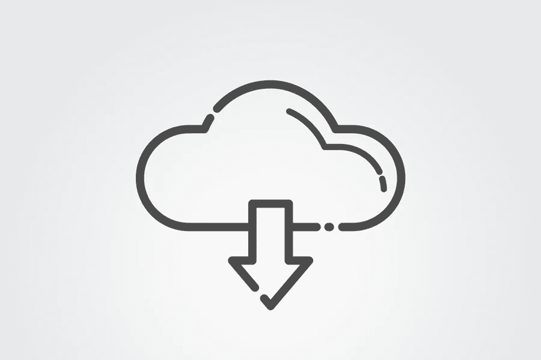

# 如何从你的 WordPress 博客出售下载和数字文件

> 原文：<https://medium.com/visualmodo/how-to-sell-downloads-and-digital-files-from-your-wordpress-blog-f643aa028102?source=collection_archive---------0----------------------->

电子商务已经进入黄金时代。世界上一半以上的人口都在使用互联网，这是网上销售的最佳时机。让我们来看看如何从你的 WordPress 博客销售下载和数字文件。

# 为什么出售下载和数字文件？

下载和数字文件是从你的博客中赚钱的最好方式之一。虽然传统的电子商务卖家不得不担心库存和运输库存，但有了数字下载，事情就简单多了。这仅仅是上传数字产品并增加流量的问题。

下载和数字文件也比传统产品更便宜，更容易制作。通常，只需要时间投资和一些设计工作就能创造出一个现成的销售产品。

# 在 WordPress 上销售数字下载的 3 种不同方式

如果你想销售数字下载，你需要一个电子商务平台来销售。每种类型的平台对特定类型的业务都有效，让我们来看看哪种平台适合您。

# 1.Saas(软件即服务)

WordPress 网站的一个流行选项是 Saas 平台来销售下载。Saas，也称为软件即服务，允许你按月付费租赁[电子商务](https://visualmodo.com/7-powerful-ecommerce-plugins/)软件。

这个选项很容易使用——通常，你不需要任何编码知识就可以开店，而且开店只需要五分钟。如果你最终遇到任何麻烦，你可以联系该平台的帮助和客户服务中心。

最重要的是，Saas 对于新兴卖家来说非常实惠。月费通常在 10-30 美元之间徘徊，但一些平台允许你免费开始使用**。你不会获得付费服务那么多的功能，但对于希望以尽可能低的成本起步的新卖家来说，这是一个不错的选择。**

**Saas 平台是销售数字下载和文件的绝佳选择。因为与物理产品相比，数字产品需要简单的交付方式，所以 Saas 将快速、经济地满足您的需求。**

# **2.开放源码**

**开源是平台之王，另外 WordPress 最好卖下载。像 WordPress 这样从头开始构建的开源平台本质上是一本开放的书。你可以自己设计，或者指导一个网页设计师，按照你想要的方式来写，直到最后一行代码。**

**但是权力越大，责任越大。虽然你可以随心所欲地定制你的网站，但你也必须自己处理所有的事情。如果你的网站有问题，你的设计团队将会解决问题。**

**最重要的是，这种平台价格昂贵。你将从零开始，如果你不知道如何编码你想要的网站，你需要聘请一个开发团队来为你做。除非你已经做了数百万美元的销售，或者你正在销售一个复杂的产品，否则这种选择可能会带来更多的麻烦。**

# **3.在 WordPress 出售下载**

**无头平台是 SaaS 和开源的结合。如果您已经有一个现有的集成软件平台，headless 允许您将它与不同的购物车和 API 结合起来，以满足您的业务需求。**

**虽然不像开源软件那样可定制，但它确实比 Saas 更灵活。但是，请记住，代价是开发时间。建立一个开源平台并不困难，但是你仍然需要一些编码知识来将它与你当前的 CRM 集成。**

# **未来之路:数字文件**

**最后，数字文件的易用性、简单性和可访问性正在成为普通互联网用户的竞技场。越来越多的 WordPress 博客作者正在从一个简单的博客作者转变为在线企业家，在 WordPress 上销售和分发他们的文件并控制下载。总之:**

****使用 Saas，如果……**您需要一个经济实惠的交钥匙解决方案来帮助您起步。**

****如果……**业务蒸蒸日上，您准备投入大量时间和精力来定制解决方案，请使用开源软件。
**使用 headless 如果……**您已经有了想要与定制购物车/API 组合集成的现有软件。**