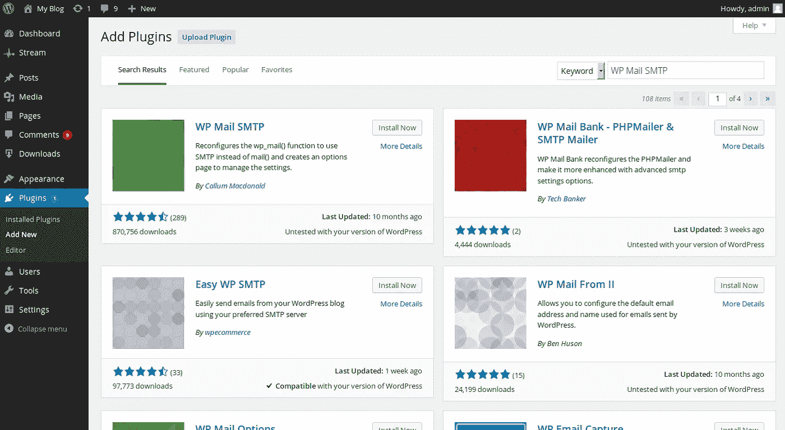
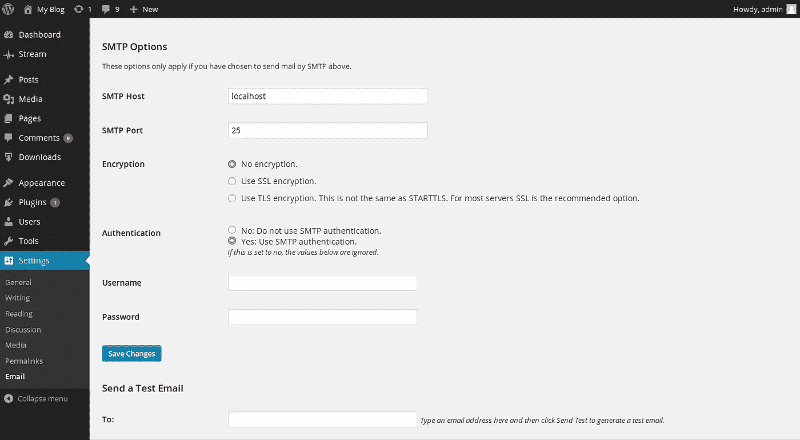
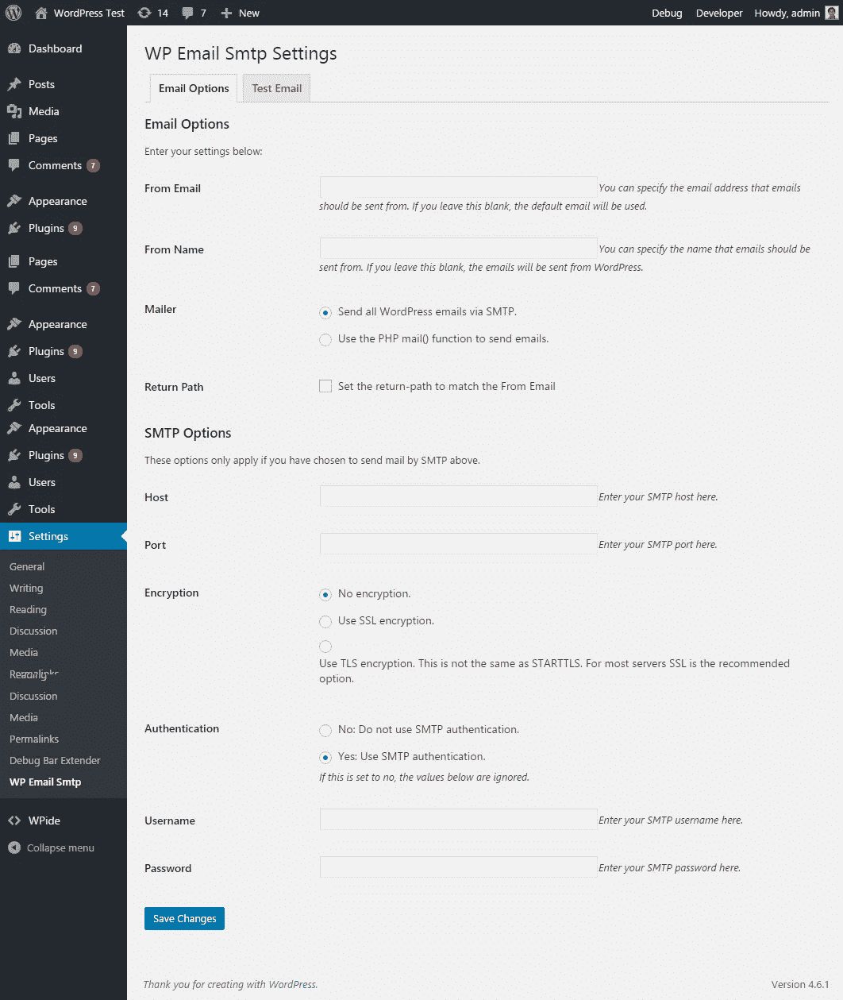

# 如何为 WordPress 邮件发送设置 SMTP

> 原文：<https://medium.com/visualmodo/how-to-setup-smtp-for-wordpress-email-delivery-e77ca48af115?source=collection_archive---------0----------------------->

你的联系方式邮件没有到达你的邮箱吗？看到知道一个简单的方法来解决它，使电子邮件来正常。在这篇文章中，我将向你展示如何使用 SMTP 来提高 WordPress 发送的邮件的送达率。

你知道什么最糟糕吗？当你的邮件出现在预定收件人的垃圾邮件文件夹中时。你在发送需要被看到的内容，但是互联网的看门人却把它直接发送给了垃圾邮件。

很烦。但是，任何试图通过 Gmail 账户接收联系表格 7 邮件的人都可以证明，发送到你的 [WordPress](https://visualmodo.com/) 网站的邮件经常会出现这种情况。

看，那是因为 WordPress，默认情况下，使用 PHP 邮件功能。因此，垃圾邮件文件夹会吃掉太多重要的电子邮件，如联系表单通知、注册细节、密码重置等。

# WordPress 的 PHP 邮件功能有什么问题？

如果你幸运的话，什么都没有。PHP 邮件大部分时间都是有效的。以我的经验来看，基本的 WordPress 通知邮件很少会变成垃圾邮件(尽管确实会发生)。当从[插件](https://visualmodo.com/)发送通知时，WordPress 的 PHP 邮件功能会真正崩溃。

例如，我一直需要设置自定义过滤器，以允许来自联系人表单插件的通知邮件进入我的收件箱，而不是垃圾邮件文件夹。

一些主机也限制 PHP 邮件功能的使用。据我所知，这不是一个主要的考虑因素(大多数主机只会限制你，如果你滥用它)，但它可能是一些主机的问题。

另外，我读过一些导致 WordPress 的 PHP 邮件功能问题的安全插件，尽管我没有亲身经历过。

总而言之，如果你的 WordPress 电子邮件有任何投递问题，转到 [SMTP](https://visualmodo.com/) 提供了一个解决问题的好机会。

# 什么是 SMTP？为什么用在 WordPress 上

SMTP 是简单邮件传输协议的缩写，是传输电子邮件的公认标准。您将看到的主要好处是更好的可送达性和可靠性。Gmail 等电子邮件客户端不太可能将通过 SMTP 发送的电子邮件视为垃圾邮件。这是因为，与 PHP 邮件不同，通过 SMTP 发送的电子邮件实际上会经过一些认证。你也可以为发送的 WordPress 邮件设置一个品牌邮件。

# 如何通过 SMTP 发送 WordPress 邮件

很长一段时间，为 WordPress 设置 SMTP 的标准插件是名副其实的 [WP 邮件 SMTP](https://wordpress.org/plugins/wp-mail-smtp/) 。据我所知，这仍然是一个可行的选择。但不是我推荐你用的。相反，我推荐一个叫做[邮差 SMTP](https://wordpress.org/plugins/postman-smtp/) 的插件。原因如下:

*   Postman SMTP 包括一个非常简单的设置向导
*   你不需要明文存储你的电子邮件账户密码信息
*   它用 Zend_Mail 代替了 PHPMailer
*   它记录所有的电子邮件和发送错误，这样你就可以很容易地发现任何问题
*   如果你的主机阻塞了 SMTP 端口，邮递员 SMTP 通过 [HTTPS](https://visualmodo.com/) 投递

基本上是比 WP 邮件 SMTP 全方位更好的体验。以下是使用方法。

# 步骤 1:安装并激活 Postman SMTP

开始安装并激活插件。它在 WordPress 目录下是免费的，所以你可以直接从你的 WordPress 仪表盘安装它。

激活后，进入**设置→ Postman SMTP，准备配置它。**

# 步骤 2:配置详细信息

关于 Postman SMTP 的一个好处是它方便的设置向导。要启动向导，您只需单击按钮。很简单，对吧？

我将向您展示如何使用您的主机的 SMTP 信息来设置一切。但如果你更喜欢的话，你也可以使用 Gmail 或 SendGrid 等第三方 SMTP 服务。

您需要做的第一件事是输入您想要发送电子邮件的电子邮件和默认的“发件人”名称:

接下来，您需要添加您的传出主机名:

要找到您的传出主机名，您需要转到您主机上的 cPanel 帐户。在你的**邮箱账户**下。找到您想要使用的电子邮件，然后选择**设置邮件客户端。**如果您尚未创建电子邮件帐户，您可以在 cPanel 的同一个页面中创建:

然后，向下滚动到**手动设置**并找到**安全 SSL/TLS 设置**。您的发送主机名是由**发送服务器**选项提供的 URL:

一旦你输入了你的发送主机名，Postman 将会分析它并(希望)给你一个选项列表供你选择:

确保选择带有正确端口号的传出主机名。您可以从 cPanel 帐户中完全相同的位置获得端口号。

在下一页，您需要输入您的用户名和密码。同样，您可以在 cPanel 的相同位置找到它们。您的用户名通常是您的电子邮件地址。您的密码是您在 cPanel 中为您的电子邮件帐户创建的密码。

一旦你输入这些细节，你就完成了！

# 第三步:发送测试邮件

现在是确保设置正常工作的好时机。为此，您可以从 Postman SMTP 仪表板发送一封测试电子邮件:

如果一切顺利，您应该会在您输入的电子邮件地址收到一封电子邮件。只要收到邮件，SMTP 就配置好了！

额外收获——那幅微笑的卡通肯定会让你笑逐颜开！

# 通过第三方电子邮件服务使用它

就像我说的，你也可以通过第三方邮件服务使用 Postman SMTP。Gmail 是一个受欢迎的选择。你可以用它每天发送大约 500 封电子邮件——你只需要生成一个 API 密匙就可以让它工作。

也可以使用 SendGrid，每月 9.95 美元起。

如果您需要帮助，邮差 SMTP 设置向导将帮助您设置这两个选项。

# 不要将此用于时事通讯

虽然 SMTP 有助于提高基本电子邮件的可送达性，但你不应该把它用于时事通讯。如果你想建立一个时事通讯，你仍然应该得到一个列表建立插件，并使用类似 MailChimp 的东西来发送你的时事通讯。

简讯的另一个好选择是 SendinBlue。它可以与你的 WordPress 仪表盘集成，帮助你安全地发送时事通讯。

# 包装东西

如果你是你的 WordPress 网站的唯一用户，并且你从未遇到过任何电子邮件问题，你可以让事情保持原样。但是如果你曾经遇到过 WordPress 的邮件变成垃圾邮件的问题，你应该遵循这个指南来为 WordPress 设置 SMTP，并提高你的事务性 WordPress 邮件的可送达性和可靠性。