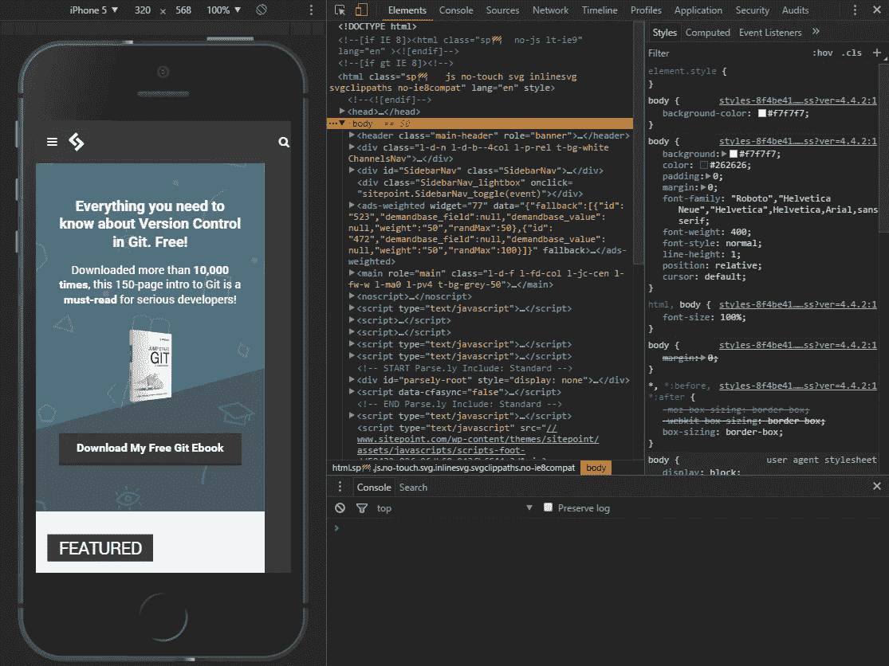
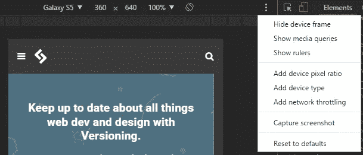
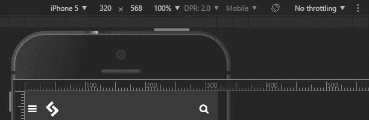
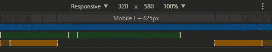
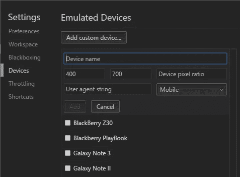
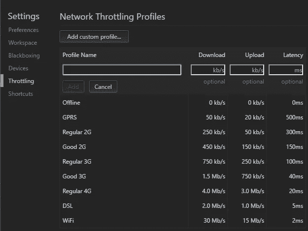
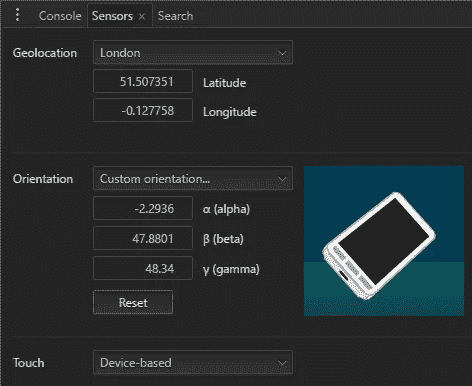

# 如何在浏览器中模拟移动设备

> 原文：<https://medium.com/visualmodo/how-to-simulate-mobile-devices-in-browser-11453b3838b1?source=collection_archive---------0----------------------->

网站测试变得越来越复杂。在几个浏览器中检查功能的日子已经一去不复返了。您的最新杰作必须在一系列不同操作系统、屏幕分辨率和功能的移动、平板和桌面设备上进行严格评估。在极端情况下，它可能需要和最初开发一样长的时间。现在了解如何在浏览器中模拟移动设备，以使您的工作更好地测试您的响应网站，以最佳方式为每个设备

触摸屏、混合设备和高密度显示器使这一过程变得更加复杂。如果你在一台配有鼠标和键盘的普通电脑上编码，很难理解你的杰作将如何运行。像鼠标悬停这样的功能不一定有效，你的应用程序可能无法运行。但是，如何在开发过程中测试您的系统，并避免在多个设备之间运行和切换的痛苦呢？

幸运的是，所有现代浏览器都提供移动仿真工具，最好的一个可以在 Chrome 中找到。它有助于识别早期问题，而无需离开舒适的 PC 和开发环境。

# 开发者工具

启动 Chrome，导航到想要测试的网页，打开**开发者工具**(菜单>工具>开发者工具，Mac 上 Cmd+Opt+I，Windows 和 Linux 上 F12 / Ctrl+Shift+I)。

您现在可以通过点击左上角的**切换设备工具栏**图标来启用浏览器模拟器:

现在将出现设备模拟:

当选择**响应**作为设备类型时，可以改变仿真屏幕的尺寸。

# 支持触摸的仿真

将鼠标移到设备上，会看到一个圆形的“触摸”光标。这将对基于触摸的 JavaScript 事件做出反应，如`touchstart`、`touchmove`和`touchend`。不应该发生特定于鼠标的事件和 CSS 效果。

按住 **Shift** 然后点击并移动鼠标来模拟缩放。

# 移动仿真设备工具栏

花点时间熟悉一下移动模拟器上面的工具栏和菜单是值得的:

默认控件包括:

*   设备类型(或简称为**响应**
*   当前分辨率
*   比例(可以放大或缩小屏幕以更好地适应模拟器面板)
*   纵向/横向切换按钮(假设选择了除**响应**之外的设备)

三点菜单允许您显示或隐藏附加控件:

*   设备框架(如果有，手机或平板电脑的图片)
*   像素标尺
*   设备像素比率(如模拟视网膜屏幕的 2.0)
*   设备类型(如“移动”或“平板电脑”等类别)
*   网络节流(一种在较慢的连接上限制带宽和测试性能的方法)
*   最后一个选项允许您捕获包含设备框架(如果显示)的屏幕截图。

# CSS 媒体查询栏

工具栏下方的栏显示了一系列典型的手机、平板电脑和设备尺寸。当选择**响应**作为设置该宽度的设备时，可点击此按钮。

从三点菜单中选择**显示媒体查询**,查看 CSS 中所有媒体查询设置的图形化彩色编码表示。

*   蓝色-以最大宽度为目标的查询
*   绿色-以某个范围内的宽度为目标的查询
*   橙色-以最小宽度为目标的查询

可以单击任何栏来将模拟器屏幕设置为该宽度。

# 模拟设备选项

左侧的下拉菜单允许您选择一个设备。为流行的智能手机和平板电脑提供了几十种预设，包括 iPhones、iPads、Kindles、Nexus 平板电脑、三星 Galaxy 等。

并非所有器件都会同时出现—选择器件下拉列表底部的**编辑…** 或从开发者工具菜单(F1)中选择**设置**并选择**器件**选项卡:

您可以启用或禁用设备，或者通过定义以下内容输入您自己的设备:

*   一个名字
*   “手机”或“平板电脑”等分类
*   浏览器用户代理字符串
*   设备分辨率
*   和像素比(例如，iPhone Retina 屏幕的像素密度是报告的视口分辨率的两倍，为 2)。

请注意，所有浏览器都用所有 HTTP 头发送的用户代理字符串来标识自己。这可以在客户端或服务器端进行检查，在 web 开发的黑暗时期，可以用来修改或提供不同的用户体验。在极端的情况下，观众将被引导到不同的网站。[这种技术总是有缺陷的](https://www.sitepoint.com/why-browser-sniffing-stinks/)，但由于响应式网页设计技术，它已经变得非常多余，而且鉴于市场上可用设备的数量，它完全不可持续。

# 带宽节流模拟

节流下拉菜单允许您模拟通常在移动连接或不可靠的酒店和机场 wifi 上体验的慢速网络速度！您可以使用它来确保您的站点或应用程序快速加载，并在所有环境中保持响应。

在**网络**选项卡和 Chrome 的设备工具栏(启用时)中有节流下拉菜单。您可以通过选择节流下拉菜单底部的**编辑…** 来设置自己的带宽配置，或者从开发者工具菜单(F1)中选择**设置**并选择**节流**选项卡:

点击**添加自定义配置文件**然后进入:

*   配置文件名称
*   每秒千比特的下载速度
*   每秒千比特的上传速度
*   以毫秒为单位的延迟(发出网络请求时的典型延迟)

# 仿真移动传感器

智能手机和平板电脑通常具有传感器，如 GPS、陀螺仪和加速度计，这些都是桌面设备所不具备的。这些可以在 Chrome 中通过选择**更多工具**然后从开发者工具主三点菜单中选择**传感器**来模拟:

出现一个新窗格，允许您定义:

*   当前纬度和经度，或者从下拉列表中选择一个主要城市。您还可以选择**位置不可用**来模拟您的应用在设备无法获得 GPS 信号时的反应。
*   方向。有几个预设可用，或者您可以通过单击和拖动来移动设备图像。

# 远程真实设备调试

最后，Chrome 允许你通过 USB 连接一个真实的 Android 设备，进行远程设备调试。从开发者工具主三点菜单中选择**更多工具**，然后选择**远程设备**。确保**发现 USB 设备**被选中，然后连接您的手机或平板电脑，并按照说明进行操作。

Chrome 允许您设置端口转发，以便您可以在设备上导航到本地服务器上的网址。Chrome 的预览窗格显示了设备屏幕的同步视图，你可以使用设备或 Chrome 本身进行交互。

可以使用包括**应用**选项卡在内的所有开发工具，在离线模式下测试渐进式 Web 应用。注意，与需要 HTTPS 的真实应用程序不同，Chrome 允许 PWAs 通过 HTTP 连接从本地主机运行。

# 太好了！我现在不需要任何设备！

Chrome 的移动浏览器模拟器非常有用和强大，但它不能代替在真实设备上与您的网站或应用程序进行交互，以评估完整的用户体验。

您还应该知道，没有一个设备模拟器是完美的。例如，Chrome 在 iPhone 或 iPad 上显示页面，但不会试图模拟 Safari 的标准支持或怪癖。

也就是说，对于快速和肮脏的移动测试来说，Chrome 的设备仿真非常出色。这比在真正的智能手机和平板设备之间切换要容易得多，您将拥有所有的开发工具供您使用。这会节省几个小时的努力。

如何在浏览器中模拟移动设备—来源[https://visualmodo.com/](https://visualmodo.com/)