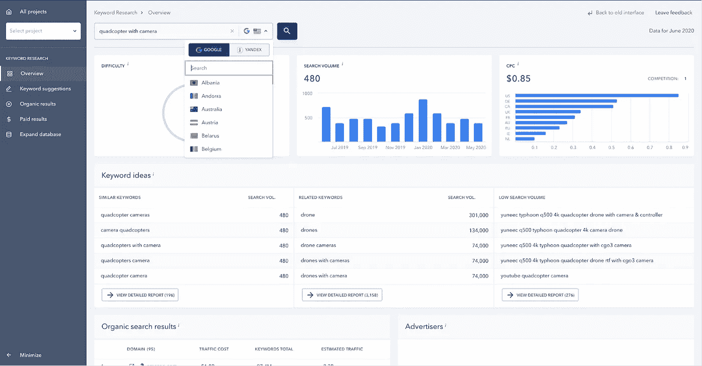
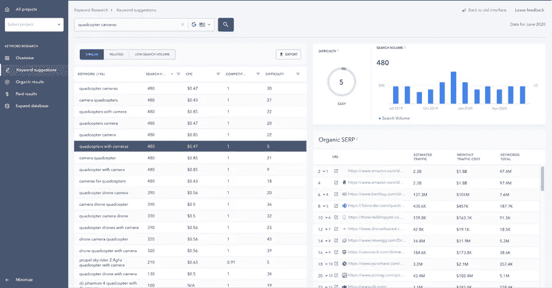
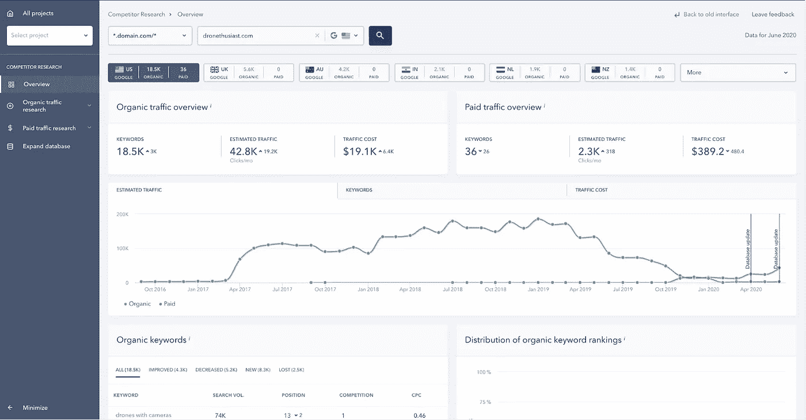
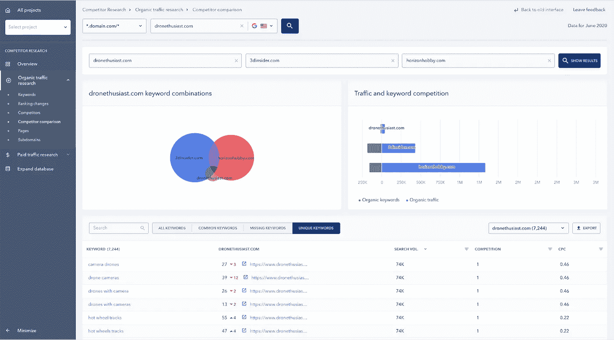
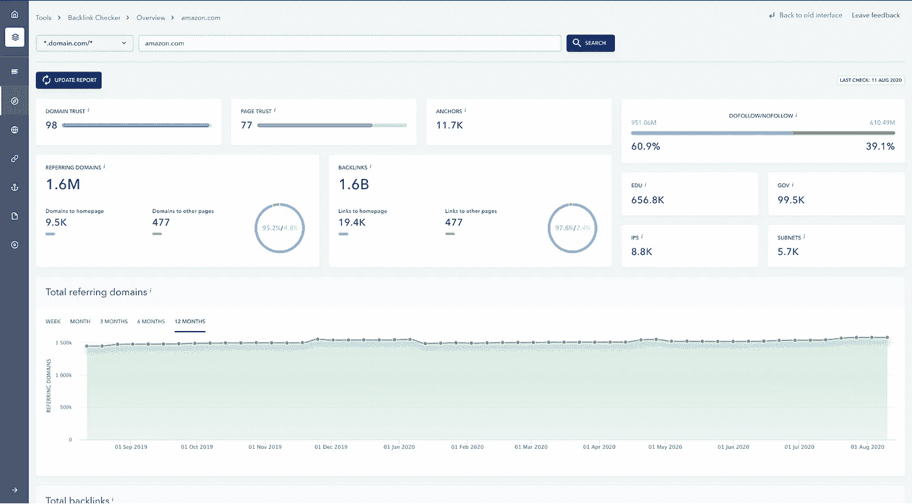
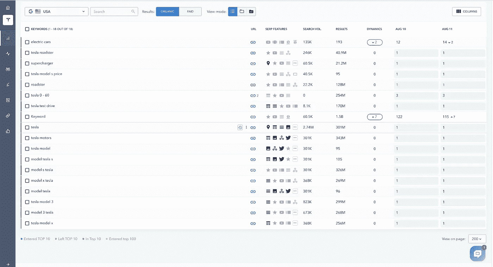
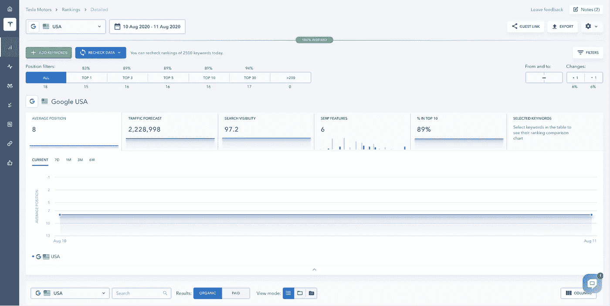

# 如何用更新的 SE 排名 SEO 软件解决关键 SEO 问题

> 原文：<https://medium.com/visualmodo/how-to-solve-key-seo-problems-with-updated-se-ranking-seo-software-9ead964cf4f3?source=collection_archive---------0----------------------->

有效的网站推广的成功公式取决于网站的类型、利基市场的竞争程度、可用的资源以及你所拥有的时间。一个优化者需要区分任务的优先次序，并根据目标制定营销策略，无论是在谷歌搜索结果中名列前茅，增加网站流量，提高转化率，还是同时进行。考虑到这一点，SEO 的关键阶段保持不变。语义是站内和站外优化的基础，即创建高质量的内容，修复技术搜索引擎优化问题，并与内部和外部链接。在这篇文章中，你将学习如何用新版本的 SEO 排名软件解决关键的 SEO 问题。

通常，实现这些目标是非常耗时的。但是有一个更好的解决方案——所有这些常规流程都可以优化。

# 如何用更新的 SE 排名 SEO 软件解决关键 SEO 问题

在这篇文章中，我们将展示如何用特殊的工具自动化 SEO 工作过程而不影响质量。SE 排名拥有所有的工具 SEO 专家和营销人员的在线平台。使用这些工具，您可以:

*   找到目标关键词，对它们进行聚类，为它们优化网页，并跟踪网站对目标关键词的排名。
*   进行语义分析，研究你的竞争对手，他们的关键词和反向链接资料，跟踪他们在谷歌前 100 名目标关键词中的排名。
*   找到你所有的反向链接并监控它们。
*   扫描您的网站，查找所有技术错误并接收错误恢复建议，还可以监控网站上的任何变化，以便随时了解情况。
*   将分析数据收集到一个界面中。
*   生成信息丰富的报告，并管理同事和客户的不同访问级别。

SE 排名最近更新了，现在由于出色的适应性设计、扩展的功能集和超快的网站加载，它甚至更好了。

信息丰富的图表允许查看所有最重要的数据，并在网站优化的每个阶段更快地做出战略决策。

让我们仔细看看任何 SEO 策略的基本组成部分，以及 SE 排名工具在不同项目阶段帮助应对主要挑战的方式。

# 选择正确的关键词

选择关键词是制定任何营销计划的第一步——首先，你需要弄清楚人们应该用什么关键词和短语通过搜索引擎找到你的网站。

有很多方法可以找到关键词。你可以使用[搜索引擎建议](https://visualmodo.com/6-reasons-website-needs-seo/)或者在结果页面底部找到类似的查询。你也可以通过社交网络上的特定论坛和群组来更好地了解目标受众的需求。

# 网站管理员工具解决关键的搜索引擎优化问题

不过，搜索关键词最简单的方法是使用特定的工具。谷歌和必应都有。虽然 Bing 的工具与 Google keyword planner 相比并不先进，但功能仍然符合标准。要访问 Bing 关键字研究，只需注册 Bing 网站管理员工具，并获得新内容想法的关键字建议。

您也可以使用 SE 排名平台上的关键字排名跟踪来完成这项任务。该工具允许为从澳大利亚到日本的任何地区选择正确的关键字，并查看一年中特定搜索结果的动态。

来自 Yandex Wordstat 的工具查询的内部数据库的所有关键字和搜索引擎建议被聚集到一个界面中。新的数据库定期增加，现有的数据库也在扩大。几天前，英国和美国的数据库变得大了几倍——用于竞争对手分析的数据库扩展到 8000 万和 2 亿次查询，用于关键词研究的数据库分别扩展到 4200 亿和 5200 亿个关键词。

考虑一下主要的度量查询，从数百个选项中选择最佳关键词——它们总是在众目睽睽之下。

当你在列表中选择一个关键词后，你会看到词频动态、关键词难度、付费搜索结果的竞争程度，以及有机搜索的主要竞争对手名单。只需点击一下，你就可以访问竞争对手的网页，看看你是否能创造出更好的内容。

尽量寻找关键词难度低的高频查询——使用这样的关键词会让你上第一个谷歌页面。

# 向你的竞争对手学习

在构建语义核心时，检查你的竞争对手的网站进展如何。当处理你的利基市场中发现的数百个关键词时，很容易漏掉那些不明显的查询，而且不能保证你的竞争对手也漏掉了它们。也许，这些非显而易见的关键词已经给你的竞争对手带来了流量。此外，使用 SEO/PPC 竞争对手研究工具很容易找到这样的关键词——在这里，你会看到许多图表，展示了该网站在有机搜索和付费搜索中的表现。

你可以找到访问该网站的用户住在哪里，例如，来自哪些国家，该网站已经为哪些关键词排名，以及他们给你多少流量。你也可以看到你的网站和你的竞争对手的网站在总体排名中的排名。

要找到您遗漏的主要竞争对手使用的关键词，请进入您的领域并点击“**有机竞争对手语义对比**”图表查看详细信息。在“Missing”选项卡中，您会看到您的竞争对手使用的查询，但不会在您的网站上使用。在下拉列表中，您可以选择一个竞争对手，并查看只有这个域名的关键字排名。

如果你也对付费推广感兴趣，你可以使用这个工具来查看你的竞争对手的广告关键词，甚至可以看到他们的广告文本。

随着最近 SE 排名的更新，它的客户可以使用 SEO/PPC 竞争对手研究工具作为白标和其他工具的一部分。白标功能允许将 SE 排名平台与您的域名和您自己的品牌一起使用，这使得代理商可以在其品牌界面中向客户展示他们的工作成果。

# 监控反向链接解决关键的搜索引擎优化问题

你不仅可以使用一些竞争对手的关键词，还可以使用合作的平台。此外，可以通过分析竞争对手的反向链接配置文件。你还需要分析反向链接，看看有多少平台链接到你的竞争对手，这些平台的质量如何。

SE Ranking 提供的反向链接监控工具将帮助您客观地评估任何网站的反向链接配置文件。由于大量的信息图表，你会明白竞争对手的个人资料有多好，以及它在几秒钟内获得反向链接的速度有多快。

许多指标都是可点击的。比如在主图表上，你看到使用了 11，7k 的锚文本反向链接。如果您单击某个图形，您将被重定向到该工具的必要部分。这将让你了解什么是最常用的锚，并看到完整的域名列表和某些锚文本的反向链接。

以下是您可以分析的其他关键参数:

*   该网站的特定反向链接
*   链接域
*   关注/不关注链接的比率
*   反向链接数量最多的竞争对手的页面
*   地理的 IP 地址的网站链接到一个网站

当然，你不仅需要分析竞争对手，还需要分析自己的网站。所有重要的反向链接应该对工具进行监控。如果反向链接被删除或者链接到你的站点的页面没有被索引，这个工具会通知你。

# 创建高质量的内容并检查网页排名

如果你已经有了一个结构良好的语义核心，你可以继续创建高质量的内容。弄清楚用户到底需要什么并为他们的问题提供解决方案是非常重要的。发布内容后，将一个或多个相关关键字添加到关键字排名跟踪工具中。

SE 排名最初是一个排名跟踪工具。自那以后，情况发生了很大变化——SE 排名变成了营销人员和 SEO 专家的成熟平台。特别是，关键字排名跟踪器也获得了一些新的功能。但有一点是不变的:选择它的用户在网站排名上获得 100%准确的数据。在 Yandex，Google，Bing，Yahoo，甚至 YouTube 上。所以，解决关键的 SEO 问题是一个好主意。

您可以跟踪任何位置的排名。在移动或桌面搜索中搜索特定城市的邮政编码。如果您想知道您的网站在谷歌上的排名，您可以监控 SERP 功能(排名、快速链接、图片集、视频等)。)这样您就可以了解查询搜索结果中有多少元素。如果你的网站在名单上。

# 网站整体排名

网站排名的总体情况可以出现在该部分的图表上。在新版本的 SE 排名中，图表具有预览功能。所以，现在您可以同时看到所有关键数据。

您甚至可以最小化图表，这将允许您查看预览。以及显示网站排名详情的表格。因此，一个很好的方法来解决关键的搜索引擎优化问题。

当你做一些对页面优化非常重要的事情时，你可以在图表上添加评论。例如，从一个有声望的网站获得反向链接。稍后，一条评论会帮助你弄清楚你所采取的行动是如何影响排名的。

# 搜索引擎优化审计、分析和数十种其他工具

当然，搜索优化并不会在你创建网页后停止。您还需要关注技术方面。如果你的网站加载速度很慢，如果它还没有准备好移动。如果有成吨的 404 页。要爬到谷歌搜索结果的顶端将会困难得多。尽管有高质量的内容和出色的反向链接。这就是为什么定期对网站进行审计如此重要。SE 排名提供了完成此任务所需的工具。

如果你不仅想在谷歌搜索结果中名列前茅。也是为了从流量中获得转换。没有出色的分析工具，您将无法取得成功。SE 排名提供了联系 GA、GSC、Yandex 网站管理员和 Yandex 的机会。Metrica 将您的帐户添加到一个界面中，以查看网站分析的总体情况。与其他工具一样，Analytics 创建了大量图表，使分析更加简单。

总的来说，SE 排名提供了 30 多个工具来自动化 SEO 和解决各种营销任务。

# 未来的大计划解决关键的搜索引擎优化问题

SE 排名团队将继续努力工作并更新平台。增加技术审计实施机会的工作。一个工具将筛选网站的 100 多个错误，并提供解决方案。短期计划还包括创建在当地成果中推广的模块。

SE 排名正在朝着让搜索引擎优化工具真正方便的目标前进。此外，借助先进技术，易于使用。即便是现在，这个平台已经具备了构建有效营销策略所需的一切。每次更新都会添加新的功能并改进界面。这就是为什么今天全球有超过 40 万的用户选择 se 排名。