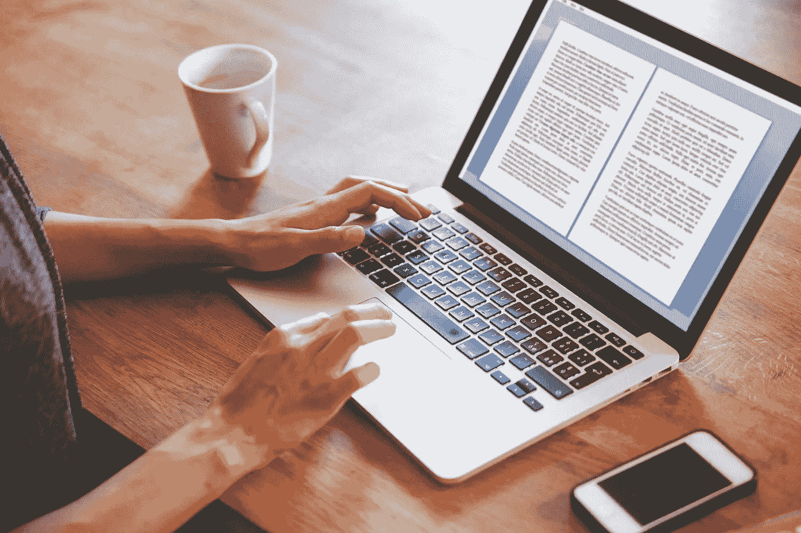
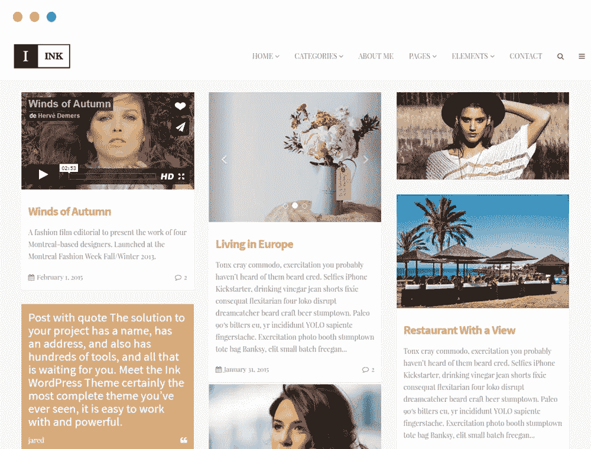

# 如何开博客？

> 原文：<https://medium.com/visualmodo/how-to-start-a-blog-c197be6318d0?source=collection_archive---------13----------------------->

如果你正在考虑开一个博客，我要对你说的最重要的事情是:去吧！开始你的博客吧！去做吧！写博客是一个伟大的搜索引擎优化策略，它是一个美妙的营销工具，写博客很有趣！一个新的博客会让你做出明智和战略性的选择。在你开始之前，花一点时间考虑如何建立你的博客，这样你以后的工作就会少一些。让我和你分享一些关于如何开博客的建议。

# 选择你的定位

你应该总是写你所知道的。但是你不应该写你所知道的一切。选择一个利基市场。决定一个主题，写一些与主题相关的文章。如果你写的是类似的话题，你的读者更有可能会回来阅读你的其他帖子。人们会知道会发生什么。开一个妈妈博客意味着你写下所有关于你的孩子和家庭生活的事情。开一个旅游博客意味着你写关于旅游的东西。当然，你可以偶尔写一些稍微偏离主题的东西，但是要坚持你的定位。旅游博客的读者并不期待一篇关于园艺的博文。

# 做你的关键词研究

一旦你选择了你的利基，你应该做一些坚实的关键字研究。试着找出人们在寻找什么。当他们想了解你的定位和你的话题时，他们用的是什么词？你应该真正了解你的潜在观众的想法。如果你做了适当的[关键词研究](https://yoast.com/keyword-research-ultimate-guide/)，你最终会得到一长串你希望被找到的关键词。尽量想出有竞争力的头部关键词，以及竞争力较弱的[长尾关键词](https://yoast.com/focus-on-long-tail-keywords/)。

# 考虑网站结构

这是考虑[网站结构](https://yoast.com/site-structure-the-ultimate-guide/)的最佳时机。你所在的小众领域流行哪些品类？你希望排名的最重要的头部关键词是什么？你应该写一篇关于这些关键词的长篇大论。那些将会是你最本质的文章，或者换句话说，你的基石内容。你应该把这些文章放在网站的显著位置。

在你写完那些漂亮的基础文章后，写很多关于那个主题的子主题的博客文章，并且总是链接到你的基础文章。这样，你就能准确地告诉谷歌你网站上最重要的文章是什么。

# 正确的主题和 CMS

我们建议你在 WordPress.org 下运行你的博客，使其易于控制和管理，并选择正确的主题，以更好地展示你的帖子，内容和搜索引擎优化在谷歌上的位置，所有这些都很容易安装和建立。查看更多关于我们博客主题的信息[https://visualmodo.com/theme/ink-wordpress-theme/](https://visualmodo.com/theme/ink-wordpress-theme/)

# 写第一篇文章

花一些时间做关键字研究，并思考网站结构。但是不要花太多时间。就写第一个帖子吧！把笔写在纸上，就这么做。你的博客从第一篇文章开始。那个帖子不一定要完美，只要能发表就行。需要一些帮助来开始吗？看看我们的[关于如何让你的帖子变得令人敬畏的 10 个建议](https://yoast.com/seo-friendly-blog-post/)。

# 图片和视频

写博文不仅仅是写一个好听的故事；一个成功的博客也有图片和视频。每个帖子应该显示至少一个图像。自己拍漂亮的照片是创造图像的好方法，制作短视频也是一个很好的博客策略。尤其是如果你写的是自己生活的方方面面，照片是必不可少的。

# 为搜索引擎优化

在发布你的帖子之前，使用 Yoast SEO 优化它(当然是在 [WordPress](https://yoast.com/wordpress/plugins/seo/) 上，但是现在也在 [Magento](https://yoast.com/dev-blog/release-candidate-yoast-seo-for-magento-2-now-available/) 和 [TYPO3](https://yoast.com/dev-blog/yoast-goes-typo3/) 上了!)!).不要忘记创建一个令人敬畏的 [SEO 标题](https://yoast.com/page-titles-seo/)和一个体面的[片段](https://yoast.com/snippet-preview/)。微调您的文本。确保你的文本既可读又便于搜索引擎优化。

# 推广你的博客

使用[社交媒体](https://yoast.com/cat/social-media/)是接触和扩大你博客受众的最佳方式。这就是为什么你的博客应该有一个脸书网页。在脸书上分享你的帖子是一个很好的营销策略。也别忘了 Instagram 和 Twitter！

除了使用社交媒体来推广你的博客，我们建议你[发送一份电子简讯](https://yoast.com/the-basics-of-email-marketing/)。让人们注册并发送电子邮件，告诉他们你最新的博客文章和一些有趣的事实。

# 坚持下去！

开博客最重要的事情——除了建立你的新博客——是写第一篇博文。一旦你写了第一篇文章，你的博客就开始了。你应该坚持写博客来使它成功，所以试着确定一个发布新帖的频率。你不必每天都写博客，一周一次或者甚至两周一次会是一个不错的开始频率。找一个你能坚持的频率！如果你的博客频率稳定，你的读者会知道会发生什么。

如何开博客？https://visualmodo.com/