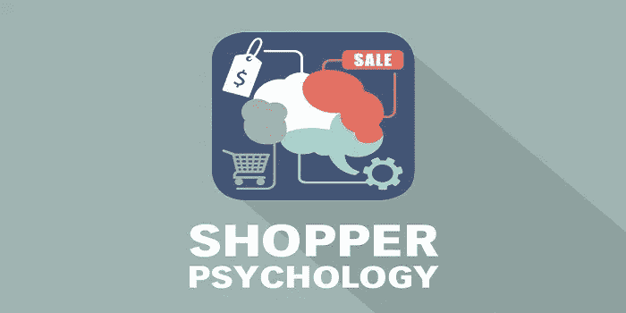

# 如何说服买家

> 原文：<https://medium.com/visualmodo/how-to-sway-buyers-29b06fd3d256?source=collection_archive---------0----------------------->

## 用购物者心理唤起忠诚度

“建立它，他们就会来”——一种自信、鼓励或其他任何东西的声音，今天这是商业世界最大的谎言。你创造了一个有用的产品(直到今天人们都没有它)，然后你等待你的市场来敲你的门。但是，他们没有。让我们面对现实吧，创造一个奇妙的产品比出去推销它更容易。但是，如果这并不困难呢？如果你能以某种方式知道你的目标受众已经想要的是什么，以及是什么通过购物者心理影响他们的购买决策，会怎么样？

这不是产品的错，是你的营销。除非你造了一个灯泡，当你走路时，它会随着你的步伐飞，根据需要自动关闭/打开/变暗，或者类似的东西，否则没有人会来。

# 如何利用购物者心理影响购买者并唤起忠诚度

许多研究跟踪了购物者的购买模式，他们的发现令人惊讶。人们不会随意购买，有一种与购买相关的思维模式、模式和心态。例如，多达 93%的购买者认为颜色和视觉外观是最重要的。请继续阅读，了解如何利用购物者的这种心理来推动销售。

# 关注视觉效果

人类大脑处理视觉信息的速度比处理文本快 60，000 倍，80%的时间都在记忆。这是文本的 4 倍。此外，90%的买家推断视频对他们来说是一个巨大的因素。

# 颜色不仅仅是颜色

冲动购物者受红色、橙色、黑色、宝蓝色的影响，而传统购买者更可能对橙色、粉色和天蓝色做出反应。然而，Teals 和海军蓝可能会建立信任，尤其是对于大宗采购。[另一方面，Groupon](https://www.16best.net/groupon/) 在他们的网站上使用绿色来让他们的购物者放松，并创造一个令人愉快的环境，让他们愿意以后再回来。

# 打开音乐

事实证明，使用音乐会让消费者在商店里花更多的时间，感觉等待时间更短，有时(像古典音乐一样)，会购买更贵的东西。也就是说，大多数购买者更喜欢流行音乐。

# 不要忽视这些标志

无论是保证标签还是“[特卖](https://visualmodo.com/)”标志，大量购物者(接近 80%)更有可能因为标志而购买。

不仅仅是这些，甚至像气味这样小的东西也会起作用。此外，保持一个网站/博客并征求评级和评论是值得的，因为它们能激发信任并提高品牌忠诚度。