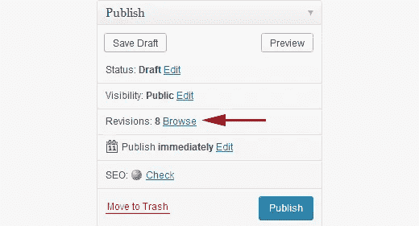
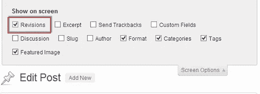
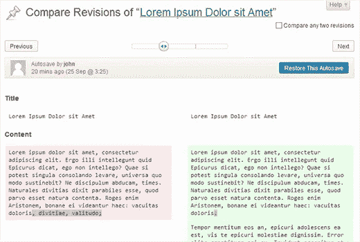
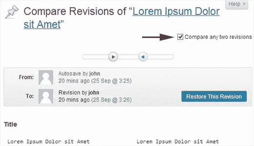
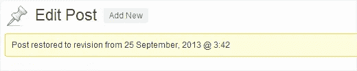

# 如何撤销 WordPress 的修改

> 原文：<https://medium.com/visualmodo/how-to-undo-wordpress-changes-post-revisions-28481dfc5a?source=collection_archive---------7----------------------->

WordPress 有一个内置的功能，允许你撤销修改并返回到文章的早期版本。这个特性被称为发布修订，或者简称为*修订*。写文章的时候，我们大多数人都会犯错。有时候你甚至希望你没有删除你之前写的东西。修订版允许您及时返回并撤消任何更改。在这篇文章中，我们将向你展示如何在 WordPress 中撤销文章修改。

## 什么是帖子修订版？

WordPress 有一个内置系统，可以在每次自动保存或者用户保存文章时，将文章存储为修订版。WordPress 文章编辑器中的自动保存功能会每 60 秒保存一篇文章作为特别修订。然后，旧的自动保存将被新的自动保存的修订所取代。每次用户单击保存、更新或发布按钮时，都会在数据库中存储一个新的修订。

你可以在你的文章编辑界面上或者通过浏览修改来查看这些修改。自从 [WordPress 3.6](http://www.wpbeginner.com/news/whats-new-in-wordpress-3-6/) 以来，有了一种新的更直观的方式来浏览你的修订，允许你看到每个修订中所做的修改以及谁做了这些修改。如果需要，您还可以浏览不同的修订，并返回到其中的任何一个。

***它会删除我当前的修订吗？*** 不，它不会删除你当前的版本。相反，您的当前版本将被保存为另一个版本，您可以恢复到它，就像您恢复到早期版本一样。

## 为什么应该使用帖子修订版

几乎每个 WordPress 用户都可以从帖子修改中受益。写伟大的内容需要大量的调整和重写。文章修改可以让你看到你的过程，鸟瞰你的文章是如何发展的。然后，您可以在草稿的不同状态之间切换，进行更改，使您的文章更适合发布。

对于多作者的 WordPress 网站，文章修改允许编辑管理团队同时处理一个故事或文章。您可以看到谁对文章进行了更改，他们做了哪些更改，等等。将文章修改和[编辑流程](http://www.wpbeginner.com/plugins/how-to-improve-your-editorial-workflow-in-multi-author-wordpress-blogs/)结合起来，你就有了一个强大的编辑平台。

## 如何在 WordPress 中使用帖子修订撤销更改

WordPress 在文章/页面编辑界面的发布元框中显示每篇文章的修订数量。点击浏览将带您到发布修订屏幕。

您也可以通过点击屏幕选项并检查修订，在文章编辑区下方显示修订。

文章修订屏幕会显示文章的最新修订，顶部有滚动条。滑动滚动条上的按钮将带你进入文章的不同版本。每个修订中所做的更改将以绿色和粉色突出显示。在顶部，您可以看到进行这些更改的用户、时间和其他信息。WordPress 也会让你知道一个修订是自动保存还是草稿。

您还可以使用“下一个”和“上一个”按钮来移动修订，或者选中顶部的“比较任意两个修订”复选框。这将把按钮滚动条一分为二，你可以把每个按钮带到不同的版本，并比较两个不同版本之间的差异。

要恢复修订，只需点击*恢复该修订*或*恢复该自动保存*按钮。WordPress 会将所选修订恢复为您当前的文章修订，然后您可以将其保存为草稿。

你也可以限制文章修改，甚至完全[禁止文章修改](http://www.wpbeginner.com/wp-tutorials/how-to-disable-post-revisions-in-wordpress-and-reduce-database-size/)。然而，我们强烈建议不要这样做，因为文章修改在很多情况下非常方便。如果你愿意，你可以[删除旧的文章版本](http://www.wpbeginner.com/plugins/delete-old-post-revisions-in-wordpress-with-better-delete-revision/)，因为你确定你不再需要它们了。

我们希望这篇文章能帮助你理解如何使用文章修改来撤销 WordPress 中的修改。你用过帖子修改吗？请在下面留言告诉我们。也别忘了订阅我们的 [Youtube 频道](http://youtube.com/wpbeginner)。

如何撤销 WordPress 的修改——visual modo[https://visualmodo.com/](https://visualmodo.com/)