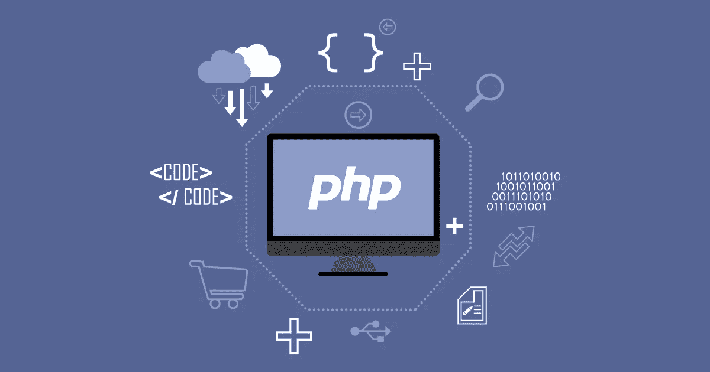

# 如何更新你的 PHP 版本

> 原文：<https://medium.com/visualmodo/how-to-update-your-php-version-99bb99f23ac9?source=collection_archive---------0----------------------->

PHP 是最流行的服务器端脚本语言，为数百万个网站提供动力，包括 WordPress 网站，保持它的更新对网站的安全和性能非常重要，现在看看如何更新 PHP 版本。

如果你是从你的 [WordPress](https://visualmodo.com/) 站点的通知中到达这个页面的，你的博客运行的是一个**过时且无人维护的**版本的 PHP。不仅是你的网站的性能(很多)低于它应有的水平，你可能会发现事情并不像你期望的那样工作，并且容易出现安全漏洞！

# 如何更新 PHP？

# PHP 是什么？

PHP 是一种脚本语言，它很可能为你的 WordPress 网页提供动力。像所有软件一样，PHP 会随着时间的推移而更新，以修补安全问题并改进其功能。和其他软件一样，保持你的 PHP 版本最新是很重要的。最新版本的 [PHP](https://visualmodo.com/) 可以让你的网站[快 3 倍](https://visualmodo.com/)并且确保你使用的是 PHP 7+。

# 更新你的 PHP 版本

# 联系你的主人

在大多数情况下，你不能自己更新 PHP 版本，需要联系你的主机。升级过程是一个简单的过程，应该是你的主机可以为你做的事情，而不会影响你的网站或向你收费。这里有一封信，你可以寄给你的托管公司:

> 亲爱的主持人:
> 
> 我在你们的一个服务器上运行一个 WordPress 网站，WordPress 建议至少使用 PHP 7。我们使用的内容管理系统 WordPress 在他们的需求页面上把 PHP 7 列为推荐版本:[https://wordpress.org/about/requirements/](https://wordpress.org/about/requirements/)
> 
> 你能让我知道我的主机是否支持 PHP 7 或更高版本，以及如何升级吗？
> 
> 期待你的回复。

# VPS 服务器

如果您有 VPS 服务器，请参见[如何从 PHP 5 升级](https://laracasts.com/discuss/channels/tips/how-to-upgrade-from-php-5-to-php-70-on-ubuntu-1404-with-nginx-146)。

# 我的主机不支持 PHP 7

如果你的主机不支持 PHP 7 或更高版本，我们建议你找一个支持的主机。我们有一个 [WordPress 托管解决方案的列表，我们推荐](https://wordpress.org/hosting/)，它们都支持 PHP 7 或更高版本。如果你联系另一个主机，在购买之前一定要问他们你的网站将在哪个 PHP 版本上运行。

# 更多信息

PHP 有一个不支持版本的列表，包括他们网站上的日期。如果你自己开发 WordPress 插件，你可能想看看名为 [WPupdatePHP](http://www.wpupdatephp.com/) 的 PHP 库。