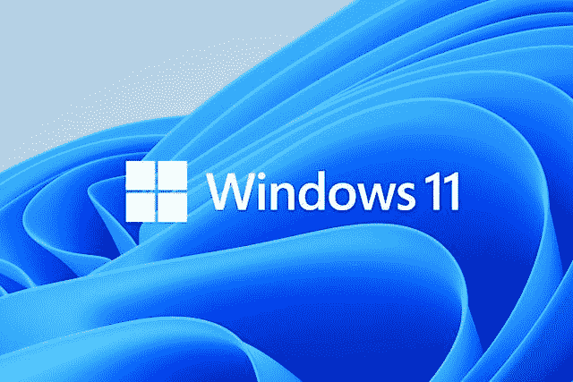

# 如何轻松升级到 Windows 11 教程

> 原文：<https://medium.com/visualmodo/how-to-upgrade-to-windows-11-easily-tutorial-f1ecb57bbc60?source=collection_archive---------1----------------------->

Windows 11 现已准备就绪，将在全球数百万台电脑上提供。然而，就像任何新操作系统的推出一样，它不会在一夜之间发生。所以，很多 Windows 用户会等待一段时间，直到神奇的升级通知出现。在今天的教程中，我们将学习如何轻松升级到 Windows 11。

如何轻松升级到 Windows 11

不想等了？你不需要一点点的努力。所以，你可以马上下载并安装新版本的 Windows。但请记住，与以前版本的 Windows 不同。如果你的电脑不符合其标准，你可能不会被邀请安装 Windows 11。这并不意味着你不能安装新的[操作系统——微软](https://visualmodo.com/what-makes-windows-and-wordpress-work-so-well-together/)说如果你有一台旧机器。您将能够访问 Windows 11。不过，你必须下载 Windows 11 ISO 文件并手动安装操作系统。(但是，您可能无法获得自动更新—您可能每次都必须安装新的 ISO。).

如何升级到 Windows 11

既然更新已经推出，您可以通过转到“设置”-“Windows Update”来检查它是否已到达您的计算机。如果你还没有升级，想看看你的机器是否足以运行 Windows 11，你可以下载微软的 PC Health 应用程序(点击这里)，它会告诉你你的设备是否符合条件。如果是这样，而你又不想等，下面就告诉你如何安装 Windows 11。转到软件下载页面。