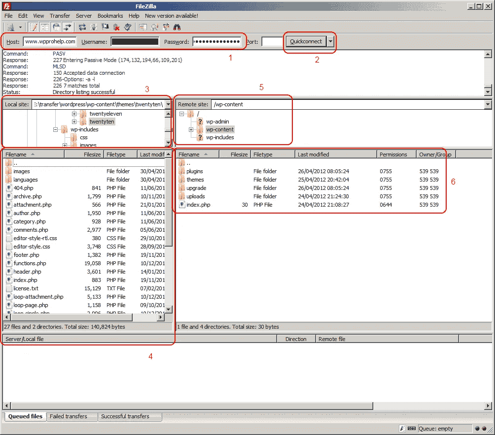
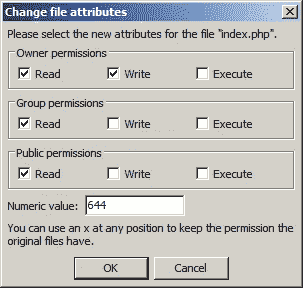

# 如何用 FTP 上传 WordPress 文件

> 原文：<https://medium.com/visualmodo/how-to-upload-wordpress-files-with-ftp-7e55711e3cce?source=collection_archive---------0----------------------->

# 什么是 FTP 协议

FTP(文件传输协议)是一种“传输方式”,用于将文件从本地计算机传输到远程网站，如 WordPress 博客。FTP 也可以用来从你的 WordPress 网站下载文件到你的电脑上，或者在远程网站上改变文件和目录的权限。

# 为什么需要知道如何使用 FTP？

对于任何一个站长来说，FTP 都是一个非常重要的协议。有各种各样的原因说明为什么能够使用 FTP 是非常重要的:

# 将文件上传到您的网站

有时，您可能需要将文件(如 imges 或 HTML 验证文件)从您的计算机传输到您的网站，并且您将需要 FTP 作为一种传输方式。

# 从你的 WordPress 网站删除文件

有时在上传新插件后，激活后你会发现这个插件不兼容，WordPress 管理员控制台不可用。在这种情况下，解决这个问题的唯一方法是通过 FTP 连接到网站，导航到 WordPress 插件目录并删除插件。WordPress 插件文件存储在 WordPress 的/wp-content/plugins 目录中。

# 修改 WordPress 主题

有时，你可能需要改变你的 WordPress 主题或者修改现有的主题。将教程中的一段代码粘贴到 WordPress 仪表盘中的 Appereance > Editor 窗口可能会意外地将您锁定，或者破坏某些东西。最好的方法是通过 FTP 登录，下载 WordPress 主题文件，修改它，然后再次上传到 WordPress 主题目录。WordPress 主题目录是/wp-content/themes/。

# 更改文件和目录权限

一些 WordPress 插件需要创建一个临时目录或单个目录来存储缓存数据。如果这些 WordPress 插件没有适当的权限来创建这样的文件或目录，WordPress 插件将会产生错误，并且不能正常工作。在这种情况下，你需要改变目录和文件权限，这样 WordPress 插件就能够创建并写入一个目录。

# 使用 FTP 客户端连接到你的 WordPress 博客需要什么信息？

1.  远程服务器的主机或主机名。通常这是你的 WordPress 博客的网址或 URL，例如[www.website.com。](http://www.website.com.)
2.  一个用户名和密码来验证和访问你的博客或网站。通常情况下，这些凭证是由您的主机提供商在您注册时提供给您的，您使用这些凭证来访问您的 CPanel。如果没有，你可以从你的主机用户门户创建一个新的 FTP 用户名和密码，并配置它来访问 WordPress 文件。
3.  一个 FTP 客户端软件。市场上有许多不同的 FTP 客户端软件。最好的 FTP 客户端之一是 FTP FileZilla，它可以免费下载。

**注意:**应该在下面屏幕截图 1 中用红色突出显示的部分 1 中输入主机、用户名和密码。

# 如何使用 FTP 上传和传输 WordPress 文件

一旦您在上面的第 1 部分中指定了详细信息，请单击“快速连接”按钮(以红色突出显示并标记为上面的第 2 部分屏幕截图 1)。一旦你连接到你的 WordPress 网站，你将能够在你的 FTP 客户端看到以下部分(在上面的截图 1 中全部用红色突出显示):

*   第 3 部分:本地计算机目录位置
*   第 4 部分:存储在突出显示的本地目录中的文件
*   第 5 部分:远程网站(WordPress 博客)目录位置
*   第 6 部分:存储在突出显示的远程目录中的文件

要从你的本地计算机上传一个文件到你的 WordPress 博客或网站，只需将文件从本地站点部分(上面截图 1 中的第 4 部分)拖放到远程站点部分(上面截图 1 中的第 6 部分)。因此，如果你需要上传一个修改过的 WordPress 主题文件，在远程网站上导航到‘WP-content/themes/[主题目录]。一旦您在这样的目录中，拖放文件 footer.php 到远程站点部分。

**WP White Security 安全提示:**使用 FTP 协议时，凭证和文件内容以明文形式通过互联网发送，即恶意用户可能会截获您的凭证并登录您的网站。理想情况下，您应该始终使用 SFTP(也称为 FTPS)。

# 如何更改 WordPress 文件或目录权限

要更改 WordPress 博客中文件或目录的权限，您可以:

a)使用 CHMOD FTP 命令；或者

b)只需右键单击此类文件或目录，然后选择“文件权限”

WP White Security 安全提示:在大多数情况下，文件应该被赋予只读权限，但允许所有者拥有写权限也可以在上传新文件时覆盖它们。

更多信息请访问我们的[博客](https://visualmodo.com/blog/)