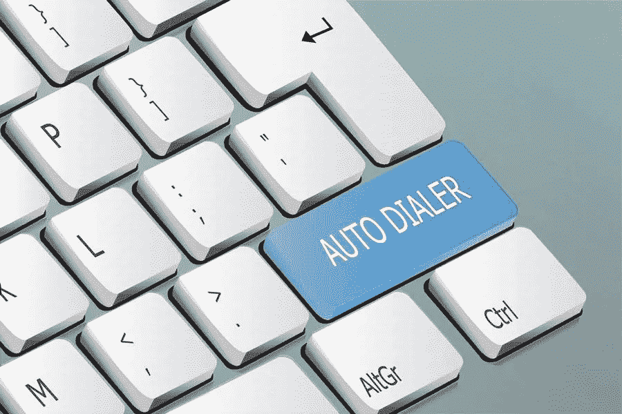

# 如何使用自动拨号器满足您的业务需求

> 原文：<https://medium.com/visualmodo/how-to-use-an-auto-dialer-for-your-business-needs-7d9a3e10b072?source=collection_archive---------1----------------------->

任何企业都将拜访潜在客户和客户作为其运营的战略组成部分。在本文中，我们将分享如何使用自动拨号器来满足您的业务需求。它可以是完成回电请求、提供客户服务或产生销售线索。那些希望让代理完全专注于呼叫并帮助他们实现所需目标的人可以使用自动拨号器。

在当今快节奏的现代世界中，自动拨号器是拨打电话的核心。他们自动化重复和单调的任务，从而为任何企业节省时间。因此，利用像 Call Cowboy 这样的拨号平台是值得的。如您所知，现代商业环境已经被大量要收集和分析的数据、要实现的底线和要满足的最后期限所包围。

对于没有听说过或不熟悉自动拨号器的人来说，它到底是什么？你为什么需要一个？你如何为你的公司使用它？请阅读下面的内容，了解更多相关信息。

# 什么是自动拨号器？

自动拨号器的引入使呼叫中心有能力进行大规模的对外呼叫活动。这使得企业能够高效快速地拨打电话号码。

自动拨号器或自动电话拨号系统(ATDS)是一种电子软件或设备，使用顺序或随机号码生成器自动拨打电话号码。自动拨号器要么将呼叫连接到真人，要么在呼叫被应答后播放录音消息。

当自动拨号器将客户连接到实时代理时，它被称为强力拨号器或预测拨号器。另一方面，当自动拨号器播放预先录制的消息时，它通常被称为语音广播或自动呼叫。也就是说，当自动拨号器将呼叫连接到真人时和当来电者接听时播放录音消息是有区别的。

为了确定拨号的最佳时间，预测拨号器通常使用实时分析。另一方面，电源拨号器为代理拨打预设的电话号码列表。对于语音广播或自动呼叫，一些例子是要求拿起电话的人按下按钮或播放广告。

# 四种类型的自动拨号器

有四种不同类型的自动拨号器。您的企业可以将它们用于各种目的。它们包括以下内容:

# 1 个机器人拨号器

这个拨号器有助于节省时间。它主要用于企业发送产品更新或提醒。使用 robo 拨号器，您可以预先录制消息，然后发送给联系人列表中的所有人，而不必等待电话线空闲。您也可以使用此拨号器设置 Press-1 功能，以便自动呼叫可以将联系人直接连接到现场代表或收集联系人回复。确保您了解与 robo 呼叫相关的电信法规。它们确实存在，并且可能因您所在的业务区域而异。

# 2 预览拨号器

此拨号器有助于重要的跟进或复杂的销售，在这种情况下，代理需要查看以前的记录和对话历史。预览拨号器主要用于销售人员或代理在拨打电话之前需要更多时间来研究联系人的情况。

# 3 预测拨号器

这个拨号器跳过传真机、未接电话、忙信号和坏号码。使用预测拨号器，代理实际上可以每小时拨打大约 110 个电话。这个拨号器可以在短时间内拨打大量电话，因为它可以一次拨打几个号码。它使用机器学习和预测算法来学习您的团队过去拨打的电话，并调整拨号率，确保代理始终待命。

# 4 电源拨号器

使用电源拨号器，您可以选择在到达应答机时留下预先录制的语音邮件。他们跳过占线号码和未接电话，并确保当电话接通时代理始终在线。使用电源拨号器，代理每小时最多可以拨打 70 个电话。这个拨号器一次只能拨一个号码，按照联系人列表中的顺序。当代理希望花更多时间来个性化呼叫时，可以使用它。大多数电源拨号器允许用户调整拨号速率，以便为每个人分配多个联系人，并加快呼叫过程。

# 如何为您的企业使用自动拨号器

自动拨号器在过去被认为是从电话号码列表中拨打联系人的唯一方式。然而，在今天的商业世界中，它们更多地被定义为有益的集成软件。这些现在可以与几乎任何客户关系管理系统集成。拥有一个自动拨号器真正改变了商业运作的方式。

自动拨号器也能够检测断开的呼叫、应答机等。它给企业带来许多好处，从小型企业到大型企业。

以下是您可以最大限度地利用自动拨号器为您的企业带来的好处的方法:

# 1 使用自动拨号器产生更多销售线索

企业可以使用自动拨号器来最大化呼叫连接的数量。这让您的代理更有可能达成销售线索。自动拨号器也是增加销售线索的有力工具。代理可以在打电话之前利用它来收集有关联系人的信息，以帮助他们创建更个性化的对话。个性化有助于提高参与度和转化销售线索的机会。

# 2 使用自动拨号器保持数据新鲜

任何业务数据通常都需要快速，尤其是当它包含销售线索时。自动拨号器可以快速处理任何数据。这有助于确保导线是热的。更新数据通常通过自动过程到达拨号器。它通常利用数据库同步。可以手动更新数据。你可以使用一个自动拨号器，以确保你的大部分线索是跟进专业和非常迅速，大大增加了铅:销售转换率你的业务。它可以自动回拨或回收未接电话、占线号码和语音邮件。

# 3 使用自动拨号器来提高代理的生产力和效率

拥有自动拨号器可以将代理的通话时间增加 200–300%。另一方面，手动拨号的销售团队平均通话时间仅为每小时 10-15 分钟。他们的大部分时间都花在安排回电时间或跟进电话、留语音邮件或听忙音上。使用自动拨号器，代理更有可能成功完成销售，从而增加业务收入。

# 4 使用自动拨号器建立专业一致的品牌

企业呼叫中心的不同性能水平可能会导致服务不一致。这也可能导致销售团队内部的不良情绪，增加员工流失率。问题是，如果是呼出电话，坚持你的服务水平目标是很有挑战性的。这是因为每个主管和代理都有不同水平的经验、动机和能力。自动拨号程序的使用迫使团队遵守纪律，并通过自动拨号过程消除任何不一致。你的团队与潜在客户和客户的联系越一致，你的品牌建设就越成功。

# 5 使用自动拨号器来提高呼叫的个性化

个性化已经被监控化了。然而，这一部分侧重于入境销售，而不是出境销售。您企业中从事集客销售的代理需要有量身定制的响应，以满足潜在客户和客户的个性化需求。问题是，多达 42%的销售代理在没有自动拨号器的情况下打电话之前缺乏他们需要的数据。

# 使用自动拨号器处理产品销售策略的突然变化

在自动拨号器的帮助下，品牌重塑可以快速进行，结果监控可以实时进行。随着经济、天气甚至法律的变化，许多企业不得不改变他们的销售策略。因为它已经包含了客户服务或销售团队取得成功的大部分要素，这使得过渡更加容易。使用自动拨号器还可以让您的主管使用脚本、电话录音和实时电话辅导尽快对代理进行再培训。

# 7 使用自动拨号器检测应答机

您的代理在使用连续号码拨打联系人列表时，经常会遇到无法接通的号码。通常，也没有迹象表明应答机正在接听电话。这就是自动拨号器的用武之地。如前所述，一个关键特征是能够将真人拾音器与电子设备或应答机区分开来。它经常分析传入的音频，并判断它是来自机器还是人类。自动拨号器减少了拨打此类号码的次数，降低了所需的人工干预水平，并提高了客户服务或销售团队的效率。

# 8 使用自动拨号器获得实时统计报告

企业所有者还可以使用来帮助代理了解实时统计数据以及是否存在问题。由于自动拨号器提供定制报告的能力，这成为可能。它还允许访问通话录音，让您和您的经理有机会监督代理的表现。自动拨号器有一个用户友好的界面，用户可以通过实时指标导航。

# 9 利用自动拨号器的全渠道功能

无论您想通过视频聊天、电子邮件、传统智能手机、短信或普通电话与潜在客户和客户联系，都可以在一个易于使用的代理桌面上实现，这要归功于自动拨号器的全渠道功能。使用全渠道系统，通过短信开始互动。其他渠道可以很快打来电话。它允许您的代理与潜在客户无缝沟通。

# 10 .使用自动拨号器来确定打电话的最佳时间

自动拨号器可以减少被拒的机会。通过准确预测致电新销售线索或潜在客户的最佳时间。它使用以前呼叫的数据和先进的算法使之成为可能。

# 11 使用自动拨号器提高公司的可信度

如前所述，如果没有自动拨号器，不同代理之间的通话质量会有很大差异。拥有自动拨号系统有助于提高您公司的可信度，因为它可以确保所有呼叫都符合行业和公司标准。

# 12 使用自动拨号器来提高代理的士气

自动拨号器帮助您企业中的代理更成功地完成销售。这些也让你的代理赚取更多佣金成为可能。这些事情有助于积极的代理人士气。无论你的业务是收债、销售、呼出还是呼入，你团队的士气是最重要的。自动拨号器消除了重复的任务。例如听没完没了的铃声、手动处理呼叫以及拨打电话号码。它带走了你团队中的平凡。

但是，请注意，实际上将您的团队转移到自动化环境中是很困难的。因此，你可以慢慢地改变自动拨号器的手动“点击拨号”模式。因此，随着时间的推移，它的预测状态不会突然改变。尽管人们普遍认为，自动拨号器确实能提高代理人的士气。一旦代理已经使用了它，他们中的大多数人就不会再想回到非拨号环境了。

# 13 使用自动拨号器提高员工保留率

如前所述，自动拨号有助于提高代理人的士气。高效的员工是快乐的员工。也就是说，代理商跳槽到更好的地方的比率变得非常低。因为自动拨号器可以帮助他们减少被拒绝的机会，并满足他们的个人配额。它减少了代理辞职的机会，从而提高了您企业的员工保留率。

# 自动拨号器业务结论

毫无疑问，自动拨号器使电话销售变得轻而易举。代理不再需要手动呼叫联系人，让您的公司免于任何人为错误造成的麻烦。这些也为你或你的企业节省了大量的时间和金钱。遵循你从这篇文章中学到的如何最大化自动拨号器带来的好处的方法。使用它来实现非常复杂的业务需求，同时简化您的操作。