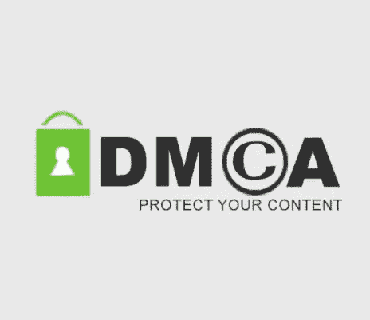
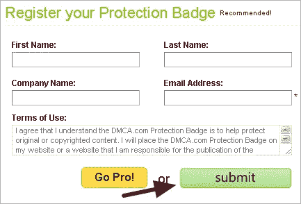
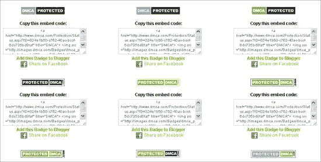

# 如何使用 DMCA 徽章？

> 原文：<https://medium.com/visualmodo/how-to-use-dmca-badge-96edbc38de21?source=collection_archive---------0----------------------->

## 保护 WordPress 站点

DMCA 徽章是放置在你的网站上的保护印章，阻止小偷窃取你的内容。有了注册的徽章，您就可以访问工具、资源和支持，迅速拿下任何窃取您内容的网站。小偷不喜欢那样！

# 如何使用 DMCA 徽章保护？

当你发现有人未经许可抄袭了你的博客内容是什么感受？感觉糟透了。这种情况我也面对过好几次。每当我发现内容窃贼在[谷歌](https://visualmodo.com/)中排名较高时，我会向谷歌报告删除复制的内容。

这是个好主意。但我们应该防范内容窃贼。保护你的博客不被复制的方法之一是在你的博客上添加一个 DMCA 徽章。

如果你不知道 [DMCA](https://visualmodo.com/) ，这里有一些信息给你。DMCA(数字千年版权法)是一部控制版权作品的美国版权法。DMCA 的目标是保护网上知识产权。

您可以在您的博客上添加一个**保护徽章**，以阻止内容窃贼并保护您的内容。它会让内容窃贼在试图复制你的内容时犹豫不决。

**为什么是 DMCA？**

*   如果你的内容被盗，提交一份 DMCA 下架文件。
*   通过 DMCA.com 的安全门户网站监控您的页面。
*   获得**DMCA.com 保护状态证书**以阻止内容盗窃。
*   专业计划执行 DMCA 取下，扫描你的内容的副本，找出谁是你敲竹杠，等等。

# 如何给 WordPress 博客添加保护徽章

在你的博客上添加 DMCA 徽章非常简单。它不会占用你超过五分钟的时间。

首先，进入[徽章页面](http://www.dmca.com/)，填写您的名字、姓氏、公司名称和电子邮件地址，注册您的帐户。

如果你想创建一个免费帐户，然后只需点击“提交”。我建议你从免费账户开始。如果需要，以后您可以升级到专业版。

一旦你登录到你的帐户，你会发现那里的保护徽章。虽然有一个 [WordPress 插件](http://wordpress.org/plugins/dmca-badge/)可以让你在你的网站上安装保护徽章，但我不建议你安装一个插件只是为了添加一个徽章，你可以通过添加一个小部件来做到这一点。

现在您需要选择一个徽章并复制代码。在你的博客边栏/页脚中添加一个文本小部件，并将代码粘贴到那里。(快速指南:登录到 [WordPress](https://visualmodo.com/) >外观> Widgets >任意文本或 HTML >粘贴代码>添加到侧栏/页脚)。

就是这样。你完了。保护机器人将很快抓取你的网站，你的内容将受到该法案的保护。DMCA 徽章不能阻止某人从你的[博客](https://visualmodo.com/)中复制内容。但是这个徽章会阻止内容窃贼复制你的内容。如果你发现有人抄袭了你的内容，就要求你的系统采取行动。

希望这个徽章能帮助你保护你的东西不被盗。如果你觉得这篇文章有用，请在脸书、Twitter 和 Google+上分享这篇文章。