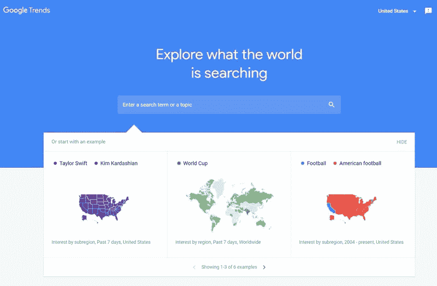

# 如何为你的企业使用谷歌趋势？

> 原文：<https://medium.com/visualmodo/how-to-use-google-trends-for-your-business-e678f4f87335?source=collection_archive---------1----------------------->

你不会相信谷歌趋势对你的生意有多有用。如果你认为它查找流行关键词的基本功能仅仅如此，你会惊喜地发现你可以用不同的方式使用这个谷歌功能。

# 在你的企业中使用谷歌趋势的 10 种方法

*   寻找利基市场

使用 Google Trends，你可以做的第一件事就是找到受欢迎的或正在增长的利基市场。要做到这一点，把你的投资范围设定为从 2004 年到现在。这将让你看到哪些利基是受欢迎的现在已经有一段时间了。如果您让过滤器显示过去 12 个月，您可能会将季节性主题与流行主题混淆。

一个稳定的受欢迎的利基将有一个通常恒定的图形贯穿几年。如果你看到最初几乎没有搜索，然后图表突然暴涨，这意味着这是一个季节性利基，可能会像它出现一样迅速消失。稳定的在一年的不同时期可能会有轻微的下降，但那是绝对正常的。

*   在相关主题中查找相关产品类别

你知道你可以在谷歌趋势上查看相关话题吗？在输入你的关键词并得到其受欢迎程度的图表后，向下滚动到“相关主题”部分。在那里，你会发现一个不同的单词和短语的列表，人们会用你的关键词来搜索。

这可以用来寻找你可以在你的商店介绍的产品。例如，你正在销售指甲油，你想扩大你的商店，包括更多的产品。通过在谷歌趋势上寻找指甲油，你可以看到相关的主题是什么，并选择那些是产品的。当然，你会遇到一些没有意义的(例如，一个看似与指甲油无关的名人)，但你总是可以写一篇关于那个名人的指甲油的文章。

*   关键词研究

我们大多数人可能习惯于使用关键字工具(这是非常有效的)，但如果你想尝试一些新的东西，谷歌趋势是一个不错的选择。就在“相关主题”旁边，有一个叫做“相关查询”的部分，在那里你可以看到与你的关键词相似的不同关键词。

当你为搜索引擎优化你的产品页面时，你可以使用这些单词和短语。Google Trends 只显示搜索次数最多的，所以你可以确定它们都很受欢迎。

*   围绕季节趋势的促销

你卖的产品不会全年都受欢迎。你的销售额会有下降的时候，但没什么可担心的。在这几个月，你可以开始销售季节性产品来填补空缺。

比如你在卖比基尼。Google Trends 会告诉你什么时候这些被搜索得更多，但是你也应该注意到什么时候它们不那么受欢迎了。比方说，最不受欢迎的时间是 9 月到 11 月。既然你卖比基尼，你可能也想卖太阳镜和夏天的帽子。在谷歌趋势上搜索这些，看看它们在 9 月至 11 月期间是否受欢迎。如果是这样，那就是应季产品了！

*   内容新鲜度

内容新鲜感是指你把旧文章拿出来，添加一些新的细节，然后在你的博客或网站上重新发布。这个过程通常在你开始失去谷歌搜索结果中的位置时进行，但你也可以季节性地进行。

带着你的季节性话题分析，用它来回顾你的旧文章。然后在你的文章覆盖的主题的流行高峰期开始时发布它们，看着你的流量急剧增加。

另一个好主意是把你的新内容翻译成不同的语言走向世界。使用在线本地化服务 Word Point 来完成这项工作，而不要使用谷歌翻译，谷歌翻译可能会混淆你的单词，产生无法理解的文本。

*   当前趋势

Google Trends 的主页显示了趋势搜索部分，可以浏览该部分来查找当前的趋势主题。您可以浏览每日趋势搜索、按国家搜索和实时搜索趋势。

当前的热门话题很重要，因为你可以写一篇与每个人都在谈论的话题相对应的文章。这将保证你会从这些内容中获得流量。这些通常是关于[最新新闻](https://visualmodo.com/blog/)的，但是你也可以利用 Twitter 上的趋势标签来驱动你的页面浏览量。

*   按地区查找合适的主题

恰当的营销能够瞄准正确的受众，这通常包括适应特定地区客户的需求。即使你只在一个国家经营，一个城市的人也不会和另一个城市的人有同样的兴趣。

通过谷歌趋势，你可以查看你的[关键词](https://visualmodo.com/google-adsense-keywords-pays-more/)在特定国家、地区、州和城市的受欢迎程度。要做到这一点，只需设置过滤器并观察趋势的表现。然后，决定你的目标受众和目标市场。

*   使用谷歌趋势比较监控竞争对手

Google Trends 有一个惊人的功能，可以让你比较多达五个竞争对手或搜索词，看看谁的表现更好。这将有助于你发现是你领先于竞争对手还是他们领先于你。或者，你也可以比较你正在销售的不同产品，看看哪个更受欢迎。

*   谷歌趋势 YouTube

除了增加你网站的受欢迎程度，你还可以提高你的社交媒体形象，也就是 YouTube 上的形象。 [YouTube trends](https://www.youtube.com/feed/trending) 是查看当前流行趋势的好方法，但是如果你想查看你所在领域的流行趋势，你必须使用谷歌趋势。

围绕趋势(如流行趋势)的视频通常有一年的结尾。所以，比如说，就拿‘2019 年流行趋势’来说吧。你会看到这类视频在同年 1 月左右发布在 YouTube 上，但如果你用谷歌趋势(Google Trends)查看'时尚趋势 2018 '(上一年)的流行程度，你会看到该短语的图表从 2017 年底开始，然后在 2018 年期间保持流行，并在 2019 年逐渐消失。通过分析它什么时候达到峰值，什么时候停滞不前，你可以决定什么时候发布‘2019 年流行趋势’的视频更好。

*   谷歌趋势谷歌购物

最后，你可以使用 Google Trends 上的 Google Shopping 功能来检查什么时候是开始你的广告活动来推广你的产品的最佳时间。不要忘记，在检查数据时，你应该根据你计划的目标点击不同的国家。一旦你分析了信息，为你的新产品计划你的广告活动。

# 结论

总而言之，谷歌趋势可能不是营销人员和企业主中最受欢迎的工具，但这肯定会改变，看看它到底有多有用和有效。尝试所有这些技巧，分析你收集的数据，并在你的营销策略中使用它！