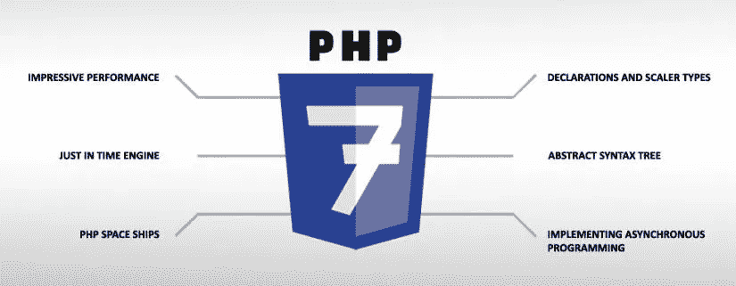

# 如何在 WordPress 中使用 PHP 7

> 原文：<https://medium.com/visualmodo/how-to-use-php-7-in-wordpress-5b793f7f6d16?source=collection_archive---------0----------------------->

PHP 7 终于在一段时间前发布了，它有许多很棒的新特性——它也将帮助你保持你的 WordPress 网站处于最佳状态。现在看看如何在你的 WordPress 中使用 PHP 7 来提高速度。

PHP 7 是服务器端软件历史上最重要的更新之一，它为超过 82%的互联网提供动力，在本指南中，我们将讨论使用它的来龙去脉。

我们将看看 PHP 7 的*难以置信的*优势，并帮助你理解坚持推荐的最低版本(5.6)的*重要性*。你还将学习如何检查你的 WordPress 站点是否为 PHP 7 做好了准备，并衡量升级到这个新版本的利弊。

在本指南结束时，你将*装备*对 PHP 的牢固*理解*，并且*说服*足够更新到*推荐的最低版本*——或者甚至可能采取下一步到 PHP 7！

让我们开始吧…

# PHP 使用指南——什么是 PHP？

对于那些对这个主题完全陌生的人来说，PHP 是一种服务器端脚本语言，旨在根据请求生成 HTML 页面。
把它想象成一个简单的**三步流程:**

*   **输入:**输入一组以 **PHP 脚本形式编写的命令，**作为 PHP 引擎的输入。
*   **处理:**PHP 引擎***执行*服务器*上的*脚本。**
*   ****输出:**输出是由 web 浏览器呈现的 HTML 页面。**

**在上述三步流程中，我们可以识别一些**组件**。**

1.  **PHP 脚本**
2.  **PHP 引擎**
3.  **计算机网络服务器**
4.  **输出 HTML**

**现在，让我们看看它们如何与典型的 WordPress 环境相关联。**

**1) PHP 脚本: WordPress 本质上是一个用多种脚本语言编写的庞大的、有组织的代码集合，比如 PHP、JavaScript 和 [CSS](https://visualmodo.com/) ，其中最主要的是 PHP。这就是 WordPress 的动态本质。**

****2) PHP 引擎:**认为它是*执行*PHP 脚本中的指令的**核心组件**——在运行它的*服务器*的帮助下完成。PHP *引擎*是最关键的组件之一，影响网站的速度、性能和可靠性。也是我们讨论的中心话题！**

**服务器:这是远程计算机，也称为“网络主机”，你的 WordPress 站点就托管在这里。如果有一个没有安装 PHP 的 web 主机，WordPress 就不会在上面运行。**

****4)输出 HTML:** 每次加载 WordPress 网站，PHP 引擎都会被召唤。*脚本*由 *PHP 引擎*使用*服务器*执行，*最终(或输出)HTML* 被导出到访问者的网络浏览器。这就完成了整个过程。**

# **PHP 7 是什么？**

**现在我们清楚了什么是 PHP 脚本，让我们来谈谈 PHP 引擎。在本文的剩余部分，我们将同义地使用术语**‘PHP 引擎’**和**‘PHP’**。**

**PHP 7 是一个 PHP 引擎，于 2016 年 12 月推出，具有大量新功能、性能改进和安全增强。如同每一堂好课一样，让我们从一点历史开始。**

# **PHP 简史**

****

**PHP 于 1994 年作为一种脚本语言由拉斯马斯·勒德尔夫发布，目的是创造一种工具，使更新他的个人主页变得容易。****他一点也不知道这个副业会发展成为超过 82%的网站的动力——包括像** 脸书**和 **WordPress** 这样的大网站。**

**多年来，PHP 已经发布了几个版本。第一个版本是在 1995 年，随后是 1997 年的 2.0 版本。1998 年发布了 3.0 版，随后在 2000 年发布了 4.0 版。**

**是预期让 PHP 7 变得特别吗？**

**这就是事情开始变得有趣的地方。PHP 第 5 版于四年后的 2004 年发布。它继续有**多次**迭代——以至于委员会决定*跳过*版本 6，跳到版本 7。客观地说，PHP 5 的第一次迭代是 2004 年发布的 5.0 版本。它的最后一个迭代，PHP 5.6，发布于十年后的 2014 年。**

**两年后，PHP 7 出现了——迄今为止最有前途的 PHP 版本。从本质上说，世界不得不等待整整 12 年才得到 PHP 7。**

# **PHP 7 中的性能改进**

**等待没有白费。PHP 7 带来了大量的性能和安全性改进。让我们深入了解每一项性能改进，并辅以可靠的基准测试。**

# **1)大幅提高带宽(每秒请求数)**

**运行 WordPress 4.1.1，PHP 7 的性能几乎是 PHP 5.6 的两倍。**

**在上图中，我们可以看到在不到一半延迟的情况下，**的每秒请求数几乎是**的 2.18 倍。******

# **2)降低并发用户的延迟**

**延迟是服务器和客户端之间第一次请求和第一次响应之间经过的时间。延迟越低，服务越好。让我们看看 PHP 7 是如何处理它的。**

**我们根据每个 PHP 引擎的并发用户数量的*选取了三个数据点。***

1.  **橙色条代表十个人同时使用你的网站时的延迟。**
2.  **蓝色条代表双倍(即 20 个并发用户)。**
3.  **粉色条代表 40 个同时使用的用户。**

**在所有情况下， **PHP 7 都将它的前辈打得落花流水。****

******所有这些都在** 完全相同的硬件上！**这意味着，如果您升级到 PHP 7 并做好所有必要的兼容性检查(稍后将详细介绍)，您应该会看到性能提高了两倍。**

# **3) WORDPRESS 4.0 以上版本针对 PHP 7 进行了优化**

**WordPress 4.0 本身已经被**微调**以利用 PHP 7 的最新特性。[根据 Zend](http://www.zend.com/en/resources/php7_infographic) 的说法，与它的前身 WordPress 3.6 相比，它在相同硬件上的性能几乎翻了一番。**

**在上面的图表中，我们看到在一个主要的 WordPress 更新中有一个双倍的性能提升。这个基准是*与 [PHP](https://visualmodo.com/) 的版本*无关。相反，这表明 WordPress 社区正在为即将到来的 PHP 版本不断优化代码。**

# **4)减少 75%的指令，同样的结果**

**PHP 7 还有一个**杀手指令集。**它是**惊人的优化，可以用更少的指令执行同样的任务**。例如，PHP 5.6 上的一个 WordPress 请求在 1 亿条 CPU 指令中执行。而在 PHP 7 中，同样的请求在 2500 万条 CPU 指令中执行。这将**完成相同工作所需的**命令数量**减少了**75%**!****

# **5)显著的性能提升**

**WP 引擎的常驻书呆子 Jason Cosper 喜欢摆弄最新的 PHP 引擎，看看哪个效果最好。**

**在他的一次实验中，他发现 PHP 7 运行 WordPress 4.3.1 和 bbPress 的速度比 PHP 5.5 快 6.6 倍。**

# **2018 年 Q1 WordPress PHP 状态**

****

**现在我们对 PHP 7 的好处有了一个功能性的了解，让我们看看有多少 WordPress 用户在使用它。**

****好消息:**根据[官方 WordPress 统计数据](https://wordpress.org/about/stats/)，截至 2017 年 4 月 20 日，9%的 WordPress 社区已经升级到 PHP 7。**

****好的:**大约 40%的 WordPress 用户正在使用 PHP 5.6。这是一个相对好的消息，因为 PHP 5.6 获得安全支持直到 2018 年 12 月 31 日。**

**然而，真正的坏消息是，超过 50%的活跃 WordPress 网站使用的 PHP 版本早于 5.6，这使得所有这些网站暴露于严重的漏洞问题。**

*   **PHP 5.4 从 2015 年开始[就没有打](http://php.net/supported-versions.php)的补丁了。**
*   **而且 PHP 5.5 从 2016 年开始就没有打补丁了。**
*   **如果你使用的是 5.6 以前的版本(更多关于如何检查你的 PHP 版本的信息)，请立即更新你的 PHP 版本。**

# **希望的灯塔**

**Yoast SEO 的创始人 Joost de Valk 决定对此做些什么，Yoast SEO 是一个拥有超过 300 万活跃安装的 WordPress SEO 插件。引用原文:**

> **从 Yoast SEO 4.5 开始，我们将在 WordPress 仪表盘上向运行 PHP 5.2 的网站管理员显示一个通知。这个通知将是巨大的，丑陋的，不可忽视的。在这个通知中，我们将解释为什么管理员应该升级网站的 PHP 版本。**

# **WORDPRESS 和 PHP 的过时版本**

**在这一点上，指出 **WordPress 将继续支持 PHP 的旧版本**是很重要的。这并不意味着你可以高枕无忧。升级到 5.6 对我们最有利——如果不是 PHP 7 的话。**

**如果你使用的是 PHP 5.6，很快就会有一些事情发生:**

1.  **根据[PHP 官方支持时间表](http://php.net/supported-versions.php)，PHP 5.6 将在 2017 年 1 月 17 日之前获得**官方支持**。已经结束了。**
2.  **好消息是，PHP 5.6 将在 2018 年 12 月 31 日前获得安全支持。**
3.  **当然，你仍然会错过完全零投资就能获得的所有性能提升。**

# **切换到 PHP 7 —值得吗？**

**现在我们已经对 PHP 7 的各种优势有了明确的理解，让我们来解决一个至关重要的问题:**您应该切换到 PHP 7** 吗？**

**做出任何决定的方法应基于*逻辑*。我们将着眼于解决这三个基本问题:**

# **1.转 PHP 7 有什么好处？**

**我们已经讨论了由网络基准支持的五个要点。所有这些都指出了一系列的好处，并且在做出转行的决定时，得到了响亮的**是**。**

# **2.你的 WORDPRESS 主题和插件与 PHP 7 兼容吗？**

**仅仅因为 WordPress 兼容 PHP 7(并向后兼容 PHP 5.6)，难道*不*就意味着它所有的主题和插件都是吗？你可以使用一个定制的主题或者插件，它的特性在 PHP 7 中已经被否决了。你也可以使用一个来自 WordPress 知识库的插件，这个插件已经有一段时间没有更新了。有什么解决办法？**

# **3.如何检查你的 WORDPRESS 站点是否为 PHP 7 做好了准备？**

**幸运的是， **WP 引擎**的慷慨开发者创造了一个非常棒的插件来解决这个问题。**

**介绍 PHP 兼容性检查器:一个扫描你的 WordPress 代码库和活动主题插件的插件，寻找已知的兼容性问题。**

***PHP 兼容性检查器插件支持的 PHP 版本***

**您可以检查 PHP 的五个不同版本的兼容性问题，范围从 5.3 到 7.0。**

**兼容性问题(如果发现)分为**错误**和**警告。**插件将列出违规代码的**文件**和**行号**，以及该代码与所选 PHP 版本不兼容的原因。**

**然而，*有一些限制:***

1.  **该插件无法检测运行时兼容性问题，因为它不执行任何现有的主题和插件。**
2.  **它依靠 WP-Cron 在后台扫描文件，因此 WP-Cron 必须在服务器上启用并工作。**
3.  **偶尔会有[误报](https://github.com/wpengine/phpcompat/wiki/Results)的报告，因为插件无法检测到可能用于向后兼容的未使用的代码路径。**

**PHP 兼容性检查器支持的插件示例列表。**

**总而言之，这是一个非常简洁的插件，它可以告诉你你的 WordPress 堆栈是否准备好升级了！**

# **4.不改用 PHP 7 会有什么危险？**

**以下三点说明不升级到推荐的 PHP 7 的**缺点**。他们还强调了不将升级到**要求的最低**版本 **PHP 5.6 的一些可能的**危险。******

********* *4.1 性能下降:* *首先，你将错过至少两倍的性能提升，而无需投资一分钱。你猜怎么着？如果你用的是 PHP 5.2，据报道它的[比 PHP 7 慢了](https://www.phpclasses.org/blog/post/493-php-performance-evolution.html) **400%！****

****4.2 安全问题:** PHP 5.x 有太多的漏洞，新版本及时修补了这些漏洞。事实上，2016 年实际上是 PHP 安全漏洞创纪录的一年，报告了 100 多个问题，从拒绝服务(DoS)到内存崩溃、恶意代码执行等等。**

> **让你了解一下情况有多糟糕，PHP 5.4 **从 2015 年开始就没有打补丁了，**也不再支持了。然而，21%的 WordPress 用户仍然在使用 PHP 5.4！如果您是该组的一员，请立即更新到 5.6。**

****4.3 损坏的插件:**使用旧的、**不支持的 PHP 版本**会产生插件冲突。最突出的错误之一是“[意外的 T_Function](https://wordpress.org/search/unexpected+T_Function/?forums=1) ”，如下所示。**

***内容锁插件支持线程截图***

**上面的截图是对[内容锁](https://wordpress.org/plugins/content-locker/)插件的[支持查询](https://wordpress.org/support/topic/not-good-82/)。作者明确提到插件工作所需的 PHP 最低版本是 5.4。**

# **5.成功案例**

**看到全球各种组织如何从升级中受益总是令人鼓舞的。**

## **5.1)为 BADOO 省下一大笔钱**

**我们的第一个例子是约会应用 **Badoo** ，它已经成功节省了超过 100 万美元升级到 PHP 7。怎么会？简单！PHP 7 减少了完成相同任务所需的计算能力。因此，做同样的工作需要更少的服务器，最终释放了大约 300 台服务器！**

## **5.2)克林顿电子公司的业绩大幅提升**

**我们的第二个成功故事来自 WP 引擎客户克林顿电子公司。简而言之，他们想要一个加载速度快的动态电子商务商店。选择的堆栈是 WordPress，还有 WooCommerce。他们合作的机构选择 WP [引擎](https://visualmodo.com/)作为托管 WordPress 主机提供商，这反过来又推荐了 PHP 7。这次升级最终成功地将网站的加载时间减少了 60%!**

# **如何用 WordPress 切换使用 PHP 7？**

**首先，使用 PHP 兼容性检查器插件，确保你当前的 WordPress 堆栈与 PHP 7 兼容**。一旦插件给你开了绿灯，继续升级。****

*   **如果你使用的是**共享 WordPress hosting** ，比如 Bluehost，你可以通过四个简单的步骤更新你的 PHP 版本。几乎所有共享的 WordPress 主机提供商都有一个 cPanel 或者一个定制的访问面板，在这里你可以改变 PHP 的版本。**
*   **如果你正在使用一个**托管的 WordPress 托管**提供商，比如 WP Engine，切换到 PHP 7 是小菜一碟——寻求他们的支持，他们会很快完成。**

**WPEngine 使用 PHP 常见问题页面检索于 2017 年 4 月 26 日**

***WP 引擎使用 PHP 常见问题页面，检索时间:2017 年 4 月 26 日***

**对 WP 引擎用户来说，好消息是根据他们的 FAQ 页面，PHP 允许的最低版本是 5.6。**

****为什么选择 WP 引擎？**WP 引擎的诸多优势让它更具吸引力:**

1.  **创新的 WordPress 技术。**
2.  **速度极快的服务器每天能够处理数亿次请求。**
3.  **具有高级 DDoS 保护的核心安全性。**
4.  **上级支持。**

**他们在这个行业已经有几年了，并且赢得了顶级品牌，比如国家地理杂志和 T21。我个人最喜欢 WP Engine 的一点是他们回馈社区的文化——无论是赞助单词营、举办活动，还是构建令人敬畏的免费插件，如 PHP 兼容性检查器。**

**如果你正在考虑升级或者改变你当前的主机提供商，我们强烈推荐 WP Engine 作为你的托管主机提供商，计划从每月 29 美元开始。**

# **包扎**

**让我们快速回顾一下到目前为止我们所学的内容:**

1.  **PHP 为 82%的互联网提供动力，为脸书和 WordPress 等网站提供动力。**
2.  **PHP 的**推荐最低**版本是**5.6**——任何低于这个版本的都是大忌！**
3.  **PHP 7 在性能、安全性和特性方面有了显著的改进——它轻易地将 WordPress 的性能提高了 2 倍，而没有额外的硬件。**
4.  **将 WordPress 转换到 PHP 7 可以带来很多好处，而不需要任何投资。**
5.  **然而，在切换之前，你需要确保你的 WordPress 设置已经准备好使用 [PHP 兼容性检查器](https://wordpress.org/plugins/php-compatibility-checker/)插件升级到 PHP 7。**
6.  **Bluehost 等共享主机支持 PHP 7，但需要手动启用。**
7.  **WP Engine 等托管 WordPress 主机与 PHP 7 有着坚如磐石的兼容性。**

**最终，PHP 会随着每个版本的发布而不断改进。如果你只使用 WordPress 和流行的插件，你可以通过升级到 PHP 7 获得很多。然而，如果你正在使用大量定制的或者不常更新的插件，最好在升级前再坚持几个月。然而，这是*命令*，你必须使用 PHP 5.6 及以下版本！**

****已经在 WordPress 上使用 PHP7 了？想法？****