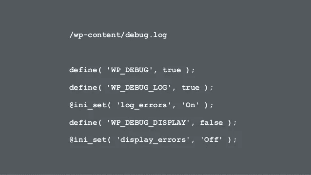

# 如何使用 WordPress 调试日志

> 原文：<https://medium.com/visualmodo/how-to-use-the-wordpress-debug-log-56768a3e7195?source=collection_archive---------0----------------------->

你犯过错误吗？我知道。纠正错误的第一步是知道错误是什么。我不能解决你所有的问题，但是我可以通过帮助你使用调试日志来帮助你修复那些由你的 WordPress 站点上的 PHP 代码产生的问题。

几周前，当我写关于定制你的 WordPress 站点的 wp-config.php 文件时，我谈到了调试设置。我介绍了如何显示错误，以及何时不希望这样做。虽然启用 WP_DEBUG，正如我在那篇文章中所描述的，在开发中是很重要的，但是您可能会有一些非致命的错误和警告，无论出于什么原因，您都不希望向所有的访问者显示这些错误和警告。此外，可能会有你没有意识到的错误和警告，因为你从来没有触发它们，但你的网站的访问者看到了。



出于这些原因，在一个活动的站点上，保持 WP_DEBUG 启用是一个好主意，但是要防止错误被显示出来。为了查看这些错误和警告，您需要将它们写入一个特殊的日志文件，以便您可以查看它们。在这篇文章中，我将介绍设置错误日志和查看日志的各种方法。我还将介绍如何向日志中写入其他信息，以及何时需要这样做。

记录错误，即使您正在显示它们，仍然是有用的，因为拥有错误记录在开发中通常是非常有用的。当错误第一次出现时，您可能无法理解它，但是一旦您从后续工作中获得了更多信息，日志中的记录可能会非常有用。

# 安装

这是我在我的 wp-config 文章中讨论的内容的简要回顾。如果你从来没有编辑过你的站点的 wp-config 文件，或者不知道什么是 WP-config 文件，或者什么是常量，我推荐你阅读那篇文章，然后回到这篇文章。

为了启用调试、防止显示错误和警告以及记录错误，您需要在 wp-config 中使用这三行代码:

```
define( 'WP_DEBUG', true );
define( 'WP_DEBUG_DISPLAY', false );
define( 'WP_DEBUG_LOG', true );
```

需要注意的是，除了启用调试显示(debug display)之外，您无法阻止致命错误导致白屏死机，调试显示会向您显示包含错误的白屏。

# 查看调试日志

实际的调试日志保存在站点内容目录中名为 debug.log 的文件中。查看和清除日志的一种方法是直接访问该文件。这不是一个特别好的工作方式，尤其是如果你的站点在远程服务器上。有一些插件可以使调试日志变得更容易，我将很快对此进行讨论。也就是说，熟悉这种方法是很重要的，如果你由于一个致命的错误而不能访问 WordPress 后端，你的调试日志可能会有线索来理解为什么。

有多种方法可以从 WordPress 后端查看你的调试日志。我的首选方法是使用[日志查看器插件](https://wordpress.org/plugins/log-viewer/)。这个免费的插件给你两种方法来查看你的调试日志，以及清除它的能力。当这个插件被激活时，你可以从它的管理页面查看你的日志，这个页面可以从工具菜单里面进入。此外，如果你激活了[调试栏插件](https://wordpress.org/plugins/debug-bar/)，这是 WordPress 最有用的开发工具之一，那么你可以从调试栏的面板上查看你的日志。我不建议在实时网站上激活调试栏，所以两个选项都有是很好的。这两个插件都可以从 WordPress 插件安装程序中安装，或者通过[开发者插件](https://wordpress.org/plugins/developer/)安装，这个插件有很多有用的工具可以帮助你改进开发。

调试日志视图如下所示:


正如你所看到的，每次 WordPress 遇到一个警告或错误，或者生成一个通知，错误、警告或通知都会被写入日志，并带有一个 UTC 的时间戳。

# 将其他信息写入日志

在某些情况下，您可能希望将信息写入日志，即使这在技术上不是错误。PHP 有一个名为 error_log 的函数，它会将信息打印到错误日志中。默认情况下，它不会正确打印和格式化。出于这个原因，我建议为您的站点添加一个额外的函数来处理格式。它是 error_log 的包装器，使用 print_r()在记录数组和对象之前对它们进行适当的格式化。该函数如下所示:

```
if ( ! function_exists('write_log')) {
   function write_log ( $log )  {
      if ( is_array( $log ) || is_object( $log ) ) {
         error_log( print_r( $log, true ) );
      } else {
         error_log( $log );
      }
   }
}
```

我强烈建议不要将这个添加到你的主题的 functions.php 中，因为在这种情况下，如果你采取普通的调试步骤切换到默认主题，它将不再工作。相反，为这个功能创建一个插件。这样做只需要在你的插件目录下创建一个文件，添加一个插件头和这个函数。标题可以像这样简单:

```
/*
Plugin Name: Log Error
*/
```

一旦你有了这个功能，它就有了多种用途。想知道某一行代码是否被调用过？使用:

```
write_log( __LINE__ );
```

你甚至可以用它来收集关于你的网站的基本情报。例如，想要记录特定帖子何时被查看以及查看的用户是否登录？下面是一些简单的代码:

```
add_action( 'wp_head', 'slug_log_post_view' );
function slug_log_post_view() {
   //set the ID of the post you want to track here:
   $post_to_track = 42;

   //get the current post's ID & make sure it's a valid ID and it matches our ID
   $id = get_queried_object_id();
   if ( intval( $id ) > 0 && $post_to_track === $id ) {

      //check if current user is logged in and if so get the user ID
      if ( is_user_logged_in() ) {
         $user_id = get_current_user_id();
         $user_id = 'a user with the ID ' . $user_id;
      }
      else{
         $user_id = 'a user that was not logged in.';
      }

      //log the information
      write_log( "The post {$post_to_track} was accessed by {$user_id}" );

   }

}
```

虽然这个功能不是谷歌分析，但它确实提供了一种快速而肮脏的方式来收集特定帖子的情报。确保在变量$post_to_track 中设置正确的文章 ID。您甚至可以为所有帖子启用此功能，方法是取消检查以查看$post_to_track 是否等于$id。如果是这样，请确保将最后一行改为使用$id，而不是$post_to_track。

# 所有的孩子都喜欢原木

我希望这篇关于 WordPress 错误日志的介绍已经向你展示了如何使用 WordPress 的这个经常被忽视的功能来帮助你调试你的站点上的任何问题。不要忘记 PHP 错误并不是您可能产生的唯一错误类型。还有 JavaScript 错误，这些错误会显示在浏览器的 JavaScript 控制台中。