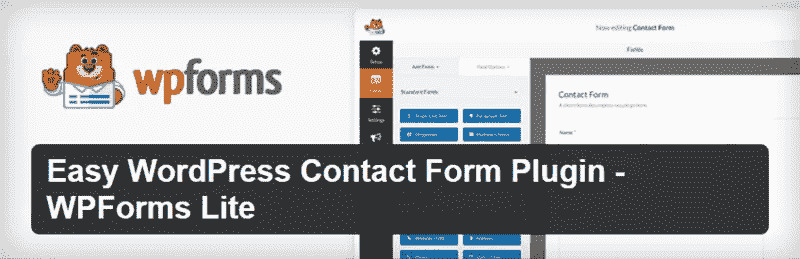
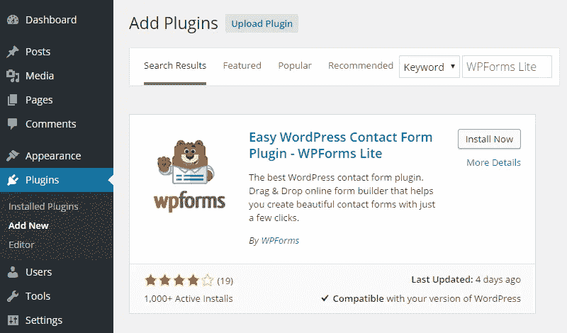
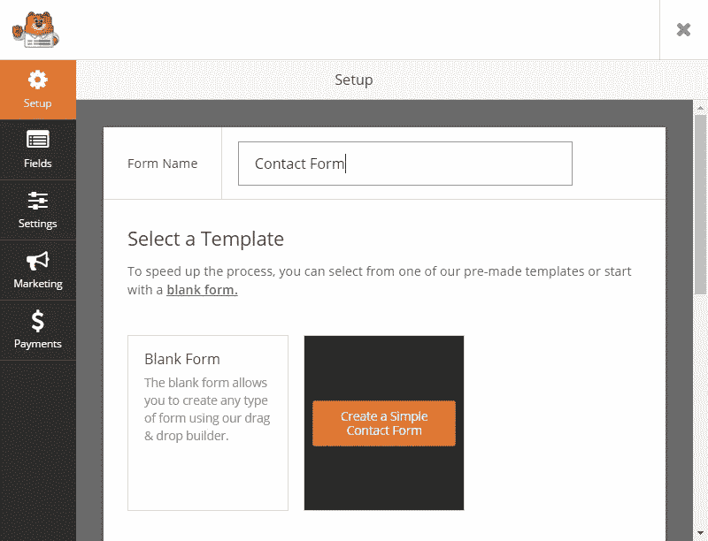
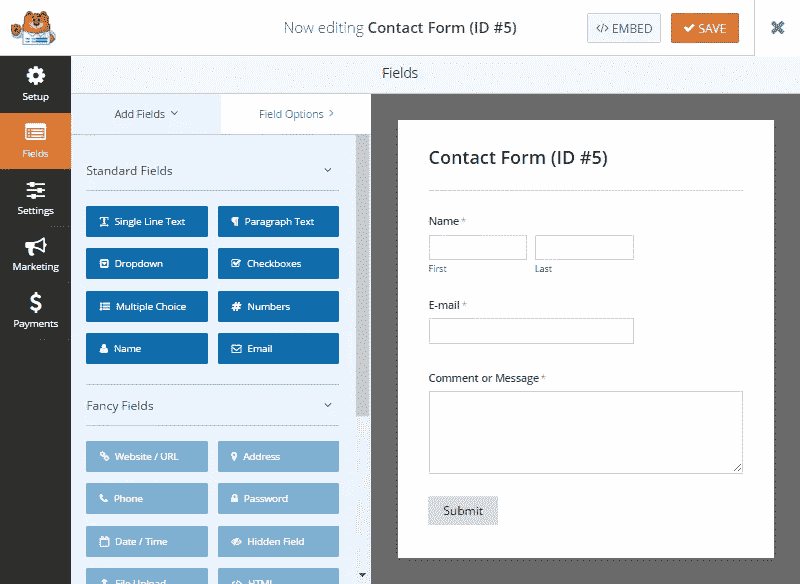
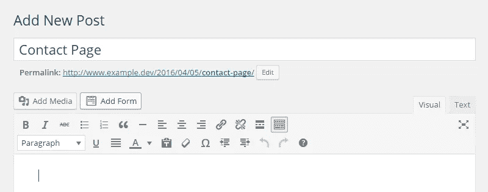
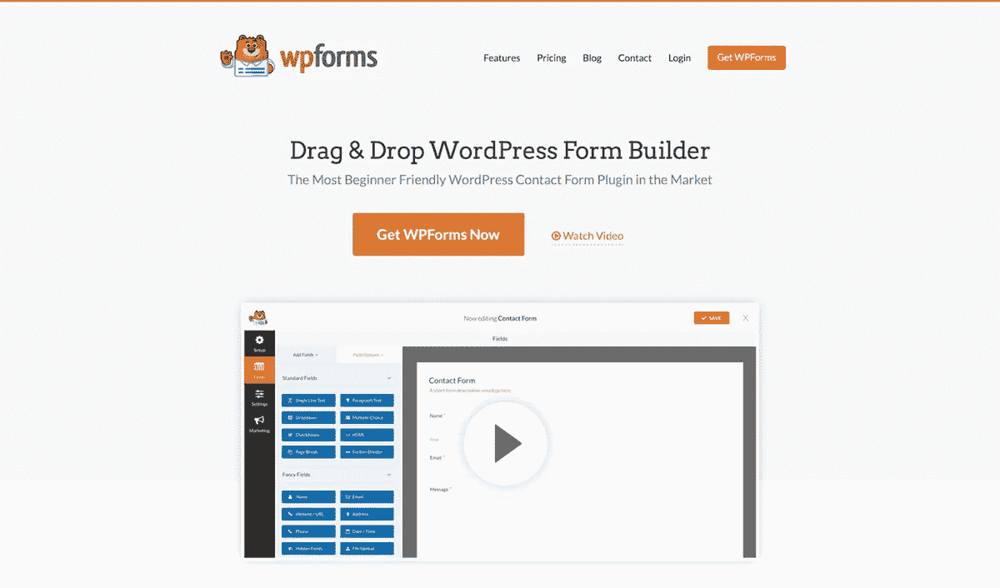

# 如何使用 WPForms WordPress 插件

> 原文：<https://medium.com/visualmodo/how-to-use-wpforms-wordpress-plugin-124f3d9bbe6c?source=collection_archive---------0----------------------->

要在你的 WordPress 网站上添加联系表单，最简单的方法是使用一个专门构建的插件——其中一个是 OptinMonster 和独白背后的团队新发布的非常强大的 WPForms。

下面，我们将向你展示如何使用免费版的 [WPForms Lite](https://wordpress.org/plugins/wpforms-lite/) 为你的 WordPress 支持的网站快速简单地创建一个基本的联系表单。

# 为什么要使用 WPForms？

说到 [WordPress](https://visualmodo.com/) 联系人表单插件，有很多可供选择。然而，WP-Forms 提供了一种最快捷、最简单的方式来为你的网站添加联系表单，同时如果你有更高级的需求，还可以选择升级你的表单。

因为有了 WPForms 模板，你可以立刻在你的 WordPress 网站上添加一个联系表单，并且，如果你需要的话，直观的拖放表单生成器工具可以帮助你为几乎任何目的创建自定义表单。

所以，现在你知道了为什么插件是一个好的选择，我们将向你展示如何使用这个免费的插件为 WordPress 创建一个基本的联系表单。

# 如何将 WPForms Lite 插件添加到你的 WordPress 网站

用 [WP-Forms](https://visualmodo.com/) 创建基本联系表单的第一步是将插件添加到你的网站。该插件有两个主要版本:一个免费版本和一个更高级的商业版本。然而，如果你想要的只是一个基本的联系方式，免费版是一个非常合适的选择。

将插件添加到你的网站的最快方法是登录到你的 WordPress 管理区并导航到仪表盘的插件部分。

从添加插件页面，在搜索框中输入“WPForms Lite ”,并安装结果中返回的第一个插件。

在下一个屏幕上，点击激活插件链接，联系人表单生成器就可以在你的 WordPress 网站上使用了。

# 如何用 WPForms 创建一个基本的 WordPress 联系人表单

作为成为最友好的用户界面插件的一部分，这个插件在激活后会显示一个有用的欢迎信息。

在欢迎屏幕上，您可以观看一段视频，指导您使用 WPForms 创建第一个联系人表单，或者只需点击插件→添加新链接即可开始。如果出于某种原因，欢迎屏幕没有显示，您可以通过点击插件侧边栏菜单，然后选择添加新项目来创建一个新的联系表单。

点击添加新表单链接后，将显示[插件](https://visualmodo.com/)用户界面。在这里，您可以为表单命名，例如联系人表单，然后从可用选项中选择一个模板。

虽然您可以从空白表单开始，但是建议您选择简单的联系人表单模板。

对于大多数目的，简单的联系表单[模板](https://visualmodo.com/)应该足够了。但是，如果您想要修改基本的联系人表单，您可以单击左侧面板中的任何标准字段，将它们添加到您的表单中。不过，如果你想使用任何花哨的字段或支付字段，你需要升级到专业版的联系表格插件。

如果你点击左边面板上的一个表单域，它会立即被添加到你的表单中。从那里，您可以将它拖放到一个新的位置，或者单击该字段进行编辑。

表单字段的编辑在左侧面板中进行，允许您修改字段标签和描述、设置字段大小以及输入任何占位符文本。一旦你对这个表格满意了，点击保存按钮就可以使用了。

# 配置您的联系人表单

你用插件创建的每个表单都可以被配置成更好地满足你的需求。单击表单生成器屏幕上的设置选项卡，打开您正在处理的表单的配置选项。

设置分为三个部分，包括表单的常规、通知和确认选项。

通过[常规](https://visualmodo.com/)设置，您可以编辑表单标题和描述，更改提交按钮文本，以及启用反垃圾邮件蜜罐功能。它建议使用最后一个选项，因为这将有助于减少您收到的垃圾邮件提交的数量，而不会影响用户对表单的体验。

通过通知设置，您可以选择将向哪些电子邮件地址发送表单提交警报，并且您可以使用确认设置来自定义访问者使用表单后显示的消息。或者，您可以选择一个页面或输入一个自定义 URL，以便在表单提交后显示。

同样，一旦您对表单确认感到满意，单击 save 按钮提交您的更改。

# 在您的网站上发布联系表单

保存表单后，您可以将其添加到您的 WordPress 网站，以便访问者可以使用。点击表单生成器屏幕上的嵌入按钮会显示一个短代码，你需要将它添加到 WordPress 帖子或页面来发布表单。

另一种向网站添加表单的方法是打开 WordPress 文章或页面进行编辑，然后点击添加表单按钮。

从弹出窗口中，您可以选择要插入的表单，也可以选择是否显示您的表单标题或描述。

插入表单后，短代码将被添加到您的帖子或页面中。然后，在发布时，短代码将被相应的形式替换。

现在，如果你的访问者想给你发信息，他们所要做的就是填写表格，然后点击“发送”。

# 管理你的 WordPress 联系人表单

如果您需要对您的联系人表单进行任何更改，您可以从插件菜单上的“所有表单”项中访问它们。

从你的 WordPress [仪表板](https://visualmodo.com/)的这个部分，你可以删除或编辑任何现有的表格，并且，如果你升级到专业版，你可以查看由你网站的访问者提交的表格条目。

由于 WordPress shortcodes 的强大功能，您所做的任何更改都会立即反映在您发布的表单中(在我们之前的文章中可以找到更多信息，WordPress Shortcodes 已解释过)。

# 最后的想法

正如你所看到的，免费的 WPForms Lite 提供了一个非常简单的方法来添加联系表单到 WordPress 网站。

通过使用标准的联系人表单模板，您只需点击几下就可以将这种类型的表单添加到您的网站上——而且，多亏了拖放编辑器，如果您确实需要对模板进行更改(例如添加表单字段或修改默认文本),整个过程真的非常简单。

注意:要了解更多关于 WP-Forms 的高级特性和功能，请务必查看我们深入的 WPForms Pro 评论。

**使用 WPForms 了吗？想法？**