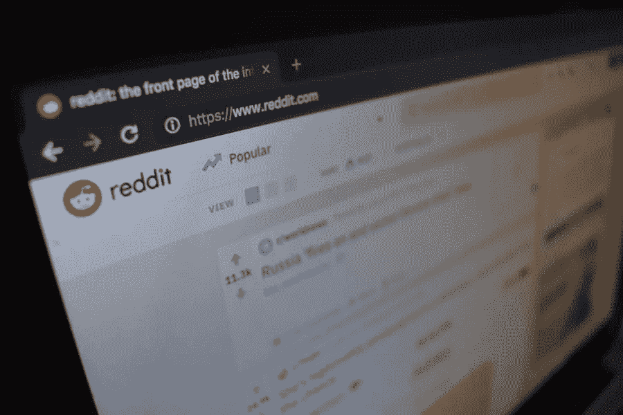

# 如何利用你的网站获得更多的 Reddit 订阅者？

> 原文：<https://medium.com/visualmodo/how-to-use-your-website-to-get-more-reddit-subscribers-52c49722f9f2?source=collection_archive---------0----------------------->

每个人都知道 Reddit 是互联网的首页。有来自世界各地的敬业、受过教育、乐于奉献的成员。它就像一个大型论坛，成员们可以分享和讨论他们喜欢的任何东西。许多营销机构也将 Reddit 作为营销目标。在这篇文章中，我们将学习如何使用你的网站来获得更多的 Reddit 订阅者。

如今，该平台上有数百万个子 red dit。你可以找到几乎所有种类的子主题——无论你是在寻找新闻、小说、笑话、科学、娱乐等等。你可以在这个巨大的平台上找到一切。

许多人制作新的 subreddits，但获得订户并不容易。你需要努力在那里获得订户。你的订阅者就是你的观众，他们可以把你的博客提升到一个新的高度。在会员/订阅者的帮助下进行讨论。通常，人们会创建子街道来聚集有相同兴趣的人，但这不是一蹴而就的事情。你需要建立一个可以为社区提供价值的真实的观众群。在这个平台上建立受众的最快方法是从合法的供应商那里购买真正的 Reddit 用户。如果你不确定如何找到一个合法的营销服务提供商。

除此之外，获得 Reddit 订阅者的另一种方式是你的网站。如果你有一个网站，那么你可以为你的子网站获得更多的观众和订户。

今天，我们将分享几个步骤，可以帮助你从你的网站上获得更多的 Reddit 订阅者。让我们开始讨论。

# 使用社交 Reddit 源小部件

你的网站访问者如何知道你的 subreddit？

答案很简单；你需要告诉他们。但是怎么做呢？

如果你使用的是 WordPress 网站，那么你可以很容易地使用社交 Reddit Feed Widget。这个小工具将帮助您在网站上显示您的订阅源。您可以选择任何想要的位置来显示提要。您可以在侧边栏或任何您想要的地方显示提要。这是告诉你的网站访问者你在 Reddit 上很活跃的最简单的方法之一。因此，这是获得更多 Reddit 订阅者的好方法

这个小部件的安装非常容易。你可以从管理面板通过 FTP 或 zip 文件安装插件。安装非常简单。安装后，您可以将提要放在任何您想要的地方。您只需要输入用户名来获取提要。您还可以控制将出现在网站上的源的数量。feed 还显示了每个帖子的评论和投票。

一旦你在你的网站上使用了你的订阅源，人们就会更多地了解你和你的订阅源。如果你用博客的名字创建了 subreddit，他们也会了解你的 subreddit。

你也可以告诉他们你的 subreddit。这样，你就可以建立一个喜欢你博客的人的社区。他们肯定会订阅你的。此外，如果你的网站上有新访客，那么他会通过 feed 了解你的 Reddit 活动。它可以吸引新用户。

# 为更多的 Reddit 订阅者分享 Reddit 帖子

如果相关的话，你可以在你的博客文章中链接到 Reddit 的文章。在博客帖子的评论区开始讨论很难，但是你可以使用 Reddit 帖子很容易地开始讨论。

你的博客读者在看完帖子后会对讨论有所了解。Reddit 有着多元化的背景，不同的人在这里分享他们对某个话题的想法。因此，链接一个帖子真的很有帮助。在你写博客之前，最好在你的 subreddit 上开始讨论。

这样，你就可以将 subreddit 上的文章链接到你的博客文章上。它将为读者提供更多的价值。你的博客的访问者会很乐意订阅。您必须链接到您的 subreddit 帖子，但您也可以链接到其他人的帖子。

# 最后的想法

制作一个 subreddit 很容易，但是获得订户却一点也不容易。你需要把其他来源的人带到你的 subreddit。

一个很好的来源是网站。你可以把你的网站访问者带到你的 subreddit，如果他们喜欢你的内容，他们就会订阅。我们分享了两种获得 Reddit 订阅者的方法。

其中一个是使用 Reddit Feed 小部件，另一个是将相关的 Reddit 帖子链接到您的博客帖子。您可以在自己的网站上轻松实现这两种方法。总之，这是一个获得 Reddit 订阅者的好方法。