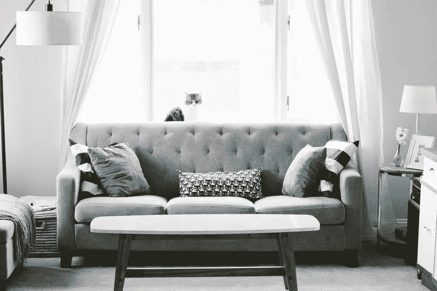

# 如何使用 L 沙发？

> 原文：<https://medium.com/visualmodo/how-to-work-the-l-sofas-32a7e0a834d?source=collection_archive---------0----------------------->

你是买新房还是翻新旧房？无论哪种方式，你知道你需要在你家的座椅家具坐。购买或使用座椅的最佳方式是选择功能齐全的组合沙发。它们节省空间，放在家里很棒。在本文中，我们将解释如何搭配 L 形组合沙发，让它最适合你的房间。

# 为什么你应该为你的客厅选择 L 型组合沙发？

正如我们提到的，这些沙发是节省空间的沙发，可以在城市阶梯上找到它们。他们可以以不同的方式，你会被他们的专业知识震惊，他们能给你的室内装饰带来最好的主流外观。

这些 L 形沙发最适合居住空间狭小的情况，它们有多种配置和种类。它们是由来自世界各地的材料制成的。它们还具有多种配置，因为任何点都可以进行定制。你可以让一只手臂比另一只短，让它更有个性，或者你也可以用不同的颜色来设计它们。它们也可以是带床附件的沙发、模块式沙发或可拆卸式沙发。

# 分隔房间

这些沙发大受欢迎的另一个原因是，它们可以分隔芽房，在一个生活空间中创造出许多多重生活空间。如果你有一大群各个年龄段的人，那么你大概可以用家具把他们分开！你可以有一个很大的布艺转角沙发，非常柔软，让人不想从那里起来。或者，你也可以选择转角沙发，借助混搭面料，随心所欲地打造完美的 L 型沙发！它物有所值，还能彰显风格，所以你完全不用担心 L 形沙发的造型。

角落沙发的圆滑线条可以提供更多时尚的证据，这是对现代家具的完美诠释。选择 L 型沙发可以是多功能和时尚的完美结合。你可以看一看物有所值的豪华公寓。

# 如何使用 L 形沙发？

# 在角落

你可以把这些沙发放在角落里，这是最流行的方法来容纳你的 L 型沙发。扶手靠着墙壁，是小客厅的理想选择。这是因为即使是闲置空间也为地毯和茶几腾出了更多空间。如果你想保持时尚，还可以在另一边放一些脚垫和扶手椅。

# 把它们堆在墙上！

另一种方法是将它们靠墙放置。另一个臂可以很好地作为分隔物。小客厅可以是一个组合式沙发，旁边有一个地方作为靠背。这可以是靠近前门，可以给出一个伟大的入口通道。沙发扶手没有靠背，你也可以把它当作躺椅使用。如果沙发的一端不在，你仍然有足够的空间容纳其他人。如果你有两张独立的沙发垂直摆放。

# 空间中央摆放着一张异形沙发

当你有一个大客厅时。这种摆放方式效果最好，因为你可以探索开阔的空间。沙发可以放在焦点上，或者是一个你可以看电视的完美位置。有一面陈述墙。沙发座位后面的空白区域可以放一些有创意的东西。摆放一些花盆或书籍。旅游纪念品也可以，但要确保你有一个很棒的展台或边控制台。

# 你可以使用哪些不同的配件？

L 形沙发可以有多种摆放方式，你可以将这些区域分割开来，而无需放入更多家具。你可以有一个独立的地方或高背可以服务的目的。有很多方法可以将客厅这样的空间从不同的区域划分开来。靠垫可以是很好的配饰，不要因为这是新家就太过分了。坚持最多六七节。

# 结论

因此，L 形沙发或组合式沙发非常棒，而且非常舒适。此外，对于喜欢招待客人的家庭来说也很实用。