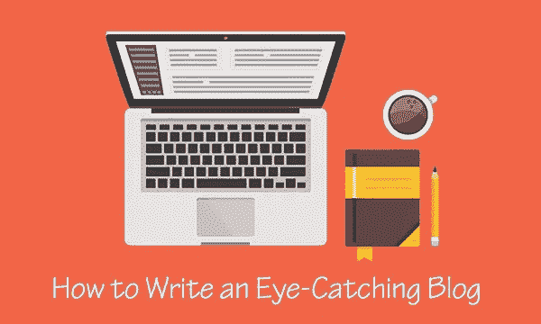

# 如何为你的博客写引人注目的标题

> 原文：<https://medium.com/visualmodo/how-to-write-eye-catching-titles-for-you-blog-6ecf1dbbc6a?source=collection_archive---------0----------------------->

在新闻业、博客业或学术界，引人注目的头衔可以成就你，也可以毁掉你。标题的作用是抓住读者的注意力，并给出文章内容的一些想法，而不透露太多。在互联网上，内容大部分时间是通过社交媒体承载的，注意力很少，标题必须在有限的时间跨度内实现很多，就像一个 [*电梯推销*](https://en.wikipedia.org/wiki/Elevator_pitch) *。*

*在线出版物从《卫报》等高质量新闻到 Buzzfeed 或 Mashable 等更具娱乐性的网站。不管编辑方针如何，他们都争取朗朗上口的* [*书名*](https://visualmodo.com/blog/) *。以下是实现这一点的一些方法:*

# 写引人注目的标题

# 激发好奇心

人们只会在标题刺激下阅读文章。让人们阅读的一个好技巧是使用一个蹦床，就像这个来自 [**福布斯:**](https://www.forbes.com/sites/billybambrough/2018/07/24/bitcoin-just-hit-8000-heres-whats-pushing-it-up/#3b3a028c88f5) “比特币刚刚达到 8000 美元——这是推高它的原因”。一个好的技巧是介绍一个事实，并给出一个更大的解释。

# 使用有效的公式

根据[Inc.com](https://www.inc.com/larry-kim/74-attention-grabbing-blog-titles-that-actually-work.html)的说法，许多有效的标题实际上都是遵循一个模板，进入其中一个类别:

*   如何标题

这种类型尤其适用于教程。*“有些目标群体确实是以快速有效地学习为导向的，比如大学生。如何文章完美地为教程工作？我从丰富的经验中了解到这一点，”*RatedByStudents 的社区经理丹尼尔·斯库特里认为。

甚至在购物时，“如何做”的文章也是有用的。以这个标题为例:“如何获得 MacBook 和其他苹果产品的学生折扣”。

*   指南标题

这种类型要在标题中用“导”字，解释清楚最终的结果是什么。这是一个很好的标题:“18 个夏天:不要和你的孩子浪费一个假期的终极指南”

*   “在此插入形容词”实现某事的方法

在最近的一次营销会议上，[GetGoodGrade.com](https://getgoodgrade.com/)公司的产品开发人员 Tristan Scott 说:“*人们经常关注你通过一篇文章带给他们的解决方案的质量，就像在营销中你必须告诉他们产品*的好处一样。”。

所以，给你的标题增加一些质量，让它更有价值:“迅速”、“容易”、“很棒”、“棒极了”、“令人惊叹”以及更多的形容词可以说服人们继续读下去。

*   基本—您需要知道的一切

如果这篇文章省去了阅读大量信息的努力，那么它对读者将是有用的。通过阅读这篇文章，你一定会得到简明的信息和最佳的结果。

*   “的秘密”或提示

透露一些秘密或提示总是让人们有兴趣阅读一篇文章的好方法。它还激发给出一个定量的指示，就像在这个例子中:

来自 Entrepreneur.com[的“如何推进女性职业发展的 3 个建议”。](https://www.entrepreneur.com/article/317225)

这是一张来自 [Twelveskip](http://www.twelveskip.com/guide/blogging/1247/blog-post-title-templates-that-work) 的有用信息图，它更深入地展示了如何为你的标题使用有效的模板。

# 利用标题的变革力量

Buzzsumo 对 1 亿篇网络文章进行的研究显示，表现最好的标题包含“可以让你”的词语，换句话说，人们正在寻找他们从阅读一条信息中获得的个人效用。

这也是一个关于情感影响的内在承诺。情绪的调色板可以包括积极的情绪，如期望、兴趣、喜悦，也可以包括消极的情绪，如厌恶、愤怒或悲伤。

下面是一些通过“那能让你”链接的例子:

*   “让你对美好世界充满希望的 20 张照片”
*   "这位父亲为他女儿所做的会让你心软"
*   “6 个技巧，让你成为更好的朋友，而不会失去任何东西”。

# 为了 SEO，插入一个关键词

来自 [HotEssayServices](https://hotessayservice.com/) 的 SEO 专家 Krystina Klein 对有效标题有一个更务实的看法:“*我经常发现网站必须适应用户的旅程，用户通常会通过搜索到达网站。我认为在标题中使用一个强有力的关键词是很关键的。*

# 限制长度

使标题可读的最大长度是 70 个字符，这是谷歌搜索引擎新使用的规则。该规则允许 10–15 个额外字符，在此之后，内容将被截断，用括号表示。

尽管《赫芬顿邮报》没有培养最短的标题，但这无疑是让人们继续阅读的有效策略的一部分。

以下是一些很好的例子:

*   " 18 件你会后悔在诺德斯特龙打折时买的秋装"
*   “是什么让雪儿的职业生涯如此独一无二地具有标志性”
*   “干旱肆虐欧洲，农作物歉收和破产威胁农民”

# 做你的研究

在撰写文章时，使用与您的需求相关的在线工具。如果你正在寻找一个更学术的内容，使用来自[Thesaurus.com](https://www.thesaurus.com/)、[奖励计划](https://rewardedessays.com/)或[最高学位论文](https://supremedissertations.com/)的资源。如果你考虑翻译其他语言的内容，请选择来自 IsAccurate.com 的帮助。

最后但同样重要的是，注意语法。正确的英语规则建议你应该大写名词、代词、动词、形容词和副词。要更深入地了解这些规则，请查看本指南。

# 最后

伟大的标题能激发人们的想象力。只要有一个故事有改变角色或读者的可能性，人们就会想知道接下来会发生什么。

简介:利昂娜·亨利森是一位经验丰富的博客写手，也是《随笔供应》杂志的 UX 设计师。当她不写作或设计时，她会游泳、远足，如果天气允许，还会滑雪