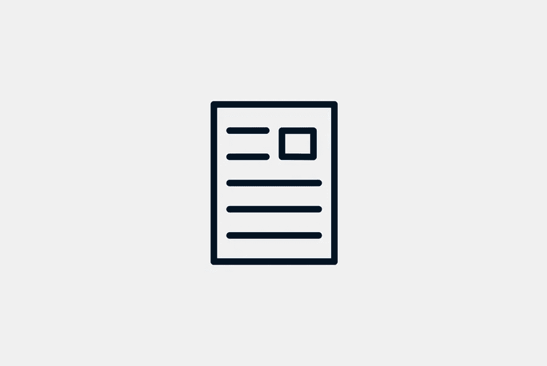

# 如何写出吸引点击的标题

> 原文：<https://medium.com/visualmodo/how-to-write-great-headlines-that-earn-clicks-e6df85cd2cb5?source=collection_archive---------0----------------------->

你为内容选择的标题是人们首先看到的东西之一。无论他们是通过搜索引擎找到你，还是你在社交媒体上分享你的内容，他们都会先阅读你的标题，以了解内容是什么。在这篇文章中，你将会看到如何写出吸引点击的标题。

这使得醒目的标题鼓励人们点击你的链接变得至关重要。你的标题需要引人入胜，需要为读者提供有价值的东西。他们会从你的内容中得到什么？如果你想提高你的点击率，你需要掌握标题写作。

本指南将为你提供一些最有价值的提示，让你写出令人惊叹的标题，让更多人点击你的内容。

# 列一个清单，写出能赢得点击的标题

如果有一件事很容易注意到，那就是许多标题关注的内容是某种列表或编号的文章。人们喜欢这样的文章，其中的信息对他们来说已经被分解成容易消费的大块。这使得获取更小的信息变得容易，他们甚至可以在阅读内容和做其他事情之间切换。这是在你写内容之前要考虑的事情，这样你才能写一篇有编号的文章或“列表条”。

当你把一个数字放在标题的开头，它会立刻吸引眼球。你可以看到“改进网站设计的几种方法”和“改进网站设计的 10 种方法”的区别。它向读者展示了他们将会得到什么。

# 具体来说，要写出吸引点击量的好标题

说到向读者展示当他们点击你的链接时会发现什么，你的内容包含的具体和清晰是值得的。如果不清楚，可能更容易被忽略，特别是如果读者觉得它令人困惑或者没有得到任何关于内容重点的真实信息。如果你的标题让读者对他们将要阅读的内容产生疑问，它就没有很好地完成它的工作。更糟糕的是，他们可能会点击它，以为他们会找到一样东西，但随后意识到这不是他们所期望的，然后离开。

写标题时尽量详细，同时保持简洁。尽可能的清晰，这样你的读者就不会有任何混淆的机会。

# 告诉你的读者他们如何受益

人们想知道如果他们点击一个链接，他们会从中获得什么。他们将如何从点击中获益？你的标题应该让他们知道他们将会学到什么，或者他们将会得到怎样的娱乐。他们有什么理由点击你的链接？

你应该让你的读者知道你的内容如何对他们有用。标题可能会告诉他们你的内容包含什么样的有用信息，比如做某事的指南。这也可能让他们知道他们将获得什么样的知识，无论是阅读最新的新闻故事还是每个人都应该知道的行业秘密。另一种吸引读者的方法是，当他们点击你的链接或在你的登陆页面上注册时，给他们一个明确的奖励，比如免费下载。

# 让读者写出吸引点击的标题

当你写标题时，直接面对读者通常是最好的方式。你应该使用第二人称，用“你”和“你的”来称呼你的读者，使你的标题更加个性化。不要只是告诉他们你的文章将向他们展示“节省能源账单的 5 种方法”，让他们知道你有“节省能源账单的 5 种方法”。虽然这可能看起来是一个微妙的区别，但它可以以非常不同的方式阅读，并直接与读者交流。