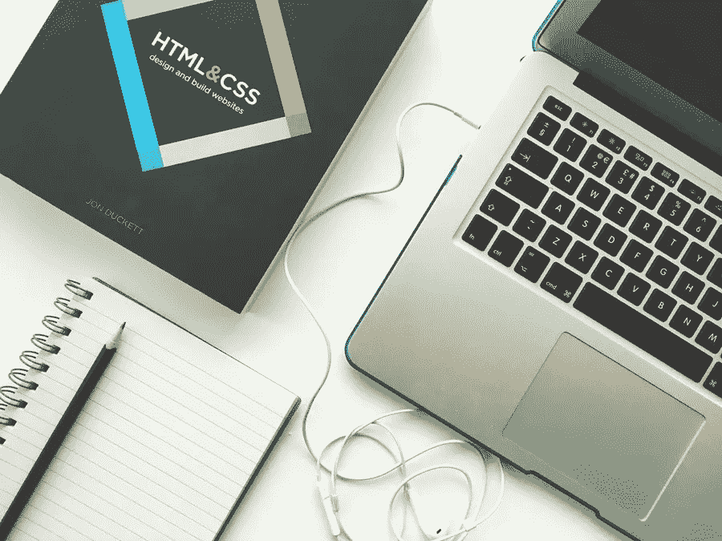

# 网站设计是如何随着时间的推移而改变的

> 原文：<https://medium.com/visualmodo/how-website-design-has-changed-over-time-31fe5d36986e?source=collection_archive---------0----------------------->

## 以及 2019 年的预期

我们今天所知道的网页设计经历了一个漫长的旅程才成为现在的样子。从最初的以单栏、基于文本的 HTML 页面为主的网站，到如今根据所用设备而变化的响应式网站，网站设计的快速进步在过去三十年里极大地改变了一切。

# 90 年代中期的网站设计

在 Tim Berners Lee 的第一个网站发布后发生的变化包括令人难忘的设计元素，例如:

*   背景图片通常被分割并插入表格中
*   好的网站设计原则通常意味着看起来最先进的东西
*   框架页面是一种流行的方式，可以清楚地区分侧栏导航和网站内容的主体

# 90 年代末的网页设计

90 年代末，[*【CSS】*](https://en.wikipedia.org/wiki/Cascading_Style_Sheets)级联样式表被推出。这一发展使得设计师能够将网页内容与设计分开。页面的设计元素，如文本大小和背景颜色，可以在样式表中定义，而不是在页面本身的 HTML 中定义。

# 21 世纪 HTML 的进步和表单的引入

2000 年代中期， *HTML 变得更加高级*。导航栏开始移动到页面的顶部。下拉菜单成为导航的首选，表单开始被使用。这一时期最重要的进步之一是用户创建内容的出现。用户可以创建和定制在线个人资料、日志集和照片。

# 2010–2016:时尚的网页布局和背景

自 2010 年以来，设计窄窄的、有质感的杂志式布局已经成为一种上升趋势。

网站被格式化成又高又瘦，不像以前那样又短又宽。导航已经变得最小化，只限于网站最重要的区域。手机友好的网页设计也占据了网页设计发展的中心位置。设计师一直热衷于创建与智能手机硬件通信的移动响应网站，以确保内容以最用户友好的方式投影。然而，这一进步不仅仅局限于手机友好性。2016 年后的发展坚持普遍应对。

# 2016 年至今:完全响应的网站

从 2016 年开始，我们看到响应式网站越来越受欢迎。这些网站根据用户使用的设备而变化。因此，无论您使用的是台式机、笔记本电脑、平板电脑还是智能手机，响应式网页设计都能确保您获得网站及其内容的最佳视图。

# 网页设计氛围的其他变化

*   ***兼容性和灵活性:*** 随着互联网的进步和社交媒体的出现，浏览互联网变得更加复杂。这使得网页设计变得更加灵活，而不仅仅是功能性的。其他网络浏览器的引入，如 [Mozilla、Chrome、Opera](https://www.digitaltrends.com/computing/best-browser-internet-explorer-vs-chrome-vs-firefox-vs-safari-vs-edge/) 等，也让设计师们注意确保他们创建的网站与现有的网络浏览器兼容。
*   ***极简/扁平化设计:*** 扁平化设计是网页设计的又一个潮流。设计师和用户继续接受极简二维设计风格的效率和愉悦。平面设计强调功能性而非装饰性设计元素。与访问者的交流是优先的，这就是为什么图标和按钮优雅地屈从于内容。网站管理员通常会将内容放在最前面，降低网站设计的复杂性。
*   ***网页设计模板:*** 在网页设计发展的古代，只有少数人会管理网站开发的任务，与此不同，今天几乎每个人都可以通过网页设计模板来设计网站。任何接触过 IT 的个人都可以创建和发布一个网站。然而，这并不意味着任何人都可以提出一个可用、高效和美观的网站设计。一个需要为自己的企业建立一个严肃网站的企业主应该雇佣一名专业设计师，这是一个良好的商业纪律。

展望 2019 年和未来，杂志网站预计将变得更加突出。在当今快节奏的世界中，如果网站想要保持有价值的流量，信息只需要点击一下就可以获得。

网页设计也有望利用电脑和手机日益增强的功能。随着这些设备变得更加复杂和强大，网站将能够包含大量的内容，但这将需要更加精心的设计。网络开发者也有必要运行更强大的软件来帮助他们设计最好的网站。