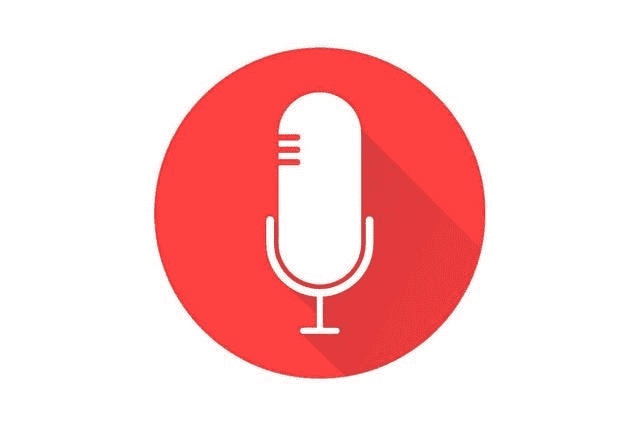

# 2021 年，语音搜索将如何影响你的搜索引擎优化

> 原文：<https://medium.com/visualmodo/how-will-voice-search-impact-your-seo-in-2021-e7c52c452eef?source=collection_archive---------0----------------------->

当大多数人在谷歌中输入一个查询时，他们希望搜索引擎做什么？首先，他们想了解他们的查询是什么意思。然后，他们希望它显示与他们的搜索查询相匹配的最佳结果。在这篇文章中，看看语音搜索将如何影响你的搜索引擎优化。

然而，我们在谷歌上输入问题的方式与我们对语音控制的助手说话的方式非常不同，比如 Alexa 或 Siri。例如，如果您在游览格拉斯哥时正在寻找一家餐馆，您的搜索可能看起来有点像这样:

2021 年，语音搜索将如何影响你的搜索引擎优化

键入搜索:“我附近的餐馆”

语音搜索:“格拉斯哥最好的寿司店有哪些？”

当我们在搜索栏中输入时，我们倾向于使用基于关键词的搜索方法。另一方面，当我们使用语音搜索时，我们的搜索变得更具对话性。因此，搜索引擎需要变得非常擅长语义:理解单词背后的真正含义。

语音搜索对 SEO 有什么影响？

我们使用语言的方式很复杂。机器不容易理解单词背后的意思，因为很多单词有多重含义。然而，语音的流行迫使引擎在这方面做得更好。像谷歌这样的流行搜索引擎正在将注意力从关键词和[转移到一致的](https://visualmodo.com/voice-marketing-strategy/)用户体验上。

问题不是你是否应该优化，而是什么时候优化你的语音搜索网站。答案很简单——现在！预计语音搜索将改变电子商务的未来。因此，到 2022 年，语音购物将达到 400 亿美元。

以下是优化语音搜索的一些好处:

顶级排名:语音搜索结果通常排名在引擎结果页面(SERPs)的前 3 位。当你优化你的搜索内容时，你可以吸引更多的访问者来你的网站。

更多的收入:更多的访问者可以带来更大的转化率。最终，更多的转化意味着更多的收入。

更大的权威:当你对语音搜索进行排名，并开始瞄准更多的受众时，你就提高了你的网站在消费者眼中的权威。

优化网站语音搜索的 3 种方法

语音搜索正在迅速普及，但还没有达到临界质量。为有特定内容目标的营销人员创造一些早期机会。在格拉斯哥著名的 SEO 公司 Web Integrations 的建议下，利用这些机会，通过以下三种方式优化你的网站:

**1。为本地搜索优化您的内容**

与基于文本的搜索相比，语音搜索是本地搜索的三倍。这完全有道理，因为当你出门在外，想要一个快速的答案来回答你的问题。拿出手机问个问题比打出来容易。

对于许多企业来说，本地搜索引擎优化已经是数字营销的基础部分。当地人是那些会到你的商店购买东西的人。因此，在本地搜索包中显示是必不可少的。尤其是如果你的企业有实体存在，比如实体店。

许多网站忽略的关键方面是始终如一地告诉人们你是一家本地企业。确保您创建的内容与您所在地区相关，并将当地关键词添加到您的文案中。