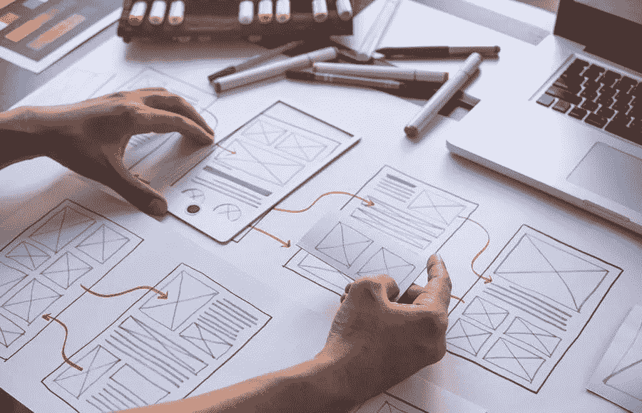

# 你的网站设计如何影响流量和观众参与度

> 原文：<https://medium.com/visualmodo/how-your-website-design-affects-traffic-and-engagement-to-audience-d26cabca9ce7?source=collection_archive---------0----------------------->

有许多方面会影响用户留在你的网站上的决定。虽然你的内容质量最终决定了交易的成败，但你首先必须用一个吸引人的设计来吸引访问者的注意力。在这篇文章中，我们将看到你的网站设计如何影响流量和观众的参与度。

# 影响视图和流量的设计元素

网页设计是给你的目标受众留下不可磨灭印记的重要组成部分。即使你在技术上拥有竞争对手中最好的信息，如果你的网站不能吸引你的观众，那也没什么意义。因此，你要确保你立刻抓住人们的注意力——即使他们还没有看到你的其他内容。你可以借助引人入胜的网页设计来做到这一点。下面列出了 4 种可能影响受众对您网站的反应的方式:

# 1 内容演示

在一个人们可以访问大量信息的世界里，你有责任不仅在内容质量方面，而且在内容呈现方面让自己脱颖而出。

例如，你必须通过将文本块分成更短的段落来解释现代人更短的注意力持续时间。你不想用大量文字信息轰炸你的读者，让他们不知所措。

演示文稿还涉及到您的字体选择和字体颜色。演示文稿必须强调你的文本的重点。

如果做得好，网页设计可以提升你的搜索引擎优化策略，因为你的内容可读性强，容易浏览。因此，人们可以很容易地评估你的网站是否有他们需要的信息。

# 2 颜色:网站设计影响参与度

虽然看起来微不足道，但你网站的颜色实际上会影响浏览者的印象和心情。你需要选择一个配色方案，不仅要与你的品牌相匹配，还要以一种吸引人的方式展示你的信息。

颜色也可以帮助浏览者决定你的网站是否是真实的。毕竟，正确的颜色有助于传达人们对你的品牌的情感。

# 3 导航

人们去谷歌，这样他们可以找到他们的问题的即时答案。如果他们登陆你的网站，你不希望他们因为复杂的布局而沮丧。

你要确保他们从 A 点到 b 点的点击次数尽可能少，浏览你的网站不应该是一件令人头疼的事情。

选择易于理解的直观设计，即使对于技术上有挑战的人也是如此。否则，人们只会对你的网站不满和不满意。

# 4 移动友好性:网站设计影响参与度

如今，一个值得信赖的网站设计机构也会告诉你如何设计你的网站的移动版。这是因为现在越来越多的人使用智能手机和其他移动设备在互联网上查找信息。

因此，无论用户的设备是什么，你都应该选择一个响应迅速且易于访问的网站设计。你不想让移动用户为了阅读你的内容而放大缩小你的网页。

# 网站设计会影响流量、跳出率和转化率

你网站的外观会显著影响跳出率和转换率。

跳出率是指用户登陆你网站的一个页面，然后没有点击其他页面就离开的百分比。另一方面，转换率是用户在浏览你的网站后订阅或购买一个项目的百分比。

为了让你的网站成功，你必须把降低跳出率和提高转化率作为你的目标。跳出率低通常意味着你的网页足够吸引人，让人们想浏览你的其他内容。

根据眼球追踪研究，浏览者只需要几秒钟就能对你的网站形成一个显著的看法。

跳出率取决于加载速度和内容质量。然而，在这项研究中，高达 94%的用户会立即拒绝一个设计没有给人留下好印象的网站。使网站设计不受欢迎的因素包括:

*   混乱的导航
*   无聊或不匹配的颜色选择
*   压倒性的文本
*   忙碌布局
*   与移动设备不兼容

# 一个好的网站可以让你的客户回头客

网站设计可能主要是为了美观，但最终，它们会带来你想要的数量。除了有助于增加你的看法，它还可以增加你的转换率，降低整体跳出率。

如果你有好的内容可以提供。传播它的最好方式是以视觉上吸引人的方式呈现。当人们发现浏览你的网站和阅读网站上的重要信息很容易时。他们更有可能关注你的内容。