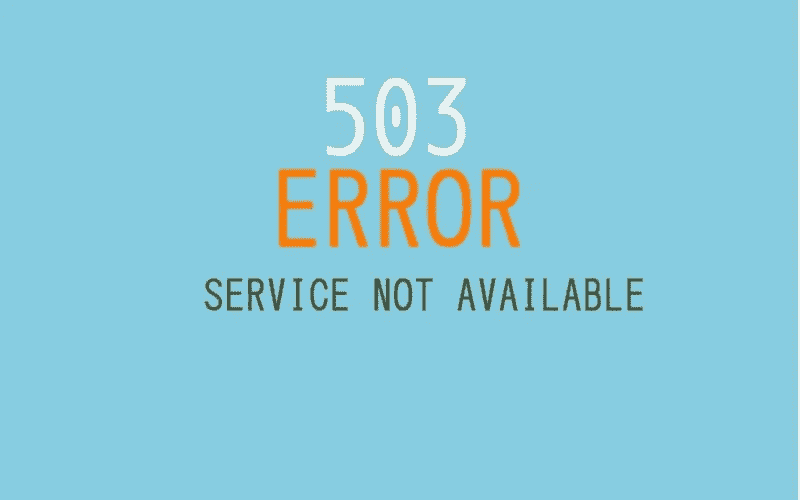
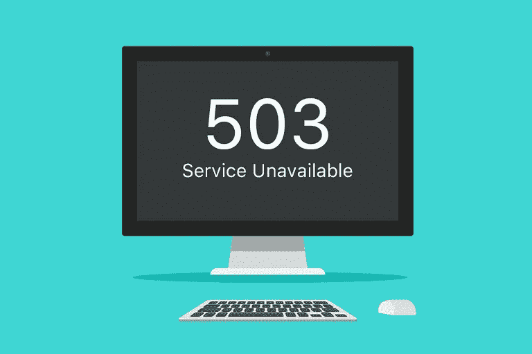

# HTTP 503 服务不可用处理

> 原文：<https://medium.com/visualmodo/http-503-service-unavailable-handling-12756c574b38?source=collection_archive---------0----------------------->

超文本传输协议(HTTP) 503 服务不可用服务器错误响应代码表示服务器未准备好处理请求。常见原因是服务器停机维护或过载。看现在怎么处理。

有时，你的网站需要一些停机时间，所以你可以修复东西或更新插件。大多数时候，这往往是一个相对较短的时期，在此期间，谷歌很可能不会试图抓取你的[网站](https://visualmodo.com/)。然而，在你需要更多时间来修复的情况下，GoogleBot 很有可能会访问你的网站，然后发现它关闭了。那么，我们如何防止谷歌取消你网站的链接呢？



# HTTP 状态代码和您

对于那些不熟悉 [HTTP](https://visualmodo.com/) 状态代码的人来说，这里有一个在处理网站维护时适用于你的状态代码的简要总结:

*   **200 好吧。**此状态代码表示服务器成功返回响应。
*   **301 永久移动。这告诉浏览器这个页面不再有效，将重定向到正确的页面。**
*   **302 / 307 临时移动。这两个 HTTP 状态代码背后有一些历史记录，但这对浏览器的指示是，您将暂时将浏览器重定向到一个不同的页面，并且当前的 URL 最终将返回到它以前的状态。**
*   **404 未找到。**此状态代码表示无法找到您试图导航到的页面。
*   **410 内容已删除。**如果您故意删除了您的内容，并且无法替换，请使用此选项。
*   **503 服务不可用。**这是您在处理网站维护时想要返回到 Google 的文件。它告诉谷歌，你实际上是在这个页面上工作，或者其他地方出错了。Google 知道当这个状态码被返回时，以后要再次检查页面。这就是我们将要进一步讨论的。

请注意，Google 会将返回 200 HTTP 状态代码的页面视为 Google 搜索控制台中的“软 404”，尽管该页面上有错误(或非常少的内容)。

# 告诉谷歌你很忙

如果谷歌在抓取你的网站时遇到 404，它通常会从搜索结果中丢弃该页面，直到下次它返回来验证该页面是否已返回。然而，如果谷歌在特定页面上反复遇到 404，它最终会推迟重新抓取，这意味着在页面返回搜索结果之前会经过更多时间。

为了克服这种潜在的更长时间的排名损失，您需要在处理特定页面时返回 503 状态代码。根据此 RFC 的[，503 服务不可用状态代码的原始定义是:](http://www.w3.org/Protocols/rfc2616/rfc2616-sec10.html)

*由于服务器临时过载或维护，服务器当前无法处理请求。这意味着这是一种暂时的情况，经过一段时间后会得到缓解。如果已知，延迟的长度可以在重试后报头中指示。如果没有给出 Retry-After，客户端应该像处理 500 响应一样处理响应。*

这意味着返回一个不可用的 HTTP 503 服务和一个`Retry-After`头，这将告诉 Google 在返回之前要等待多少分钟。这个**并不意味着[谷歌](https://visualmodo.com/)将在 X 分钟后再次爬行，但它将确保谷歌不会在此之前的任何时候回来查看。**

如果你想实现这个头，有几个选项可以选择。

# 使用 WordPress 默认值

默认情况下， [WordPress](https://visualmodo.com/) 在更新插件或 WordPress 核心时已经返回了一个 503。WordPress 允许你通过添加一个`maintenance.php`到你的`wp-content/`目录来覆盖默认的维护页面。请注意，您将负责正确返回错误标题。计划做数据库维护？你也必须处理好这件事。添加一个`db-error.php`文件到你的，并且`wp-content/`确保你也在这里正确地返回一个错误头。

如果你想给你的 WordPress 网站添加一些更好的东西，看看 WP 维护模式。这个插件还增加了很多额外的功能，除了我们在前面提到的。

如果您只是编写自己的代码，并且想要一个易于实现的解决方案，您可以将以下代码片段添加到您的代码库中，并在代码中调用它来确定您是否处于维护模式:

```
function set_503_header() {
    $protocol = 'HTTP/1.0'; if ( $_SERVER['SERVER_PROTOCOL'] === 'HTTP/1.1' ) {
        $protocol = 'HTTP/1.1';
    } header( $protocol . '503 Service Unavailable', true, 503 );
    header( 'Retry-After: 3600' );
}
```

注意，代码片段中的`3600`以秒为单位表示延迟时间。这意味着上面的示例将告诉 GoogleBot 在一个小时后返回。也可以在`Retry-After`中添加一个具体的日期和时间，但是你需要小心你在这里添加的内容，因为添加一个错误的日期可能会导致意想不到的结果。

# 专业提示



# 贮藏

在使用维护页面和返回 503 状态代码时，您需要考虑一些事情。如果你经常使用缓存，你可能会遇到缓存不能正确传递 503 状态的情况，所以请确保在你的[网站](https://visualmodo.com/)的实时版本上经常使用它之前，你能正确地测试它。

# Robots.txt

你知道还可以为你的机器人返回一个 503 状态码吗？来自谷歌的 Pierre Far 在[的这篇文章](https://plus.google.com/+PierreFar/posts/Gas8vjZ5fmB)中解释说，如果你在 robots.txt 文件中返回 503 状态码，谷歌将停止抓取你的网站。这样做的最大好处是在维护期间减少了服务器负载。

# 处理好你的保养！

正如我们所看到的，当你做网站维护的时候，你可以通过添加一个 503 来避免失去排名，让谷歌知道它以后可以回来抓取你的网站。有几种方法可以做到这一点。选择最适合你的，你将拥有一个维护良好的网站，没有失去排名的危险。祝你好运！