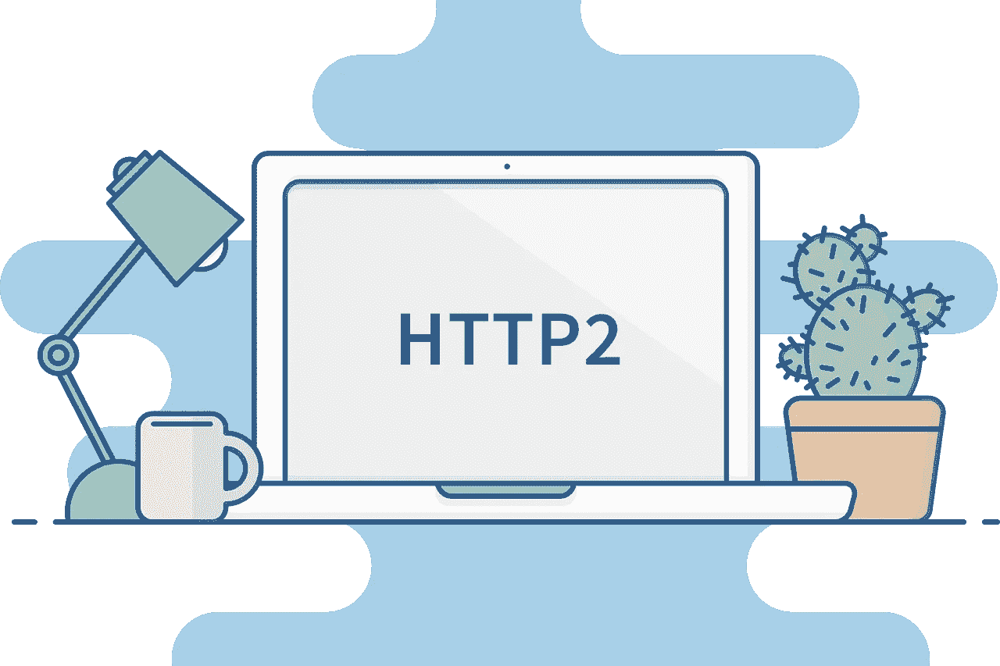

# HTTP2 协议:什么是 http 2 协议及其优点

> 原文：<https://medium.com/visualmodo/http2-protocol-what-is-and-its-benefits-71d55f38c37f?source=collection_archive---------0----------------------->

超文本传输协议第二版，简称 HTTP2，是 15 年来对 HTTP 的第一次重大更新。先前的协议标准 HTTP/1.1 自 1997 年以来一直在使用，它使用了各种笨拙的变通方法来改进 HTTP 的局限性。它基于 SPDY(“speedy”)，这是由 Google 发起的一项开源实验，旨在解决 HTTP/1.1 的一些问题和局限性

# 什么是 HTTP2，它是如何工作的？

每当你点击一个链接来访问一个站点，就会有一个请求被发送到[服务器](https://www.bluehost.com/?utm_source=%28direct%29&utm_medium=affiliate&utm_campaign=affiliate-link_claudiocamposp_notype)。服务器用该网站的状态消息(标题)和文件列表来回答。查看该列表后，浏览器会一次询问一个文件。HTTP 1.1 和 HTTP/2 的区别在于接下来会发生什么。

说你想要一套新的乐高玩具。首先，你去商店买你的乐高。回家后，你打开盒子，看说明书，上面告诉你必须做什么:一次一块砖。所以对于每一块砖，你都要看说明书，看下一步用哪一块砖。下一块砖也是如此，以此类推。如此往复，直到你完成整个乐高玩具。如果你的一套有 3300 块砖，那要花很长时间。这是 HTTP1.1。

有了 [HTTP/2](https://en.wikipedia.org/wiki/HTTP/2) 这些变化。你去商店拿你的盒子。打开它，找到说明，你可以要求所有的积木用在一个乐高积木组。你可以继续问说明书要更多的砖，不用看说明书。"这些砖块放在一起，所以它们在这里。"如果你真的很快想要，你甚至可以一次得到所有的砖块，这样你就可以在瞬间搭建好布景。

# HTTP2 继续更多任务

HTTP/2 有很多很酷的特性，可以帮助你加快加载速度。当然，最重要的一点是完全多路复用，这意味着多个请求可以通过一个在传输过程中保持开放的连接同时发生。另一个很酷的东西是服务器推送；这从一个请求开始，但是当服务器注意到 HTML 需要几个资源时，它可以不经请求就立刻发送这些资源。这可能很适合你的网站，但是这取决于某些因素，这些因素太复杂了，无法在这里讨论。

就像我前面说的，使用 HTTP1.1，浏览器请求一个站点->服务器发回一个头->这个头包含一个状态消息和 HTML 主体->对于构建站点所需的每个文件，一个单独的连接必须重复地打开和关闭。如果这个难题的一部分出了问题，它可能会阻碍其他部分，进一步减慢这个过程。这就是所谓的排队头阻塞，它吮吸大时间。这是 HTTP1.1 可以使用更新的众多原因之一。

# HTTP2 及其对 SEO 的好处

我们需要速度。多年来，网站速度一直是 SEO 排名的一个因素。现在，随着移动优先索引的引入，谷歌将对你的移动网站的加载速度进行严格的审视。在过去的几年里，网站变得越来越大，大网站有很多资产，比如 HTML、[、JavaScript](https://www.w3schools.com/whatis/whatis_js.asp) 、CSS、图片等等，这些都意味着更长的加载时间。

另一个大问题是延迟，尤其是在移动设备上。延迟时间越长，请求到达服务器和服务器发回响应所需的时间就越长。这就是为什么你应该总是使用 CDN 来减少把你的文件从离你最近的地方送到你的读者手中的时间。虽然浏览器可以处理少量的多重连接，这本身就增加了额外的时间，但来回发送数据的过程并没有真正改变。

通过微调服务器处理这些事情的方式，你可以做一些事情来[提高网站速度](https://kinsta.com/learn/page-speed/)，但就其核心而言，HTTP1.1 并不是一个非常高效的过程。HTTP/2 使得服务器和浏览器更容易管理这个过程，因此大大加快了速度。请记住，HTTP/2 的出现并没有淘汰 HTTP1.1。因为浏览器仍将使用旧协议作为后备。

# 使用 HTTP.2

实现 HTTP/2 相当容易，并且您的服务器可能已经在使用它了——使用 [HTTP2 上的工具测试它。亲](https://http2.pro/)站点。询问你的主机提供商，看看你有什么选择。还要选择一个[内容交付网络](https://visualmodo.com/does-my-website-need-to-use-a-cdn/)，也称为 CDN，提供完整的 HTTP/2 解决方案。如果您想实现 HTTP2，您还需要一个 HTTPS 连接。例如，如果您还没有 SSL 证书，可以在 Let's Encrypt 网站上获取。保护您的连接，以便您可以升级到 HTTP2。

# 结论

HTTP/2 在网络世界的统治和至高无上是不可避免的。该应用协议看起来将继承 HTTP1.x 的传统，它以革命性的数据传输能力改变了网络世界。HTTP/2 继承了其前辈的技术优势，远远大于 HTTP1.x 当时针对传统数据通信机制建立的创新差距。