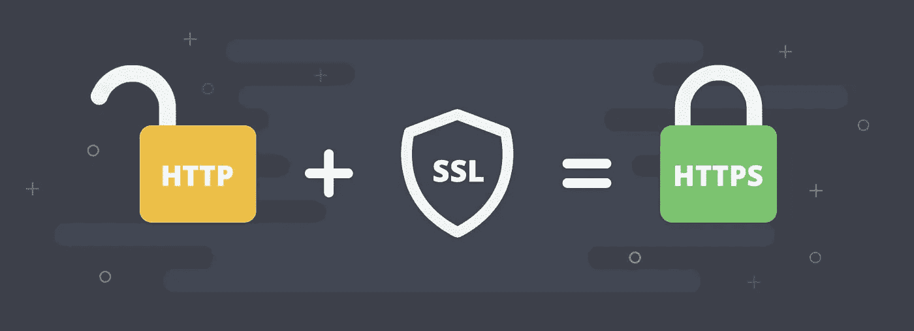
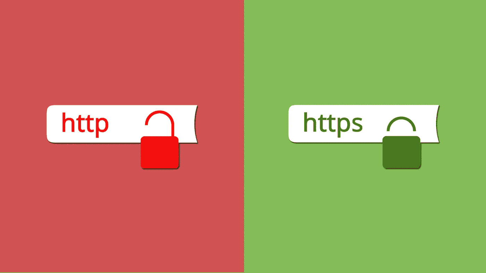

# HTTPS SSL:迁移指南

> 原文：<https://medium.com/visualmodo/https-ssl-migration-guide-df6a2cc247fb?source=collection_archive---------0----------------------->

HTTPS 提供了三层关键的保护。加密。加密交换的数据以保证其安全。数据完整性。数据在传输过程中无法被修改或破坏而不被检测到。身份验证证明您的用户与目标网站进行了通信。

# HTTPS — SSL 迁移指南



# 一点背景故事

回到 2014 年，在[心脏出血错误](http://heartbleed.com/)公之于众后，HTTPS 成为热门话题。这个 bug 允许怀有恶意的人监听通过 SSL/TLS 传输的流量。这也给了他们劫持和/或读取数据的能力。幸运的是，这个漏洞在被发现后很快得到了修补。这一事件敲响了警钟，正确加密互联网上的用户信息是必要的，而不应该是可有可无的事情。

为了强调加密敏感数据的重要性，每当你访问一个不加密潜在敏感数据(如表单)的网站时，谷歌 Chrome(自 2017 年 1 月起)都会在地址栏旁边显示一条明确的警告。

# 我如何切换？

因为您的数据安全非常重要，所以我们在 2014 年采取措施确保我们自己的网站都有 SSL 证书。如果你决定转行(你真的应该！)，有几件事你需要考虑到，以确保你的网站完全按照预期工作，一旦你完成。

*   你需要改变你所有的内部链接。这也意味着更新资产的链接(如果需要的话)。确保浏览你的主题，修改对 CSS、图片和 JavaScript 文件的引用。此外，您可以将所有的链接改为以`//`开头，而不是以`https://`开头，这将产生与协议相关的 URL。
*   确保你的 CDN 也支持 SSL。我们使用 MaxCDN，它允许您在您的 CDN 子域上轻松设置 SSL。
*   有各种级别的 SSL 可供选择，每种级别都有各自的优缺点。稍后你会找到更多的相关信息。
*   确保你的网站的`<head>`部分有一个规范的链接，可以正确地将所有来自`[http://](http://to.https://)` [的流量重定向到。](http://to.https://) `[https://](http://to.https://)`

谷歌还发布了一份方便的指南，告诉你如何在不严重影响排名的情况下搬到 HTTPS，你可以在这里找到。

# 这对我的排名有什么影响？


就像前面提到的，如果你没有相应的计划，从 HTTP 迁移到 HTTPS 会稍微影响你的排名。然而，当你转到 HTTPS 后，你的排名会随着时间的推移而提高。谷歌[在 2014 年](https://webmasters.googleblog.com/2014/08/https-as-ranking-signal.html)宣布，拥有 SSL 证书将被视为一个积极的排名因素，因此值得投资。

为了确保谷歌机器人可以在迁移后更快地重新索引你的[网站](https://visualmodo.com/)，确保你在`https://`低流量时段迁移到。这样，Googlebot 可以使用更多的服务器资源。只是考虑到一个中等规模的网站可能需要一段时间来恢复排名。有网站地图吗？那么 Googlebot 可能会更快地重新计算和索引你的网站。

# 在服务器上设置 HTTPS 和 SSL

一般来说，主机提供商有一项服务，允许您启用 HTTPS/订购证书。有几种类型的证书可供选择，它们在几个方面有所不同。每种型号都有自己的价格标签，所以在购买之前，请确保您的证书符合您的需求和预算！

如果你手头有点紧，也不太懂技术，那就去看看[让我们加密](https://letsencrypt.org/)获得一个免费的(！)证书。

如果您运行并管理自己的 web 服务器，在能够使用 SSL 证书之前，您必须在服务器配置中启用一些东西。[本教程](https://www.digitalocean.com/community/tutorials/how-to-install-an-ssl-certificate-from-a-commercial-certificate-authority)解释了在你的服务器上运行证书的步骤。

# OCSP 装订

必须检查 SSL 证书的有效性可能会导致加载速度稍有下降。要克服这一点，您可以使用 [OCSP 装订](https://en.wikipedia.org/wiki/OCSP_stapling)。OCSP 装订是一项功能，它使服务器能够在检查 SSL 证书时下载证书供应商响应的副本。这意味着，一旦浏览器连接到服务器，它将根据服务器上的副本检查证书的有效性，而不必询问证书供应商本身，从而显著提高性能。

# 街头流氓

在您的 Apache 服务器上启用 OCSP 装订之前，请通过在您的服务器上运行命令`apache2 -v`(或`httpd -v`)来检查您运行的是 Apache 的 2.3.3+版本。**较低版本的 Apache 不支持此功能**。

如果您按照“在您的服务器上设置 HTTPS 和 SSL”一节中的描述完成了在您的服务器上设置 HTTPS 的过程，那么您应该已经接触过专门为 HTTPS/SSL 使用而设计的虚拟主机配置。

在该文件中，采取以下步骤:

1.  在`<VirtualHost></VirtualHost>`部分，你应该加上。`SSLUseStapling on`
2.  在`<VirtualHost></VirtualHost>`部分的正上方，添加`SSLStaplingCache shmcb:/tmp/stapling_cache(128000)`
3.  通过运行检查配置是否仍然有效。`apachectl -t`如果是这样，通过运行。`service apache2 reload`

# Nginx

Nginx 还支持 OCSP 装订。在编辑服务器配置之前，请通过在`nginx -v`服务器上运行命令来检查您运行的是 Nginx 1 . 3 . 7+版本。**Nginx 的较低版本不支持此功能**。

如果你按照“在你的服务器上设置 HTTPS 和 SSL”一节中所描述的在你的服务器上设置 HTTPS 的过程，那么你应该已经接触过专门为 HTTPS/SSL 使用而设计的 Nginx 配置。

在该文件中，在`server {}`部分添加以下行:

```
ssl_stapling on;
ssl_stapling_verify on;
ssl_trusted_certificate /etc/ssl/private/ca-certs.pem;
```

最后一行引用了一个包含可信 CA 证书列表的文件。该文件用于在使用 OCSP 时验证客户端证书。

将这些行添加到文件后，通过运行以下命令检查配置是否仍然有效。`service nginx configtest`如果是这样，通过运行。`service nginx reload`

# 严格传输安全标头



严格的传输安全头(HSTS)是另一个方便的特性，它基本上强制浏览器使用 HTTPS 请求，而不是 HTTP 请求。启用这个特性相对来说比较容易。

# 街头流氓

如果您正在运行 Apache，首先通过运行以下命令启用 Apache Headers 模块。`a2enmod headers`在此之后，只需将以下代码行添加到您之前为 [HTTPS](https://visualmodo.com/) 设置的虚拟主机配置(在`<VirtualHost></VirtualHost>`部分)中:

```
Header always set Strict-Transport-Security "max-age=31536000; includeSubDomains"
```

重新加载 Apache 服务，您就可以开始了！

# Nginx

Nginx 要求您在服务器配置文件的`server{}`部分添加下面一行:

```
add_header Strict-Transport-Security max-age=31536000;
```

# 测试

要查看你的 SSL 证书是否正常工作，去 [SSL 实验室](https://www.ssllabs.com/ssltest/)，填写你的域名，看看你得到了什么样的分数。

# 重定向 URL

为了确保请求被正确地重定向到 HTTPS URL，您需要在您的配置中增加一行。这样，试图通过 HTTP 访问您的网站的流量将自动重定向到 HTTPS。

# 街头流氓

在默认的 VirtualHost 配置(用于 HTTP 请求的配置)中，添加以下内容以确保 URL 被正确重定向:

```
RewriteEngine On
RewriteCond %{HTTPS} off
RewriteRule (.*) https://%{HTTP_HOST}%{REQUEST_URI} [R=301,L]
```

和我们之前做的其他[改动](https://visualmodo.com/)一样，别忘了重新加载 Apache！

# Nginx

在 Nginx 中，更改用于 HTTP 请求的默认配置文件，如下所示:

```
server {
    listen 80;
    server_name your-site.com www.your-site.com;
    return 301 https://your-site.com$request_uri;
}
```

在测试这些更改之前，不要忘记重新加载 Nginx。

# 结论

"我应该转到 HTTPS 吗？"简而言之:是的。使用 [HTTPS](https://visualmodo.com/) 确保私人(用户)信息以更安全的方式在网络上传送。尤其是如果你处理货币交易，HTTPS 是必须的。

您最终选择哪种类型的证书，取决于您的具体使用情况和预算。确保事先适当研究你的选择。