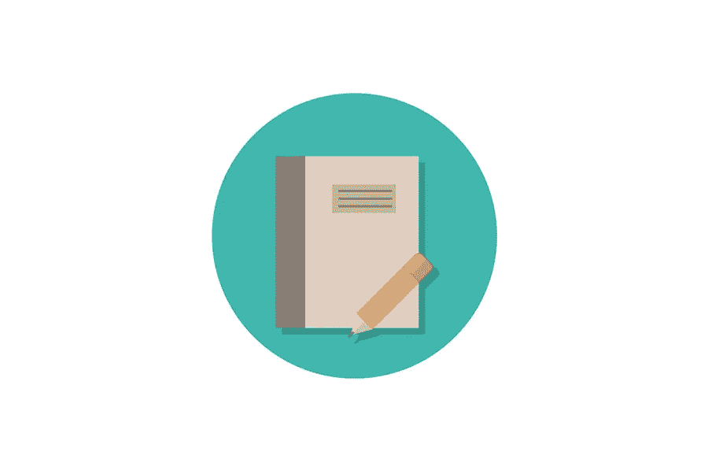

# 图像替代文本使用建议

> 原文：<https://medium.com/visualmodo/image-alt-text-usage-recommendations-44d813b713ae?source=collection_archive---------0----------------------->

为图片添加替代文本是网页可访问性和 SEO 优化的首要原则。这也是最难正确实现的方法之一。网络上充斥着缺少、不正确或糟糕的替代文本的图像。就像网页可访问性中的许多事情一样，确定合适的、等价的、可替换的文本通常是个人理解的问题。通过使用例子，这篇文章将提出我们的经验解释适当使用替代文本。

# 图片 Alt 属性和标题属性？

这是一个完整的 HTML 图像标签:

图像的 alt 和 title 属性通常称为 alt 标记或 alt 文本和 title 标记。但从技术上来说，它们不是标签，而是属性。alt 文本描述了图像上的内容以及图像在页面上的功能。因此，如果你使用一个图片作为购买产品 X 的按钮，alt 文本应该说:“购买产品 X 的按钮。”

alt 标签由屏幕阅读器使用，屏幕阅读器是盲人和视力正常的人使用的浏览器。这些屏幕阅读器通过读取 alt 标签告诉他们图像上有什么。当您将鼠标悬停在元素上时，标题属性会显示为工具提示。因此，在图像按钮的情况下，图像标题可以包含额外的行动号召。但是，这不是最佳做法。

# 背景就是一切

在为图像确定合适的替代文本时，[上下文决定一切](https://visualmodo.com/best-blog-post-title-generator-tools-to-amazing-headlines/)。基于图像本身的上下文和环境，一个图像的替代文本可能会有很大不同。

# 替代文本最佳实践

最终，图像替代文本需要具体，但也要代表它所支持的网页的主题。到目前为止了解这个想法了吗？这里有几个重要的关键来写有效的图片 alt 文本与搜索引擎优化铭记:

1.  **保持你的替代文本少于 125 个字符**。屏幕阅读工具通常会在这一点上停止阅读替代文本，在为视觉障碍者描述这一描述时的尴尬时刻切断冗长的替代文本。
2.  使用你的关键词，但要有节制。如果你的文章的目标关键词很容易包含在你的替代文本中，那就只包含它。如果没有，考虑语义关键词，或者只考虑长尾关键词中最重要的术语。例如，如果你文章的标题关键字是“如何产生潜在客户”，你可以在你的替代文本中使用“潜在客户产生”，因为“如何”可能很难自然地包含在图片替代文本中。
3.  **描述形象，要具体。利用图片的主题和背景来引导你。**
4.  **不要以“的图片”或“的图片”开始替换文字**直接跳到图片的描述。屏幕阅读工具(谷歌也是如此)会从文章的 HTML 源代码中识别出它是一张图片。
5.  **不要把你的关键词塞进每张图片的替换文字中。**如果你的博客文章包含一系列人体图片，至少在其中一张图片中包含你的关键词。找出你认为最能代表你的主题的图片，并将其分配到你的关键词中。坚持周边媒体更多的审美描述。

# 如何在 WordPress 中给图片添加可选文字

当你使用内置的媒体上传器上传图片时，WordPress 允许你为图片添加替代文本。您还可以通过访问**媒体库**并点击图像下方的编辑链接，为图像添加替代文本。

# 如何在 WordPress 中添加图片标题

当你使用内置的 WordPress 媒体上传器上传图片时，你会看到一个标题字段。WordPress 使用这个标题字段来处理你的媒体文件，不要和图片中使用的标题属性混淆。

您在上传图像时添加的标题仅被 WordPress 媒体库用来显示您的媒体文件列表。虽然这个标题会帮助你在 WordPress 媒体库中定位媒体文件，但它不是我们正在讨论的标题属性。以下是你如何在 WordPress 中给你的图片添加标题属性。