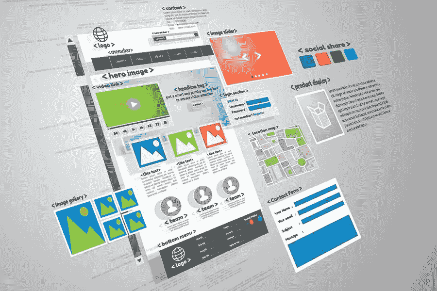

# 图片搜索引擎优化最佳实践图形和图片在网站排名中的重要性

> 原文：<https://medium.com/visualmodo/image-seo-best-practices-importance-of-graphics-and-pictures-in-website-ranking-240a77b291e8?source=collection_archive---------0----------------------->

大多数内容营销人员将他们的搜索引擎优化工作集中在文本和关键词上。他们忘记了图片也是 SEO 的重要组成部分。首先，图像 SEO 在增强用户体验方面表现出色。在这篇文章中，你会学到图片搜索引擎优化的最佳实践，以及图形和图片在你的网站排名中的重要性。

你必须意识到现在的网站不是一个塞满文本的蛋糕。这些网站除了文本内容之外，还有分层的视觉元素——图像、视频和动画。从今以后，这些元素有助于网站的视觉吸引力，并赋予其独特的魅力。

可以理解的是，如果你的登陆或博客页面看起来像一个无聊的文本块，它的转化率可能会非常低。研究支持这一说法:80%的访问者更有可能阅读包含图片的博客或任何信息娱乐帖子。

网页的受欢迎程度很大程度上取决于图像。这就是为什么他们在像谷歌这样的搜索引擎上的排名越来越重要。考虑到这些平台上最关键的排名标准是用户的体验，如跳出率和在网站上花费的时间——添加图片至关重要。

这里有一些优秀的图片[搜索引擎优化最佳实践，你应该遵循](https://visualmodo.com/seo-best-practices-that-you-should-follow/)来聚集大量的观众。

# 1 使用相关的高清图像

这是最广泛接受的图片搜索引擎优化最佳实践之一。模糊、被裁剪或尺寸怪异的低质量图像会转移用户的注意力，而不是将他的注意力转移到文本上。此外，其不专业和不合适的外观和位置将对您的品牌形象造成严重打击。

你必须找到高质量的无版权图像。幸运的是，一些在线资源提供了各种主题的库存照片。一些例子是 Shutterstock、Unsplash 和 Adobe 图像。你会在这些平台上看到大量与各种利基相关的图片。

# 2 选择正确的文件名

尽管它简单明了，但许多 SEO 从业者忽略了这个重要的细节。

在将一张图片整合到你的博客或网站之前，花些时间修改它的文件名。使用与目标关键词和网页内容兼容的文件名。

不要太长。需要切中要害，极其具体。例如，如果你正在写一个关于世界上最贵的手表的博客，标题图像可以命名为 expensive-watches.jpg。你的观众不会看到这个名字，但它会给搜索引擎爬虫更多的信息来根据你的目标关键字进行分类和排名。

# 3 使用 Alt 标签:图片 SEO 实践和重要性

Alt 标签是另一个对公众不可见的组件，但对搜索引擎算法非常重要。

如果你有一个带有 Yoast 插件功能的 WordPress 博客，你可以很容易地给图片添加替代文本。这段文字将引导搜索引擎向正确的方向前进，找出你的网页的主题。只要让你正确设置 WordPress 的 Yoast 插件。

作为一般建议，在 alt 标签中加入网页的主要关键字和照片本身的简要描述。如果你没有 Yoast，并且是一个老的 HTML 用户，在你的图片标签中添加 alt=“你的 alt 文本”来写你的 alt 描述。

# 4 找到合适的质量与尺寸的比例

这个选择有点复杂。你需要找到正确的平衡。你不应该使用太大的图片以至于影响页面的加载速度，或者太小的图片以至于影响可见性。

网站速度是一个重要的 SEO 排名要素。如果你的网站加载速度很慢，会对你在搜索引擎上的排名产生不利影响。同样，在 WordPress 上，调整图片大小是小菜一碟。然而，即使 WordPress 调整了图片的大小，它们在后端仍然会有不合适的大小。

为了防止这种情况，你必须使用图像编辑软件，最好是系统内置的软件，比如微软的 pain 或 Mac preview。如果您对这些不满意，可以使用 Adobe Photoshop 中的“存储为 Web 格式”选项来找到不影响图像质量的最小尺寸。

# 5 使用合适的文件类型:图片 SEO 的做法和重要性

您可能听说过各种文件大小，从 PNG 到 JPEP，但是您可能很难区分它们的用法。了解这些信息可以帮助您根据您的具体需求最终确定图像类型。

*   JPG 是使用最广泛的文件扩展名，因为它的兼容性和小尺寸。然而，它并不总是与最佳质量的图像相关联。在透明背景的情况下，它不能提供太多的可视性，因此，不会给出期望的结果。
*   而巴布亚新几内亚则是一举两得。这是一个高清图像的房屋灯塔，可以集成促进图像搜索引擎优化最佳实践的描述。一个缺点是它的大小比 JPEG 稍大。你应该把它用于细节图像，尤其是那些包含大量文本的图像。
*   Gif 不像 PNG 或 JPEG 那样兼容，但对于具有透明背景的简单图像来说，它是一个安全的选择。

为了进一步把你推向正确的方向，这里有一些一般性的建议:

*   对于照片，使用 JPG。
*   裁剪图形，用 GIF。
*   要获得清晰的高清图像，请使用 PNG。

# 你的网站上有 6 张主机图片

将你的图片放在第三方网站上，比如 Bluehost，会带来一系列的风险。这可能会节省您宝贵的空间，但也可能会影响照片的使用寿命。如果这些平台上的流量太大，你的图像会变暗，给访问者留下糟糕的用户体验。

相反，把你的图片放在你的专有网站上对你最有利。如果空间是一个很大的问题，你可以使用前面提到的技巧来选择正确的文件类型，以确保你的网站速度不会受到太大的影响。此外，确保你的网站有一个声誉良好的托管服务，以防止昂贵的图像停电。

# 图片搜索引擎优化实践和重要性最后的想法

如果你想在搜索引擎上给你的网站排名，图片搜索引擎优化是至关重要的。确保你特别注意文件名、类型和 alt 标签，以及其他细节，让你的品牌有最好的机会聚集大量的在线信息。