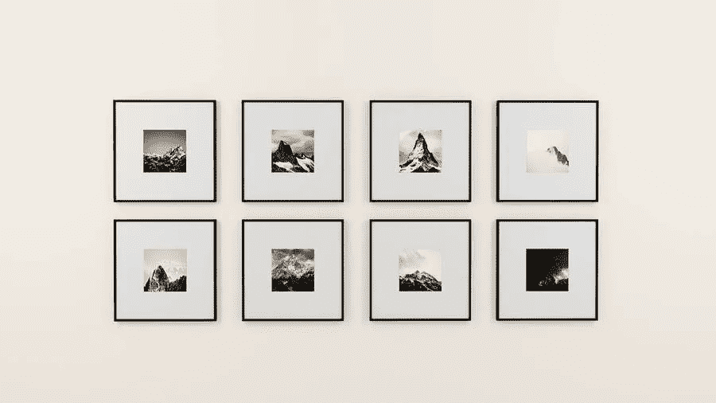

# 图像搜索引擎优化搜索引擎优化图像

> 原文：<https://medium.com/visualmodo/image-seo-search-engine-optimization-for-images-8d7c7b132aef?source=collection_archive---------1----------------------->

我们生活在一个日益视觉化的世界。在这个世界上，图像优化(SEO)的价值不容忽视，因为图像使你的网页更有吸引力。更有可能的是，你网站的每一页上都有一张图片。然而，如果没有适当的优化，你就浪费了宝贵的 SEO 资产。另外，文件越大，你的页面加载时间就越长，你的跳出率就越高。

图像优化为您的图像资产创造了许多优势，包括更好的用户体验，更快的页面加载时间，以及在传统和图像搜索结果中的额外排名机会。虽然视觉搜索技术最近取得了长足的进步，但搜索引擎机器人无法识别图像的内容；他们依靠与图像相关的文本来完全理解图像是什么，以及它与您的内容或页面主题的关系。

但是，哪些因素对于确保你的图片可以被找到并且不会降低网站速度是最重要的呢？以下是你需要知道的 14 个重要的图片优化技巧。

# 如何为 SEO 优化找到合适的图片？

使用原始图像——你自己拍摄的图像——总是比库存照片更好。你的团队页面需要你真实团队的照片。所以，不是右边的这个人或者他的一个普通朋友。题外话:别介意那家伙需要理发。

你的文章需要一张与其主题相关的图片。如果你选择一张随机的照片只是为了在我们的 SEO 插件的内容分析中得到一个绿色子弹，那么你就做错了。图像应该反映文章的主题，或者在文章中起到说明的作用。尽量将图像放在相关文本附近。如果你有主图片或者你想排序的图片，如果有意义的话，尽量放在靠近页面顶部的位置。

所有这些都有一个简单的图像 SEO 原因:带有相关文本的图像在其优化的关键词中排名更高。后面还有更多关于图片 SEO 的内容。

# 图像源替代

如果你没有任何自己的图片可以使用，有其他方法可以找到独特的图片，仍然避免库存照片。例如，Flickr.com 是一个很好的图像来源，因为你可以使用知识共享图像。别忘了归功于原摄影师。我也喜欢 Pixaby 或 Visualmodo Shots 等网站提供的图片。我们的博客作者 Caroline 写了一篇很棒的概述，介绍了在哪里可以获得很棒的图片。避开明显的库存照片，挑选那些看起来(好吧，只是一点点)更真实的照片。但是不管你用什么，有人物的照片看起来总是像普通照片，除非是你自己拍的。最后，那总是最好的主意。

照片的明显替代物可以是插图，这正是我们所使用的，或者是图表。动画 gif 应该获得荣誉奖，因为它们现在非常受欢迎。然而，即使动画 gif 很受欢迎，也不要走极端。这会让你的文章更难阅读，因为图片的移动会分散读者的注意力。他们也可以减缓你的网页。

# 为您的使用设置图像

一旦你找到了合适的图片——无论是插图、图表还是照片——下一步就是优化它，以便在你的网站上使用。有几件事你需要考虑:

# 图像搜索引擎优化的正确名称

图片 SEO 从文件名开始。你想让谷歌不用看就知道图片是关于什么的，所以在图片文件名中使用你的焦点关键词。很简单:如果你的图像显示了巴黎圣母院上空的日出，文件名不应该是 DSC4536.jpg，而是 Notre-dame-Paris-sunrise.jpg。主要的关键词应该是巴黎圣母院，因为这是照片的主要主题，这就是为什么它在文件名的开头。

# 选择正确的格式

对于图像，不存在正确的格式；这取决于图像的类型以及你想如何使用它。简而言之，我们建议:如果你想保持背景透明，请使用 PNG。为较大的照片或插图选择 JPEG:它会以相对较小的文件大小在颜色和清晰度方面给你带来好的结果。WebP 而不是 JPEG 和 PNG。它将使用较小的文件生成高质量的结果。你可以使用 Squoosh 这样的工具将你的图片转换成 WebP。徽标和图标的 SVG。在 CSS 或 JavaScript 的帮助下，您可以管理 SVG 格式的图像，例如，在不损失质量的情况下调整它们的大小。

如果你知道你的大部分观众使用特定的浏览器或设备，你可以在[CanIuse.com](https://caniuse.com/)查看这些浏览器是否支持你喜欢的格式。当你有了正确的名称和格式，是时候调整和优化你的图片了！

# 图像搜索引擎优化的比例

加载时间对于 [UX 和 SEO](https://visualmodo.com/most-common-seo-mistakes/) 来说很重要。网站速度越快，访问和索引页面就越容易。图像对加载时间有很大的影响，特别是当您上传一个巨大的图像，然后以小尺寸显示它时，例如，一个 2500×1500 像素的图像以 250×150 像素的尺寸显示，因为整个图像仍然必须被加载。将图像调整到您想要的显示方式。上传后，WordPress 会自动提供多种尺寸的图片。不幸的是，这并不意味着文件大小也得到优化，这只是图像显示大小。

# 使用响应图像

这对于 SEO 来说也是必不可少的，如果你正在使用 WordPress，它已经为你做好了，因为它是从 4.4 版本默认添加的。图像应该具有属性。这使得在每个屏幕宽度上提供不同的图像成为可能——对于移动设备尤其有用。

# 为搜索引擎优化压缩图像大小

图像搜索引擎优化的下一步应该是确保缩放后的图像被压缩，从而以尽可能小的文件大小提供服务。当然，你可以只导出图像，用质量百分比进行实验，但我更喜欢使用 100%质量的图像，尤其是考虑到 retina 和类似屏幕的流行。

# 最后的话

图片 SEO 是几个要素的总和。随着谷歌每天都在更好地识别图像中的元素，确保图像及其所有元素有助于良好的用户体验和 SEO 是有意义的。试图愚弄谷歌是愚蠢的。总之，在你的网站上添加图片时，请记住以下几点:

*   减小文件大小以加快加载速度
*   使用与你的文字相匹配的相关图片
*   如有可能，使用`srcset`
*   确保图像尺寸与显示的图像大小相匹配
*   如果合适，添加标题，以便更容易浏览页面
*   为你的图像选择一个好的文件名
*   使用图像替代文本。不需要标题文本
*   向您的图像添加结构化数据
*   为图像添加 OpenGraph 和 Twitter 卡片标签
*   不要用图像打断左边的阅读线——将图像右对齐或居中对齐
*   在 XML 站点地图中使用图像
*   尽可能提供所有背景信息！