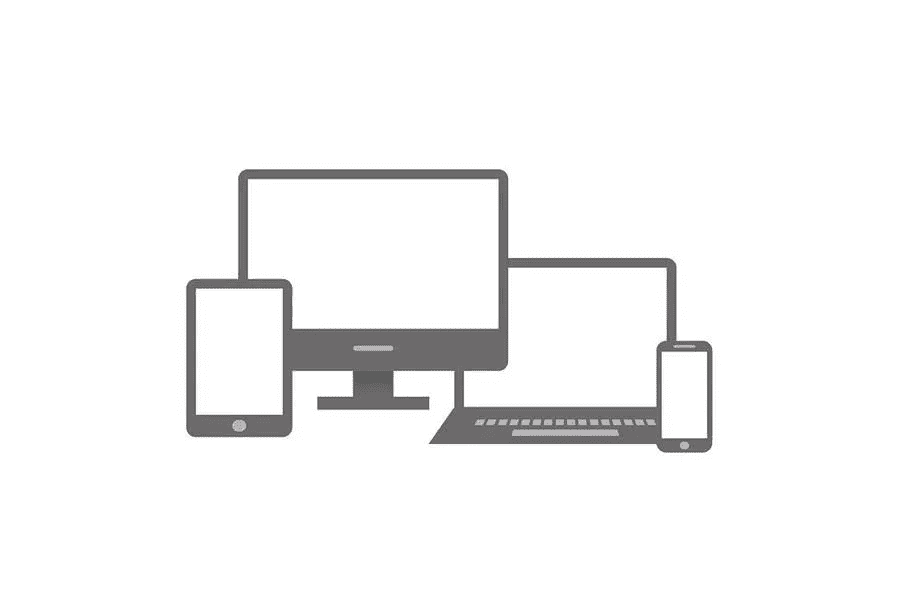

# 响应式网页设计的重要性

> 原文：<https://medium.com/visualmodo/importance-of-responsive-web-design-e0c5a717496b?source=collection_archive---------0----------------------->

说到在线搜索，近年来已经出现了从传统的台式电脑搜索到手机搜索的转变。今天，超过 75%的在线搜索来自移动设备。在这篇文章中，我们将分享响应式网页设计的重要性。

可以说，这种转变是由谷歌的 Mobilegeddon 和 AMP。谷歌在 2015 年推出了新的搜索引擎算法，谷歌在该算法中明确表示，网站的桌面版本不便于在手机上查看和使用。虽然这并不影响在桌面上的搜索，但优先考虑的是移动友好的网站。

这在搜索结果中提升了手机友好网站的排名。另一方面，不适合手机的网站在搜索引擎中的排名有所下降。正是因为这些原因，响应式网页设计成为当今世界著名的网页发展趋势。

# 网页可访问性有多重要？

Web 开发可访问性是指使用工具和技术开发或设计网站，使每个人(包括残疾人)都能轻松查看和使用网站。值得注意的是,《美国残疾人法案》( ADA)要求某些企业让聋人和盲人用户能够访问他们的网站内容，他们应该能够通过屏幕阅读器、语音或其他类型的辅助工具进行导航。

ADA 下的企业必须有一个符合 ADA 的网站。如果您的业务属于“公共住宿”类别；或者你的公司至少有 15 名全职员工，每年运营 20 周或更长时间，你应该多做一些关于网页可访问性的研究，了解什么是符合 ADA 的网站。

不遵守这些 ADA 要求可能会导致网站可访问性诉讼，并对您的品牌或企业形象造成损害。

# 响应式网页设计的重要性

响应式网站是一个可以根据浏览设备调整自身大小并做出响应的网站。响应式网站设计的主要目标是为网站用户消除手动调整大小的麻烦和困惑，无论他们是在智能手机、笔记本电脑、平板电脑还是桌面显示器上查看网站内容。

有一个响应式的网站设计有很多不同的好处。从改善用户体验到提高你的 SEO 和转换率，有许多不同的方法可以让一个响应式的网页设计[有助于你的增长](https://visualmodo.com/4-biggest-web-design-mistakes-and-how-to-avoid-them/)和网站排名。现在，我们将继续探讨响应式网页设计的一些最常见的好处。