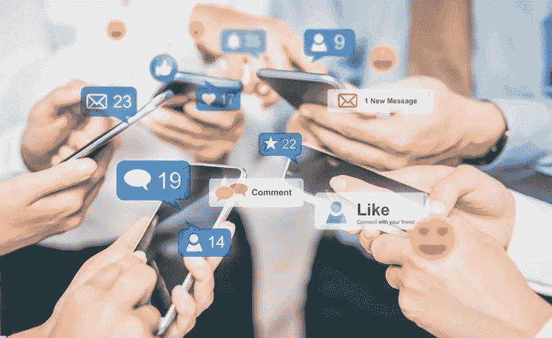

# 审查营销活动中参与度数据的重要性

> 原文：<https://medium.com/visualmodo/importance-of-reviewing-engagement-data-from-your-marketing-campaigns-89c0ef3a5fa7?source=collection_archive---------0----------------------->

当顾客不能进入市场时，市场是什么？客户买不到的产品是什么？没什么！这表明顾客是市场最重要的方面。因为他们是产品和服务存在的首要原因，所以营销活动应该以他们为目标是很正常的。在本文中，我们将讨论并分享审查营销活动中的参与度数据的重要性。

然而，它并不止于创造营销活动。你必须知道它们是否有效。但是你如何确定这一点呢？最好的方法是使用像精益数据这样的公司提供的准确可靠的分析。使用他们强大的系统，您可以跟踪和分析现有和潜在客户的参与数据。了解你的营销活动是否有效，可以让你调整到完美，从而确保你从投资中获得最大回报。

敬业度数据对你业务其他领域的成功也很重要。请继续阅读，了解更多信息。

# 1 帮助您衡量您的拓展范围

作为一个企业主，你开始所有的项目时都有一定的目标。通过营销活动，你试图鼓励新老客户支持你的品牌。

如果你在开展活动时没有衡量你的外展能力，那就达不到目标。但是，如果你能分析你的营销活动，你会找出你的最高和最低到达。您的参与度数据将使您能够了解您的客户拓展模式中哪些方面您正在获得线索，哪些方面您可以做得更好。

只有了解你目前的位置，你才会知道如何在与你的顾客和客户相关的业务中做得更好。通过了解你的优点和缺点，你将在行业中获得超过竞争对手的优势。

# 2 你可以更好地满足顾客的需求

客户参与度数据可以改变您的业务需求。这些数据可以帮助你向顾客展示你的爱和承诺。为什么参与数据将使您能够设计您的产品和服务，以满足您的顾客和客户的需求。

为了长期的成功，产品和服务不应该一成不变。相反，它们应该不断发展以适应新的市场趋势。虽然产品和服务应该不时更新和重新设计，但它们不应该改变太多，以至于失去独特性。

通过分析营销活动中的参与度数据，你会知道如何最好地重新设计和改造你的产品，以更好地为你的客户服务。此外，互动数据将告知您对客户来说最重要的是什么，让您能够满足他们的需求。如果他们看到你有多关心他们，他们会继续支持你的品牌。

# 3 查看互动数据，帮助您更好地与客户沟通

当你知道什么能让你的顾客开心时，你就知道如何与他们联系，反过来，当他们使用你的品牌时，你的业务就会增长。

你可以根据不同人群的个人资料，比如他们的家庭规模、收入和个人偏好，来接触他们。通过与他们亲密接触，你可以增加他们从支持你的品牌中获得的价值，让他们有更多的理由继续使用你的产品和服务，并向他们的朋友和家人介绍你。

# 4 .带来创新

提供价值很重要。但你知道吗，当你的品牌价值保持不变时，顾客就会厌倦你的品牌。这就是创新的来源。当你收集和分析你的参与度数据时，你会知道如何以及何时改进你的产品和服务。通过创造性地改进，您将总能增加新的价值，从而提高客户忠诚度。

例如，你的网站、应用程序、送货服务等会不断改进，以显示你愿意[听取客户反馈](https://visualmodo.com/why-its-important-to-listen-to-your-customer-feedback/)。

# 5 查看参与度数据，以帮助企业中的其他部门

虽然客户参与数据对营销部门非常重要，但它不是唯一可以从客户参与数据中受益的部门。

例如，审计人员可能需要这些数据来观察和跟踪公司的表现，或者计算机部门可以使用这些数据来开发更好的以客户为中心的应用程序或网站。

让客户参与度数据随时可用，可以让不同部门更高效地执行任务。这将进一步使不同的部门和谐地一起工作。确保顾客持续获得最好的服务。对客户需求的集体理解将有助于您的团队更快地创建有效的解决方案。

# 6 鼓励顾客保留

价值的概念是核心，并导致任何业务的生产率、增长和稳定性的提高。这是因为顾客只会去和留在他们被重视的地方。

当您分析和处理敬业度数据时。你将知道如何与客户的需求和愿望保持联系。就像他们说的:眼不见，心不烦。但是当你和客户保持联系的时候。他们会关注你的品牌，继续使用你的产品和服务。

# 查看雇佣数据结论

查看营销活动中的客户参与度数据可以帮助您做出旨在满足客户独特需求的决策。通过这样做，他们会感到被重视，并继续参与和支持你的品牌。

你的客户是你企业的生命线。如果你有他们的支持，你的业务将经历指数增长，打开机会，扩大你的市场份额。