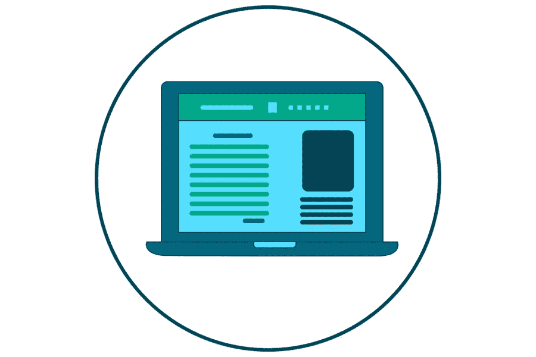

# 提高你的 WordPress 网站的可用性

> 原文：<https://medium.com/visualmodo/improve-the-usability-of-your-wordpress-website-2d1426cd4c3c?source=collection_archive---------0----------------------->

仅仅在网上发布一个 WordPress 网站是不够的。今天的网络受众要求很高，有些被宠坏了。他们在寻找有用的、视觉上吸引人的、能提供有价值信息的网站。学习帮助你提高 WordPress 网站可用性的 6 大技巧。

幸运的是，WordPress 是一个强大的 CMS，被互联网上超过 30%的网站所使用。考虑到有超过 13 亿活跃网站的事实，这意味着其中大约 4.55 亿正在使用 WP！这些网站中有顶级公司，如 TechCrunch、索尼音乐和 BBC 美国。

所以，如果你想让你的 WordPress 网站更实用，看看这 6 个建议。

# 1 选择一个好的主持人

每个网站的故事都是从一个好的主持人开始的。可靠的[虚拟主机](https://www.forbes.com/sites/steveolenski/2015/11/16/why-your-website-marketing-relies-on-the-right-web-host/)是你的网站功能更好的先决条件。有许多选项可供选择，在不同的定价方案中提供不同的功能。

为你的网站选择主机提供商时，你需要考虑两件事。第一是你的预算，第二是你需要在网站上分享的数据量。共享主机意味着你需要与其他网站共享空间，但如果你的预算有限，这可能是一个完美的解决方案。对于刚刚起步，还没有接触到更广泛受众的网站来说，这也是一个不错的选择。

选择能够保证安全、定期备份的主机也很重要。拥有一个包含定期备份的托管计划将确保您网站上的所有数据都得到保护。

最后，选择一个包含快速页面加载速度的托管计划。近 85%的人期望网站在 3 秒或更短时间内加载。所以，为了防止你的客户离开，你不能让他们等太久来加载你的网站。因此，提高你的 WordPress 网站的可用性是一件好事。

# 2 注重设计和导航

永远记住，对于网站来说，可用性比外观更重要。

当设计你的网站时，一定要去掉那些会让你的访问者感到困惑的元素。一般来说，人们喜欢可预测的网页设计，所以你不必在这里重新发明轮子。

你还需要确保访问者在你的网站上找到他们想要的东西没有问题。你可以这样做:

*   将导航面板放在页面的顶部，因为这是用户期望的位置。
*   在站点的主导航面板旁边添加一个基于 Ajax 的搜索框。
*   在档案、面包屑和侧边栏中有类别列表。

使用直观的导航会改善浏览体验，让你的 WP 网站更有功能性。

# 3 安装 WP 插件时要有选择性，以提高 WordPress 网站的可用性

有数百个插件可以用来改进你的 WP 网站功能。最重要的是，许多优质的 WP 模板包含了适合特定用途的扩展。例如，这可能是一个 WordPress 搜索插件，滑块，在线预订表单，WP 联系表单等。

尽管你可以从大量优秀的插件中进行选择，但在安装时你需要有所选择。只安装你需要的插件，如果可能的话，试着把几个功能压缩到一个插件里。拥有大量插件不一定是坏事，但是在测试更新时需要更多的努力。

# 4 将你的网站与社交媒体相结合

通过整合你的 WP 网站和社交媒体，你会让它看起来更加用户友好。此外，你将增加更多人参与你的业务的机会。以下是一些关于如何实现这一目标的想法:

*   使用社交登录功能，而不是要求访问者填写注册表。
*   添加社交媒体小部件以在您的网站页面上显示最新出版物。
*   添加社交分享选项，让访问者传播你的网站。

许多 WP 主题有基本的社交媒体集成，但你也可以用社交媒体 WP 插件自己添加。

# 使用响应式设计来提高 WordPress 网站的可用性

随着网络社区转向移动设备，拥有一个移动友好的网站是必须的。但是，作为一个内容管理系统，WP 不是一个适合移动设备的解决方案。所以，如果你想让它在所有设备上看起来和工作起来都很棒，你需要安装一些插件。

有许多响应性的 WP 主题可供选择，以确保网站上的所有信息都能在所有屏幕尺寸上正确显示。

# 6 不要忘记搜索引擎优化

当 SEO 被忽视时，网站通常达不到客户的期望。因为，说到底，每个网站都在追求更多的搜索流量和更好的转化。

许多网页设计师认为 SEO 是一种必要的邪恶。这是由于错误地认为 SEO 就是关键字填充和强制措辞。事实是，这些不再被认为是有效的搜索引擎优化策略。如果做得好，搜索引擎优化可以大大提高游客的体验。

好的搜索引擎优化和好的设计共同创造一个伟大的最终产品和一个坚实的基础。

# 提高 WordPress 网站的可用性

不断增长的 WP 社区提供了许多工具来帮助你提高网站的可用性和功能。希望这 6 个技巧能帮助你优化你的 WP 网站，提高用户参与度。

不要忘记定期更新你的 WP 主题、插件和安装。升级 WP 对安全性很重要。此外，它确保你有所有的新功能和缺陷修复，从而有助于您的网站功能。