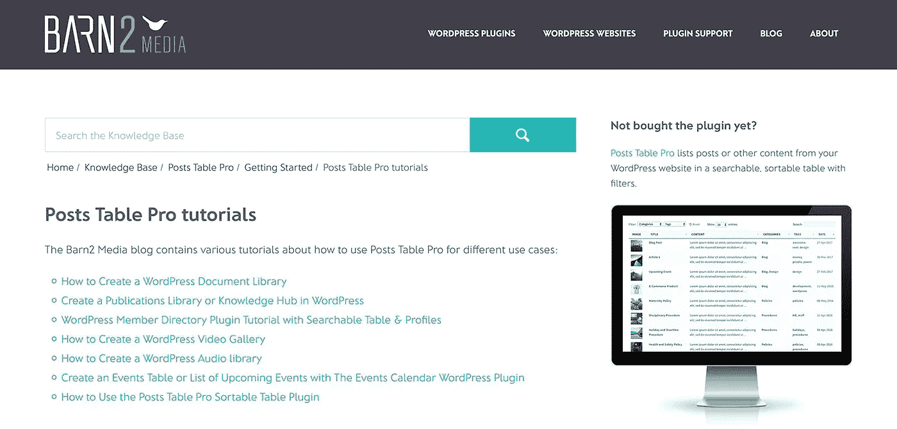
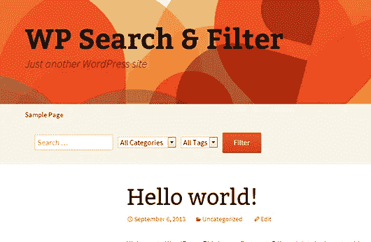
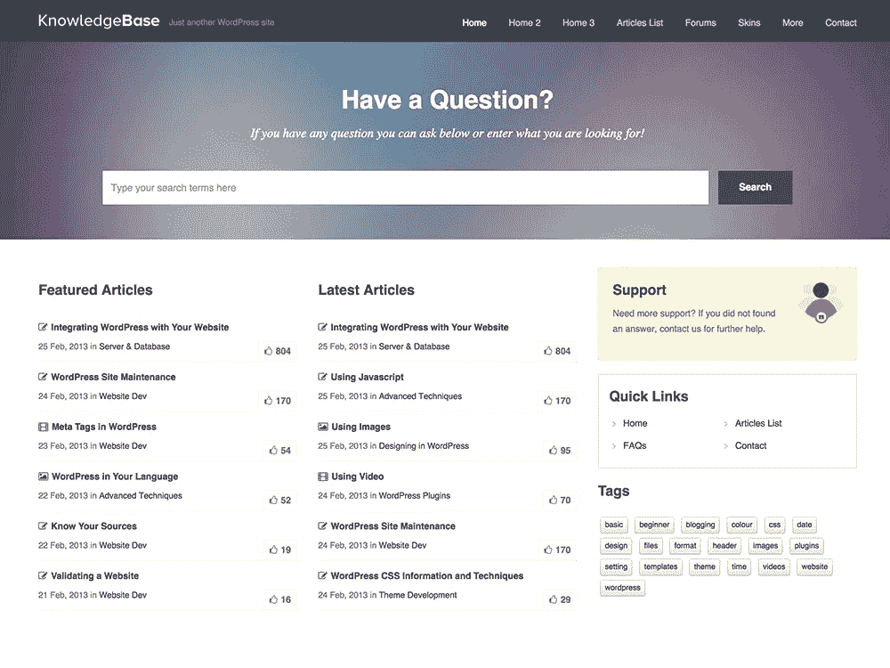
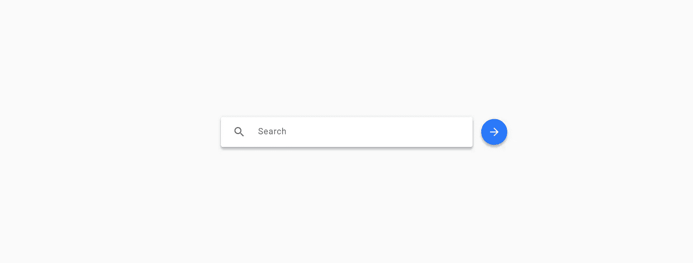

# 改进 WordPress 搜索功能

> 原文：<https://medium.com/visualmodo/improve-wordpress-search-function-67c8bb738dc3?source=collection_archive---------0----------------------->

查看一些很棒的提示和技巧来改进 WordPress 搜索功能，更好地在你的站点上为你的视图和用户展示内容。

# 根据相关性

在旧版本的 WordPress 中，搜索结果是按日期排序的，除此之外别无其他。因为这对有很多帖子的网站来说(至少)是令人讨厌的，所以 [WordPress](https://visualmodo.com/) core 推出了一个补丁，将改变搜索结果的排序方式。

变化如下:

*   在文章标题中有完整句子匹配的结果首先列出。
*   包含标题中所有搜索词的搜索结果，但不是完整的句子匹配，将在下面列出。
*   接下来会列出标题中包含任何搜索词，但不是所有搜索词或完整句子匹配的结果。
*   最后，在文章内容中包含完整句子匹配的搜索结果排在最后。在每个组中，结果按出版日期的时间顺序进一步排序。

# 改进 WordPress 搜索功能



WordPress 搜索结果中的摘录并不太好。与谷歌不同，WordPress 搜索如果找到匹配，会忽略关键词的强调。幸运的是，您可以修改部分搜索结果并添加这个特性。

# 准备您的主题

在你的主题中，寻找输出搜索结果的文件。在这个例子中，这是一个我手动创建的文件，在`/template-parts/post/content-search.php`中称为 Twenty 子主题。这个文件是存在于同一个目录中的`content-excerpt.php`的副本。

接下来，在[主题的](https://visualmodo.com/)主目录中查找名为`search.php`的文件，并查找以下代码行:

```
get_template_part( 'template-parts/post/content', 'excerpt' );
```

将此更改为以下内容:

```
get_template_part( 'template-parts/post/content', 'search' );
```

通过做这些改变，你将确保 WordPress 将使用你的自定义模板而不是默认模板。是时候添加强调的实际代码了！

打开`functions.php`，增加以下功能:

```
/**
 * Adds emphasis to the parts passed in $content that are equal to $search_query.
 *
 * @param $content The content to alter.
 * @param $search_query The search query to match against.
 *
 * @return string The emphasized text.
 */
function emphasize( $content, $search_query ) {
    $keys = array_map( 'preg_quote', explode(" ", $search_query ) );
    return preg_replace( '/(' . implode('|', $keys ) .')/iu', '<strong class="search-excerpt">\0</strong>', $content );
}
```

这个函数的作用是接受传递的内容，强调每个传入的单词，然后`$search_query`返回文本。添加到标签`<strong>`中的类可以用来进一步设计最终结果的样式(如果你愿意的话)。

# 在标题中增加重点



现在我们已经完成了设置自定义模板部件的步骤，在标题中添加强调相对容易。

进入您新创建的`content-search.php`,找到看起来像这样的行:

```
the_title( sprintf( '<h2 class="entry-title"><a href="%s" rel="bookmark">', esc_url( get_permalink() ) ), '</a></h2>' );
```

并替换为以下内容:

```
$title = emphasize( get_the_title(), get_search_query() );echo sprintf( '<h2 class="entry-title"><a href="%s" rel="bookmark">%s', esc_url( get_permalink() ), $title ) . '</a></h2>';
```

这就是全部了！

# 在摘录中增加重点



你可能会认为在摘录中增加重点不会比在标题中增加重点更难。可悲的是，事实并非如此。有了摘录，WordPress 会自动在末尾连接一个“继续阅读”链接。只要搜索短语不出现在文章的段落中，你就不会有问题，但大多数时候，如果你在寻找特定的关键词，它会出现在段落中。这导致“继续阅读”[链接](https://visualmodo.com/)断开。

为了克服这一点，你必须暂时否决一些默认的 WordPress 行为。

首先，将以下内容添加到您的`functions.php`:

```
/**
 * Creates a custom read more link.
 *
 * @return string The read more link.
 */
function modify_read_more_link() {
    return ' <a class="more-link" href="' . get_permalink() . '">Continue reading</a>';
}
```

上面的代码将被调用，以确保我们有一个可行的“阅读更多”链接。

这一部分挂钩到创建实际摘录的函数，并添加我们的重点和自定义的“阅读更多”链接。

```
/**
 * Allows for excerpt generation outside the loop.
 *
 * @param string $text  The text to be trimmed
 * @return string       The trimmed text
 */
function custom_trim_excerpt( $text = '' ) {
    $text = strip_shortcodes( $text );
    $text = apply_filters('the_content', $text);
    $text = str_replace(']]>', ']]&gt;', $text); $excerpt_length = apply_filters('excerpt_length', 55); $trimmed = wp_trim_words( $text, $excerpt_length, '' ); if ( is_search() ) {
        $trimmed = emphasize( $trimmed, get_search_query() );
    } return $trimmed . modify_read_more_link();
}
add_filter('wp_trim_excerpt', 'custom_trim_excerpt');
```

遗憾的是，对此没有更好的选择。希望有一天，可以创建一个可以调用的过滤器，而不是否决 trim 函数的大部分。

# 跟踪搜索

有几个选项可以跟踪访问者输入的搜索查询，但我们建议使用谷歌分析。要开始跟踪搜索，请完成以下步骤:

1.  登录谷歌分析。
2.  点击管理(左下角的齿轮)。
3.  在视图下，单击视图设置
4.  向下滚动，直到找到站点搜索跟踪开关并将其打开。
5.  在查询参数字段中，输入`s`。这是 WordPress 在使用搜索功能时添加的默认查询参数。
6.  单击保存

如果你的网站严重依赖于类别，并允许用户使用它们来优化搜索，谷歌[分析](https://visualmodo.com/)也给你添加跟踪的能力。获取更多关于这个主题的信息。

# 可供选择的事物



幸运的是，当你想改善网站的搜索功能时，有一些选择。正如评论中指出的，插件 Relevanssi 解决了搜索中的大多数问题，并帮助您快速轻松地开始。

如果你的网站发展很快，你想增加搜索量，甚至更多，看看一些更复杂的选择可能是明智的。我们在 Yoast 使用的一个是 Algolia。这个平台包含了大量的功能，使搜索变得更好。一些特性包括允许输入错误、支持同义词、过滤器和支持 100 多种语言。它还包括与 WordPress 的集成！

另一个选择是[亚马逊云搜索](https://aws.amazon.com/cloudsearch/)。它提供了与 Algolia 类似的功能，如果你认为你的网站需要，你可以启用自动缩放。然而，ACS 不提供开箱即用的集成，所以你必须自己编写实现或者在插件目录中寻找 WordPress 插件。在撰写本文时，只有两个插件；云搜索和电梯。

# 是的，你可以改进 WordPress 搜索

正如你所看到的，WordPress 搜索引擎这些年来已经有所改进。尽管如此，它在某些方面还是有所欠缺。幸运的是，你可以通过在你的孩子主题中添加一些额外的代码来改进它，或者通过使用 Algolia 和 Amazon CloudSearch 等外部服务来提升它。祝你好运！