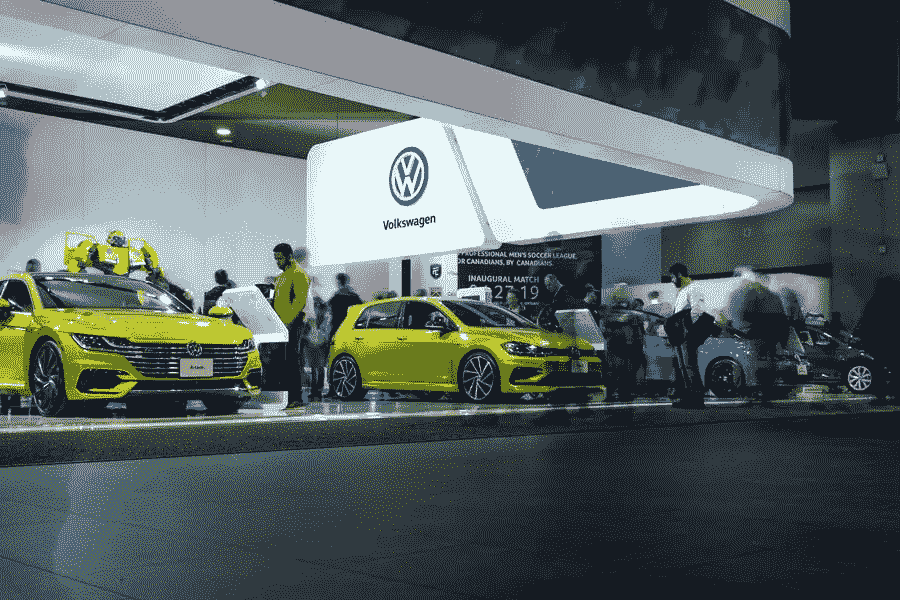

# 改进您的数字战略，让这些汽车离开展厅

> 原文：<https://medium.com/visualmodo/improve-your-digital-strategy-to-get-those-cars-off-the-showroom-floor-11f89da3ee76?source=collection_archive---------1----------------------->

电子商务正在加速发展，汽车销售也未能幸免于这种数字化的破坏。研究表明，约 59%的消费者希望获得完整的端到端在线购车体验。随着像 Carvana 这样的网站加速发展，展厅销售的日子开始失去动力。作为经销商，为了与潜在买家建立必要的信任，提升你的网络形象变得越来越重要，而这需要的不仅仅是[一个杀手级 SEO 策略](https://visualmodo.com/key-considerations-before-hiring-an-online-seo-service-for-your-venture/)。在本文中，我们将分享和探索提高数字战略的最佳方法，以使这些汽车离开展厅。

# 改善您的数字战略销售样车

# 建立信任是汽车数字化战略的基石

对于汽车公司来说，最重要的因素之一是吸引和留住客户的能力，因为回购对于业务的持续发展非常重要。将客户留在品牌家族中需要努力，信任占回购决定的 50%。

此外，为了建立信任，持续增加有价值和有帮助的博客是很重要的。见解深刻的教程，以及对电子查询的快速响应时间，这将大有帮助。现在是忘记推销的时候了。关注如何改变顾客的生活。

# 提高在线客户参与度

在数字营销和汽车战略爆发之前，直接营销是享受客户参与的唯一方式。然而，目前的情况要求汽车经销商走出舒适区，进入电子领域。虽然这意味着他们需要敏锐地意识到自己的声誉和评级，但他们也有责任提高参与度。

参与可以在各种平台上实现，研究显示，客户从他们在脸书上成功参与的企业购买的可能性增加了 53%。

# 监控客户的购买过程

借助跟踪软件作为汽车数字战略。汽车经销商能够确定销售旅程的哪一部分需要改进。哪个部分做的好。根据谷歌的说法，汽车经销商应该知道五个购物时刻。这五个步骤从哪辆车最好开始，以他们是否得到最好的交易结束。

通过能够在这个过程的每一步利用信息。经销商将能够改善他们的整个销售周期。对于经销商来说，重要的是要确保他们不仅能在网上看到，还能方便移动和联系。而汽车经销商正随着时代的发展，推出吸引人的网站。此外，信息丰富的博客，一个简洁的数字营销策略将大有作为。