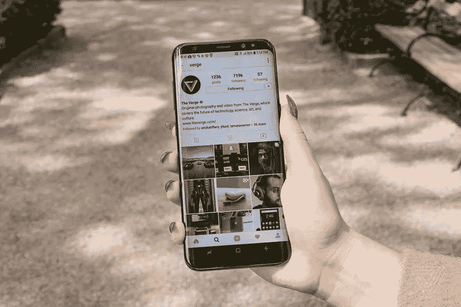

# 使用 Instagram 增加电子商务销售

> 原文：<https://medium.com/visualmodo/increase-ecommerce-sales-using-instagram-cd83979266e5?source=collection_archive---------0----------------------->

如果你想让你的品牌迅速出现在人们面前，但又不想仅仅依靠 SEO，那么你的下一个最佳选择就是关注 Instagram 这样的社交媒体——看看这种社交媒体如何帮助你的电子商务增长。

如果你经营一家电子商务商店，那么在 Instagram 上推广你的产品应该是重中之重。Instagram 现在已经增长到 [6 亿月活跃用户](https://www.statista.com/statistics/253577/number-of-monthly-active-instagram-users/)，所有人都在查看、发布和分享照片和图像。这有助于使它成为一个理想的平台，为您的网上商店做广告。

出现在 Instagram 上将有助于你的品牌接触到更广泛的受众。Instagram 还能让你创建一个粉丝社区，向他们展示你的产品。[最终](https://visualmodo.com/) Instagram 将帮助你创造商机，增加你的电子商务销售额。

然而，和所有的社交媒体渠道一样，没有万无一失的回报。成为 Instagram 上的主要玩家需要很长时间。也很难跟踪 Instagram 在增加你的电子商务销售额方面有多有效。那么，如果你想真正影响你的在线商店收入，Instagram 的最佳实践是什么？

在这篇文章中，我们将讨论一些可行的任务，帮助你使用 [Instagram](https://business.instagram.com/inspiration/#businesses-love-instagram) 来增加你的电子商务销售额。我们将看看如何开始使用 Instagram，如何让你的图片脱颖而出，以及你应该使用什么标签。然后，我们将考虑如何创建一个真正的 Instagram 存在，以及如何使用广告来增加你的 WordPress 网站的 Instagram 流量。

# Instagram 入门

[Instagram](https://www.instagram.com/) 设置快捷。只需从 Google Play 或苹果商店为您的智能手机下载应用程序。快速注册后，你就可以开始了。就这么简单！

# 选择个人资料图片

建立帐户后，您需要上传个人资料图片。选择与你的电子商务商店相关的东西，最好是你的标志。始终确保它是人们认可并会记住的东西。如果你是公司的形象代言人，那可能是你的一张照片，或者如果你销售一个主要的关键产品，那可能是那个特定产品的一张照片。

# 添加简历

你的简历很重要，因为它告诉你的读者你的业务，你是谁，你卖什么。简历只有 150 个字符长，所以你需要在短短的几个字里包含尽可能多的信息。在这里，你可以添加一个链接到你的网站，所以一定要在你的简历末尾添加这个链接。这将有助于增加你的 WordPress 网站的流量。

# 升级到企业帐户

完成个人资料后，您应该升级到[商业帐户](https://business.instagram.com/getting-started)。这是直接做的，而且是免费的，但你需要为你的企业添加一些联系方式，并有一个脸书商业网页。

虽然升级到商业账户不是必须的，但是如果你是一个严肃的电子商务商店，那么这是绝对值得推荐的。商业账户允许你显示更多关于你的 WordPress 网站和你正在销售的产品的信息。其他[的好处包括](https://business.instagram.com/blog/creating-a-business-profile-on-instagram/)对帖子和关注者的洞察，以及提升图片以推动业务目标的选项。

一旦您的商业帐户设置完毕，就该开始添加图片了…

# 让您的图像脱颖而出

Instagram 是一个图像驱动的社交媒体渠道，所以你的图像经过深思熟虑和高质量是至关重要的。你的图片需要从人群中脱颖而出，所以考虑发布一组美丽、原创、有趣和发人深省的照片。

让我们来看看在张贴图片时需要考虑什么，以及你可以使用什么工具来使它们变得特别。

# 不要强行推销

Instagram 不是硬推销，所以不要仅仅展示一张明显是产品广告的图片。想想如何巧妙地展示你的产品在使用中。展示你的产品创造的生活方式是悄悄宣传你的产品的有效方式。

Instagram 上微妙的生活方式广告的一个很好的例子来自耐克。耐克上传的大部分图片都是运动员在运动。直到你更仔细地观察，你才会注意到所有这些运动员都穿着耐克。在这里，耐克销售的不仅仅是他们的产品，还有他们品牌所倡导的生活方式。谁不想成为一名顶尖的著名运动员呢？！

# 给图像添加文本

给图像添加文本覆盖是吸引观众的一个好方法。添加励志名言、提出问题、分享新闻或对照片发表意见。将这些额外的信息添加到图片上会鼓励浏览者停下来考虑你的帖子。

当使用文本叠加时，粗体和明亮的文本是好的，但要确保它不会有损于图像。添加文字分享你的网站 URL，折扣优惠券代码，或者销售是增加网站流量的有效方法。然而，谨慎使用这种策略。过多的图片广告可能会让你失去 Instagram 粉丝。

# 创作拼贴画

创建一个令人惊叹的拼贴画是帮助你的图像脱颖而出的另一种方法。通过大学讲述一个故事可以有效地吸引你的观众，让他们对你的产品产生兴趣。

免费的 Instagram 应用程序[布局](https://itunes.apple.com/gb/app/layout-from-instagram/id967351793)允许你创建独特的拼贴画。这些可以上传并与你的追随者和潜在客户分享。

# 上传幻灯片

今年 2 月，Instagram 幻灯片秀应运而生。Instagram Slideshow 可让您上传 10 张照片或视频，在 Instagram 上以幻灯片形式播放。这是一个理想的电子商务商店，因为它允许你显示一系列产品的幻灯片。鉴于幻灯片在 Instagram 上仍是一个相对较新的概念，利用这一显示选项非常值得。

# 使用视频

要真正在 Instagram 上产生影响，重要的是发布各种媒体，以吸引不同口味的受众，并保持粉丝的兴趣。制作视频是吸引观众的另一个好方法，有助于你在竞争中脱颖而出。

Instagram 允许你每次上传最多 15 秒的视频。使用视频演示您的产品在运动中、被使用中、解决问题时，或者以其他相关的、有趣的方式。

# 使用标签的顶级技巧

标签可能很难做对。使用一些流行的标签来让大量的观众看到你的图片是很重要的。然而，过于模糊的标签最终会吸引那些对你销售的产品没有任何兴趣的人。

趋势标签也在不断变化，所以每次你发布新图片时，一定要研究相关的标签。这里有一些方法可以为你的图片找到合适的标签…

# 搜索相关标签

寻找合适标签的两个好地方都在 Instagram 上。首先，Instagram 上的搜索功能会给你一个与你的利基市场、电子商务商店或产品相关的所有[标签](https://visualmodo.com/)的列表。简单地输入你的关键词，它会显示你正在搜索什么相关的词。

其次，看看你的竞争对手在这个社交网络上使用了什么标签。你希望吸引和你的直接竞争对手一样的观众，所以看看他们用什么标签来吸引人们……然后也使用它们。

# 使用第三方工具

第三方工具，如 [Focalmark](https://focalmark.com/) 应用程序，将帮助你找到你发布的每张照片的相关 Instagram-hashtags。只要确定你发布的图片的焦点，Focalmark 就会给你一个关于这个主题的热门标签列表。选择图片中最适合你的电子商务商店和产品的标签。

# 建立自己的电子商务商店标签

随着你的电子商务商店的增长，你希望你的品牌可以通过你自己独特的标签被搜索到。这个标签应该被添加到你发布的所有图片中，这样你所有的照片都可以立即被搜索到。你也应该把你独特的标签添加到你的 Instagram-bio 上，与你的观众分享。

# 在 Instagram 上展示自己

本文到目前为止，我们已经讨论了如何建立一个 Instagram 帐户，添加各种令人驻足的产品图片和媒体，以及如何正确地给它们贴上标签。然而，如果你想使用 Insta 来增加你的电子商务销售，仅仅发布你自己的图片是不够的。那么你还需要做些什么来增长你的 Instagram 呢？

# 定期发布

制定一个你什么时候发帖的时间表，并坚持下去，这很重要。应该定期发布图片，以保持在 Instagram 上的持续存在。

稍后使用像[这样的日程安排器](https://later.com/)是一种保持有序和更新你的帖子的简单方法。稍后，您可以直观地计划和安排 Instagram 帖子，这样您就可以看到什么内容将在何时发布。通过以专业的方式管理你的 Instagram 账户，你将能够与你所在行业的大品牌竞争。

# 添加行动号召

如果你添加了合适的标签，那么你的图片就会有流量。那么，你如何让这些观众跟随你呢？

在您发布的每张图片下添加行动号召，让人们与您的照片互动。问他们一个关于图像的问题，鼓励他们分享自己的想法。人们越关注一幅图像，他们就越有可能追随你。

偶尔你可以让他们关注你，推动销售，或者通过在评论中添加 URL 来引导他们到你的 WordPress 网站。但是，不要太频繁地这样做，因为你不想让别人觉得你是销售驱动型的。

# 关注、喜爱和评论

除了定期发布和评论自己的照片，你还需要花时间喜欢和评论别人的图片。瞄准你的利基市场的图片和用户，这样你所在行业的人就会开始认识到你是这个领域的专家。

在评论中提问，或者添加一些有见地的观点，与那些发布图片或阅读评论的人交流。如果人们认为你为讨论增加了价值，那么他们会认为你值得追随。这将帮助你建立一个 Instagram 社区，你可以推广你的电子商务产品。

# 在 Instagram 上做广告

在 Instagram 上做广告是一种非常有效的方式，可以让你的 Instagram 流量增加到你的 WordPress 网站。在 Instagram 上[打广告有多种方式。您可以创建照片、视频或轮播广告，也可以从众多商业目标中进行选择。](https://business.instagram.com/advertising)

当设置你的广告时，你首先需要选择广告的主要目标。如果你希望使用 Instagram 来增加你的电子商务销售，那么你的广告目标需要是“转化”。选择“转换”将使您能够在 Instagram 广告中添加行动号召(立即购买)按钮。当点击“立即购买”按钮时，你的读者将被带到你的 WordPress 网站上你选择的页面。

通过“行动号召”按钮，您可以为您的受众创建一种直接访问您的网站和产品的方式。此按钮仅适用于付费广告，这是电子商务商店绝对应该考虑的选项。

# 在你的网站上使用 Instagram 来增加你的电子商务销售额

最后——在你的网站上突出你的 Instagram 账户或帖子是很重要的。有几种方法可以做到这一点，但最简单的是简单地使用 WooCommerce ready 主题，该主题已经包含一个自定义 Instagram 部分或小部件。

但是如果你已经有了一个你喜欢的主题，但没有整合 Instagram，你可以手动嵌入你的 Instagram 帖子，或者从 WordPress 知识库中抓取一个插件来添加你的 feed。

# 跟踪结果

重要的是要知道你的努力是否有回报，Instagram 是否真的在帮助你销售产品。Iconosquare 提供对你的 Instagram 活动、受众和[转化](https://visualmodo.com/)的深入洞察。仔细跟踪你的分析，看看哪些有效，哪些需要改进。永远记住最终结果…增加你的电子商务销售。

*你需要做些什么来提高你在 Instagram 上的形象，并帮助增加你的电子商务销售额？请在下面的评论中分享你的想法…*