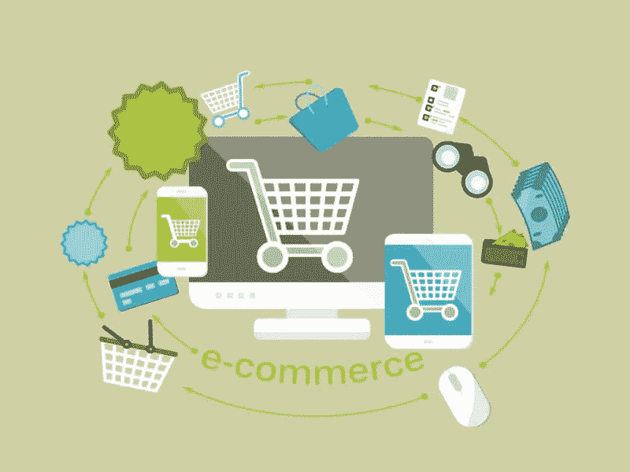

# 增加电子商务商店的销售额

> 原文：<https://medium.com/visualmodo/increase-ecommerce-store-sales-820649428000?source=collection_archive---------1----------------------->

查看最佳心理方法，通过在您的网上商店添加简单的变化来增加电子商务商店的销售额和网站商店的购买量。

我们都知道，网上购物领域正在我们眼前不断发展。一些有助于正确看待事情的数字:

*   在美国，在线销售目前只占零售总额的 14%;
*   在欧洲，这一数字为 17%。
*   65%的所有互联网用户在 2017 年至少进行了一次购买(约 10 亿+用户)；
*   美国的普通用户平均一年的购物支出为 1900 美元，而在欧洲，这一数字为 1800 美元。
*   [电子商务](https://visualmodo.com/)网站的主要流量来源:有机、电子邮件和点击付费。

# 增加电子商务商店的销售额

电子商务店主不停地寻找改进网站和增加销售额的方法。当然，继续带来更多的流量是可能的，但首先，你应该弄清楚如何从现有的[流量](https://visualmodo.com/)中增加销售转化率。

总的来说，我可以说，我在特拉维夫大学攻读经济学学位时所学的大部分课程都是多余的，或者与现实脱节，除了一门我觉得非常切题而且我非常喜欢的课程——行为经济学。是的，丹·艾瑞里和所有关于理性决策的宣传，等等。这让我对用户有了更多的了解，并试图找出当他们执行一个动作或一个决定时，是什么触发了流经他们大脑的“电流”。

推荐:除了丹·艾瑞里的书，我还推荐阅读尼尔·埃亚尔(Nir Eyal)的书《上钩》,这本书讲述了如何在使用你的产品时形成一种习惯，以及是什么驱使人们迷恋一种产品而不是另一种产品。在这篇文章中，我谈到了影响网上购物者决策的五个公认的心理学原则:

# 稀缺效应

知道饼干罐子的故事吗？这是一个比较熟悉的故事，它说明了这个原则，它是这样的:

斯蒂芬·沃切尔和他的同事在 1975 年进行了一项实验，他们给人们两罐饼干。一个罐子里有 10 块饼干，另一个罐子里只有 2 块。实验结果显示，大多数人更喜欢空罐子里的饼干(有两块饼干的那个)，尽管两个罐子里的饼干[完全](https://en.wikipedia.org/wiki/Scarcity_(social_psychology))一样。

当某样东西稀缺或难以获得时，我们往往会更想要它。你可能也听说过它作为损失规避的 **FOMO** — **F** 耳朵**O**F**M**issing**O**ut。我们在脸书和社交媒体上花费或浪费了一半的时间，因为我们害怕错过一些有趣的更新或新闻(尽管我们知道这不会每分钟都发生)。另一个与害怕错过某事密切相关的原则是紧迫性。

**在此类别下，经常会看到这样的句子或短语:**最受欢迎，销量最高，现在有 12 人正在查看该产品，该产品在过去一小时内被购买了 22 次，最后 5 件有库存，优惠结束前还有 3 小时，在接下来的 27 分钟内订购，您将在明天收到产品，等等。

# 相互作用

我相信你经常遇到这种情况——有人免费向你提供一些东西，比如数字世界的旅游指南/电子书，或者现实世界超市里的一种新型奶酪。作为交换，你被要求留下你的电子邮件地址(指第一种优惠)，或者你觉得有义务尝试更大的[包](https://visualmodo.com/)奶酪(指第二种优惠)

**其他例子:**用于计算某些东西(例如，抵押贷款)的在线计算器，在你上传图片后用于定制服装项目的应用程序，博客中的优质内容，等等。

# 框架效应

一句话——语境。如果吉米·亨德里克斯今天还活着，你有机会去看他的演出，你可能会愿意花很多钱买一张票。但是如果他在路边表演，你可能会继续走，根本不会注意到他。换句话说，这完全取决于上下文和具体情况。你喜欢什么？比一般冰淇淋含糖量少 90%的低脂冰淇淋？还是平均含糖量 10%的冰淇淋？大多数被问到的人会选择第一个选项。同样的事情也适用于一个问题，比如一个有 90%成功机会的整形手术或者一个有 10%失败机会的整形手术。当我们表达这类事情时，考虑结果(积极的或消极的)和我们想要强调的品质是很重要的。

# 锚定效应

锚定原则认为，人们的决定受到他们接触到的关于特定主题的第一信息的影响。事实上，他们太依赖这些信息了，这就像一个难以移动的锚。
在我们的日常生活中，我们经常会遇到这样的问题，比如某个特定的产品要花多少钱，或者要多长时间才能到达某个特定的地方。我们得到了一个最初的答案，我们可能会在以后坚持这个答案。如果我们回到电子商务商店，你可能会看到这一原则的实施，只要你进入一个主页，你就会看到一个特定的项目，旁边有一个折扣价，原价被划掉。

如果你在那个网站上再搜索一下，你可能会找到一个价格相同甚至更便宜的类似产品(也许是相同的)。对于任何希望了解这个原则的人来说，[这篇文章](https://www.jeremysaid.com/blog/anchoring-effect-power-conversion-optimization/)被强烈推荐。

# 保证

这一部分是关于承诺、风险以及在潜在买家中建立信任和信心。
如果你回头看看本文中关于电子商务销售增长的第一张图表，你会发现用户不在线完成购买的第二个原因是他们不够信任或认为它不够安全。另一个例子:你在一个工作日的中间出去吃午饭，看到一家餐馆外面排着长队。你会怎么想？可能这家餐馆很好，这就是为什么它排了很长的队，为什么人们愿意在外面等。在这种情况下，你可以称之为**从众行为**，但是“一群”好的评论和回应也可以说服顾客，就像在餐馆外面排起长队一样。

尽管亚马逊和易贝都是众所周知的大网站，但他们仍然继续采取各种方式来增加买家的信心。你是怎么做到的？
如上图所示——**评论、推荐和评论、卖家可信度**(以亚马逊和易贝为例)**社交证明、真实面孔验证推荐**等。