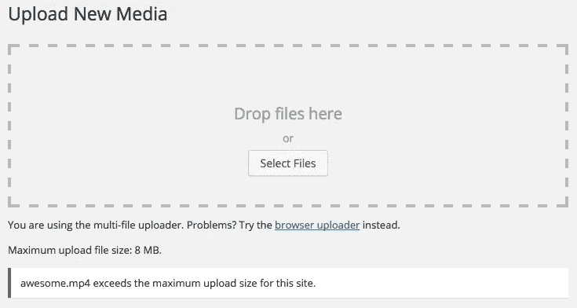

# 增加上传的最大文件大小

> 原文：<https://medium.com/visualmodo/increase-wordpress-maximum-file-size-upload-e0ba1b07a7cf?source=collection_archive---------0----------------------->

一些虚拟主机公司在你的网站上增加了 PHP 文件上传的低大小限制，这可能会产生上传最大大小的问题，而[主题](https://visualmodo.com/wordpress-themes/)，插件和大图片或视频上传，见如何改变和增加 WordPress 最大文件大小上传

根据你选择的虚拟主机公司和你选择的软件包，你们每个人都会在 WordPress 的媒体上传页面上看到最大文件上传限制。对于一些低至 2MB 的文件，这对于像音频/视频这样的媒体文件来说显然是不够的。大部分图片都在 2MB 以下，只放图片就可以了。在这篇文章中，我们将向你展示如何在 WordPress 中增加最大文件上传大小。

注意:这是一个中级教程。它可能不适用于某些共享主机，在这种情况下，您必须向您的主机服务提供商寻求支持。主机支持也可以很容易地编辑它。

# 如何增加 WordPress 最大文件大小上传？

你可以先尝试一个 WordPress.org 免费插件，[看看这个吧](https://br.wordpress.org/plugins/upload-max-file-size/)。

## 视频教程

如果你不喜欢这个视频或者需要更多的说明，那么请继续阅读。

## 1:主题功能文件

有些情况下，我们已经看到，只需在主题函数的文件中添加以下代码，就可以增加上传的大小:

`@ini_set( 'upload_max_size'``, '64M'`

`@ini_set( 'post_max_size', '64M');`

`@ini_set( 'max_execution_time', '300'` `);`

注意:所有的 Visualmodo 主题都已经有了这个功能，但是一些主机会阻止主题访问，这个方法在一些独立于你的主题的主机上不起作用

## 2.创建或编辑现有的 PHP。INI 文件

在大多数情况下，如果您在共享主机上，您将不会在您的目录中看到 php.ini 文件。如果您没有看到，那么创建一个名为 php.ini 的文件并上传到根文件夹中。在该文件中添加以下代码:

`upload_max_filesize = 64M`

`post_max_size = 64M`

`max_execution_time = 300`

据报道，这种方法对许多用户都有效。记住如果 64 不行。尝试 10MB(有时也可以)。

## 3.htaccess 方法

有些人尝试使用 htaccess 方法，通过修改。htaccess 文件，你可以在 WordPress 中增加最大上传大小。打开或创建。htaccess 文件，并添加以下代码:

`php_value upload_max_filesize 64M`

`php_value post_max_size 64M`

`php_value max_execution_time 300`

`php_value max_input_time 300`

再次强调，重要的是我们强调，如果你是在一个共享的主机包，那么这些技术可能不会工作。在这种情况下，你必须联系你的虚拟主机提供商来增加你的限额。一些主机完全拒绝他们的用户。