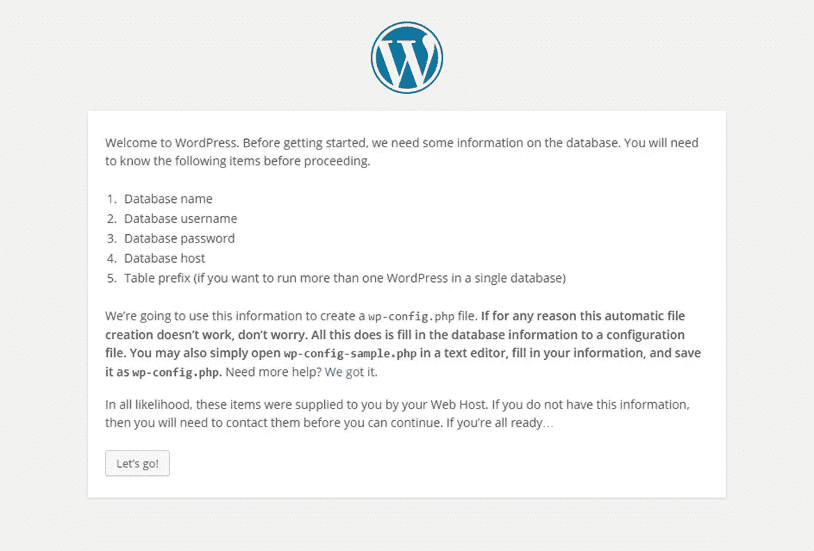
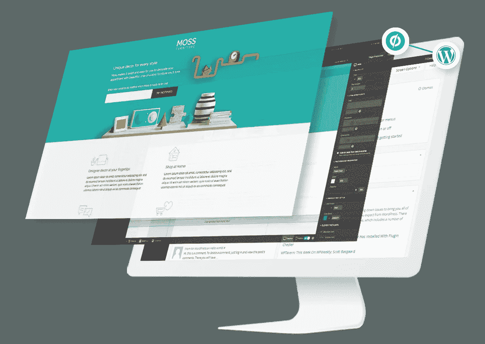

# WordPress 配置文件内部

> 原文：<https://medium.com/visualmodo/inside-wordpress-config-file-5fc940c619a?source=collection_archive---------0----------------------->

## 隐藏功能

wp-config.php 文件是与你的 WordPress 安装相关的最重要的文件之一，然而，它不仅仅是存储你的数据库设置的地方。看看你的 WordPress 配置文件中还有什么。坦率地说，大多数开发人员完全忽略了隐藏在 wp-config.php 文件中的许多令人敬畏的特性。

本教程旨在展示一些鲜为人知的功能和特性，您只需在您的[wp-config.php](https://codex.wordpress.org/Editing_wp-config.php)文件中添加几行简单的代码就可以利用它们。通常由插件处理的特性——创建一个不太干净的 WordPress 安装。

# WordPress 配置文件内部


# 强制登录和管理后端使用 SSL

当通过浏览器传输密码和其他敏感信息时，SSL 连接是关键。因此，你可能想为你的登录页面和/或你的[管理后台启用 SSL。不需要为此安装任何插件，只需几行简单的代码就可以满足这两种需求:](https://visualmodo.com/)

```
/* Force SSL on Login Pages */
define( 'FORCE_SSL_LOGIN', true );/* Force SSL for Admin Backend */
define( 'FORCE_SSL_ADMIN', true );
```

# 打开/关闭帖子修订并设置其限制

如果你不小心对一个页面/帖子做了错误的修改，结果弄坏了东西，帖子修改会非常有用。然而 [WordPress](https://visualmodo.com/) ，默认情况下，并没有对帖子的修改设置限制，随着时间的推移，这可能会增加一个相当大的数据库。同样，您可以使用 wp-config.php 文件轻松控制这一点:

```
/* Turn Off Post Revisions. */
define( 'WP_POST_REVISIONS', false );/* Set Maximum Number of Revisions. */ 
define( 'WP_POST_REVISIONS', '10' );
```

# 压缩文件、脚本和 CSS 样式

如今，网站性能非常重要，WordPress 有许多内置的压缩功能，但这些功能经常被大多数人忽视:

```
/* Compress All CSS Files */
define( 'COMPRESS_CSS',        true );/* Compress All JS Files */
define( 'COMPRESS_SCRIPTS',    true );/* Turn On GZIP Compression */
define( 'ENFORCE_GZIP',        true );
```

# 控制内存使用



在运行 WordPress 网站的过程中，内存控制通常是大多数网站管理员最终要处理的事情。您网站的 wp-config.php 文件允许您设置两个不同的限制。有人试图设置 PHP 内存限制——这是您通常用 [PHP](https://visualmodo.com/) 做的事情。ini 文件。

在默认的 WordPress 安装中，PHP 内存限制被设置为 30M。另一个选项让你设置 WordPress 应该使用的最大内存——默认设置为 256M。如果需要更多内存，只需在 wp-config.php 文件中添加以下几行:

```
/* PHP Memory Limit */
define( 'WP_MEMORY_LIMIT', '64' );
/* Maximum WordPress Memory Limit */
define( 'WP_MAX_MEMORY_LIMIT', '512' );
```

# 为您的媒体设置回收站/垃圾桶



你是否删除了一个媒体文件，然后马上意识到你犯了一个巨大的错误，并且完全没有备份那个图像？这就是为什么 [WordPress](https://visualmodo.com/) 创建了垃圾桶——这是默认为文章/页面而不是媒体项目启用的东西。幸运的是，这是一个快速解决办法！

```
/* Turn On Media Trash. */
define( 'MEDIA_TRASH', true );
```

希望这篇教程教会你一些新东西，甚至可能帮助你摆脱一两个插件——从而简化你的 WordPress 安装！一如既往地在下面的评论中发表你的任何问题！