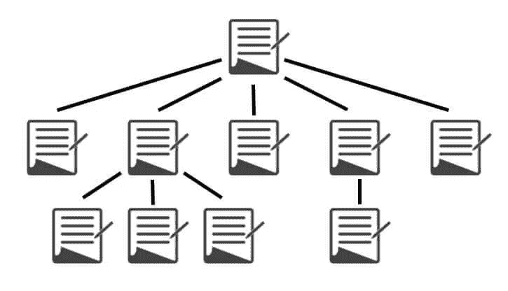

# 高效地链接 WordPress 博客文章

> 原文：<https://medium.com/visualmodo/interlink-wordpress-blog-articles-efficiently-80553c7fef10?source=collection_archive---------0----------------------->

链接帖子是 SEO 的重要组成部分。当你想提高你的 WordPress 站点的搜索引擎优化时，你应该明白如何在搜索引擎中链接文章或博客文章以获得最大效果。重要的是要知道哪些帖子需要链接，以及链接时应该使用什么类型的锚文本。

内部链接是页面搜索引擎优化最关键的因素之一。在前一句话中，我放了一个链接到我的另一篇文章。这是内部联系的正确例子。

如果你有一些博客文章，很容易将它们链接起来。但是如果你有大量的博客文章，你需要变得狡猾一些，让事情变得简单一些。

在这里，我将向你展示一些在 WordPress 中链接你的博客文章的最佳方法。

在继续之前，我想分享一下 SEO 中内部[链接](https://visualmodo.com/wordpress-themes/)的一些好处。抓取和索引:当你链接你的博客文章时，它可以帮助谷歌机器人抓取并轻松找到你的文章。这样机器人可以快速索引你的网页。浏览量跳出率:内部链接帮助你的读者发现其他相关页面。它增加了你博客的浏览量，降低了跳出率。链接汁:链接帮助网页获得更好的链接汁以及更高的排名。例如，如果页面 A 链接到页面 B，这有助于页面 B 获得链接果汁。

现在让我们看看如何在 WordPress 中有效地链接你的博客文章。

# WordPress 本地链接

如果你对自己之前的博文有很好的想法，那么这将对你很有帮助。

你可以直接从 WordPress 编辑器中搜索并插入你的博客文章的链接。只需选择你想添加链接的单词，然后点击“插入/编辑链接”图标。

然后通过输入关键词或文章标题来搜索你的博客文章，并添加链接。当你知道要链接什么时，这种方式是有益的。但是如果你有很多博客文章，就不容易回忆起这些文章并链接起来。

你可以这么做。

# WordPress 链接插件

有几个专门的 WordPress 链接插件，如 [SEO Smart Links](https://wordpress.org/plugins/seo-automatic-links/) 、[mentible](https://wordpress.org/plugins/mentionable/)、 [Insights](https://wordpress.org/plugins/insights/) 等。可惜都过时了。不再使用它们将不是一个好主意。目前，只有两个插件可以帮助你。

第一个是 [Yoast SEO](https://yoast.com/wordpress/plugins/seo/) 。它有一个高级版本，提供“[内部链接建议](https://yoast.com/wordpress/plugins/seo/internal-linking/)”功能。Yoast 收集了博客文章中最突出的单词，并根据这些单词制作了一个博客文章列表，用于链接。

一旦你激活了 Yoast SEO Premium，你会在编辑器的右边看到一个“Yoast 内部链接”框。您可以从那里复制文章链接，并将其插入到新的博客文章中。Yoast SEO 的另一个令人惊讶的功能是，你可以检查博客帖子的内部链接的数量。

只要进入 WordPress Dashboard > SEO (Yoast 标签)> General 标签，点击“计算你的文本中的链接”。这需要一些时间来计算你的链接。一旦完成，现在从 WordPress 仪表盘转到“所有文章”。您将看到两个新列，显示帖子中的内部链接数量。

这样你就可以很容易地找到低内部链接的博客文章。你可以在这些文章中添加更多的内部链接。我更喜欢使用这个插件，因为大多数 WordPress 网站所有者已经在使用这个插件的免费版本了。然而，如果你正在寻找另一种解决方案，我建议你使用链接管理器。

这是一个完整的内部链接管理器[插件。如果你没有为你的旧帖子做任何链接，这个插件会对你很有帮助。它有一些神奇的功能，如分析链接，跟踪点击，计算链接汁，自动链接，链接建议，等等。](https://visualmodo.com/blog/)

链接建议是这个插件最有用的功能。它可以帮助你在编辑文章时找到相关的文章。这会节省很多时间。所以这是两个最好的 WordPress 链接插件。

# 谷歌搜索

通常，我们会把旧的博客文章和新的文章链接起来。但是刚刚发表的新帖子呢？

我们需要把新帖子和旧帖子联系起来。在这种情况下，您必须找到与新帖子相关的旧帖子。你可以通过简单的谷歌搜索找到你自己的网站。

例如，我将在自己的博客中搜索关键词“内部链接”。我要做的就是，搜索“site:roadtoblogging.com 内部链接”这个词。

它显示了带有关键词“内部链接”的博客文章。现在，我将浏览所有的博客文章，并检查新的博客文章是否与链接相关。我会相应地链接新帖子。

该技术主要对新发表的博客文章有帮助。但是你也可以用它来写旧文章。

# 结论

所以这些是你可以用来在 [WordPress](https://awards.visualmodo.com/) 中更有效地内部链接你的博客文章的方法。现在我想给你一些内部链接 SEO 技巧来帮助你更好地进行内部链接。

*   不要使用太多的内部链接。
*   不要为了 SEO 而使用内部链接。只有当你认为对你的读者有益的时候才链接。
*   不要过度优化内部链接的锚文本。你不需要一直使用精确匹配的锚文本。
*   不要反复链接同一个页面。

在做内部链接时，请记住这些要点。

现在我想听听你的意见。你使用其他方式或插件来链接你的博客文章吗？请通过评论让我们知道。如果你觉得这篇文章有用，请分享这篇文章来帮助我。