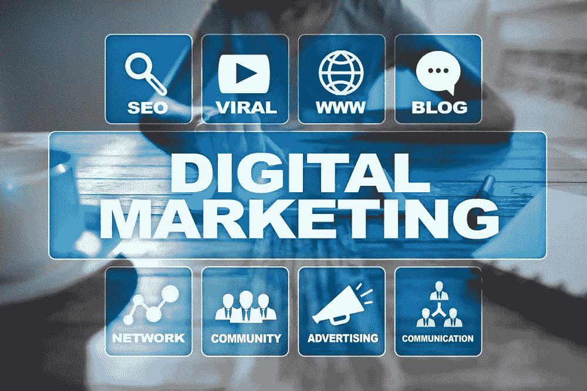

# 网络营销和如何利用它来为您服务

> 原文：<https://medium.com/visualmodo/internet-marketing-and-how-to-use-it-to-your-advantage-e0d329b049ca?source=collection_archive---------0----------------------->

现在，越来越多的人在网上进行交易。由于这个原因，电子商务已经广泛扩散。大多数在网上经营的企业家都在想方设法推广他们的业务。为他们的企业做广告的一种方式是通过互联网营销，也称为数字营销或网络营销。

# 什么是互联网营销？

网络营销是指在互联网上做广告或推销产品和服务。这是一个有效的营销策略，可以带来更多的流量，线索和销售。它指的是营销策略，如电子邮件营销，搜索引擎优化，网页设计策略，在线促销和互惠链接。一些营销渠道包括博客、内容、联盟营销、联盟计划、点击付费广告和视频/播客。

# 利用网络营销

一个企业家或营销人员可以接触到世界各地的大量的人，如果他利用互联网营销。以下是一些如何利用数字营销的方法:

*   **全球营销**

互联网营销可以通过 SEO 或搜索引擎优化等营销工具接触到全球的人们。通过这种营销，你可以在世界范围内展示你的产品和服务。许多人可以浏览你的网站和网上商店，这可以产生潜在的客户。如果你想放大你的 SEO，不要犹豫，向游戏的专家寻求专业的帮助，例如 [SEO Toronto](https://digitalrocketfuel.com/) ，他们将帮助增加你的业务在网上的知名度，使其建立和成功。

*   **高性价比促销**

数字营销的一个显著优势是，你可以以较低的成本推广你的业务。这意味着不需要为电视、广播、杂志和报纸等广告付费。你可以使用电子邮件营销向你的潜在客户发送有关你的业务和产品的信息。但是，要确保你有一个行动号召按钮，可以引导你的网站或你的产品。你也可以在一些商业目录中免费列出你的企业，比如在 Google My Business 上。

*   **销售线索生成**

互联网营销有渠道，如内容、博客、电子邮件和社会媒体，如上所述。利用这些渠道可以产生潜在客户，即有兴趣购买你的产品或服务的人。这些线索可能会成为你现在或未来的潜在客户。

*   **管理**

在网络营销，有具体的工具，你可以用来管理和经营你的业务。这些包括跟踪和衡量你的促销活动的结果。这些工具还可以用图形展示你的营销活动。有了这个，你可以很容易地了解你的广告活动的来龙去脉，这将让你做出调整和决定，以改善你的业务和营销。

*   **处理大量交易**

你可以利用网络营销来同时控制大量的客户。然而，你的网站的基础设施必须是可靠和高效的，才能做到这一点。你必须有一个优秀和功能的网站设计，配备了完整的组件，有一个安全的交易，并为您的用户提供最佳的购物体验。

*   **品牌知名度**

数字营销可以提高品牌知名度。利用网络营销渠道，你可以让很多人很容易记住你的企业或公司。你只需要创建高质量、独特的内容和详细的登陆页面来给你的网站打上品牌。最重要的是，你必须拿出高质量的产品和服务。

网络营销是一个明确的方式来达到许多人可能是你的客户现在和未来。应用上面的提示，最大化它的好处。