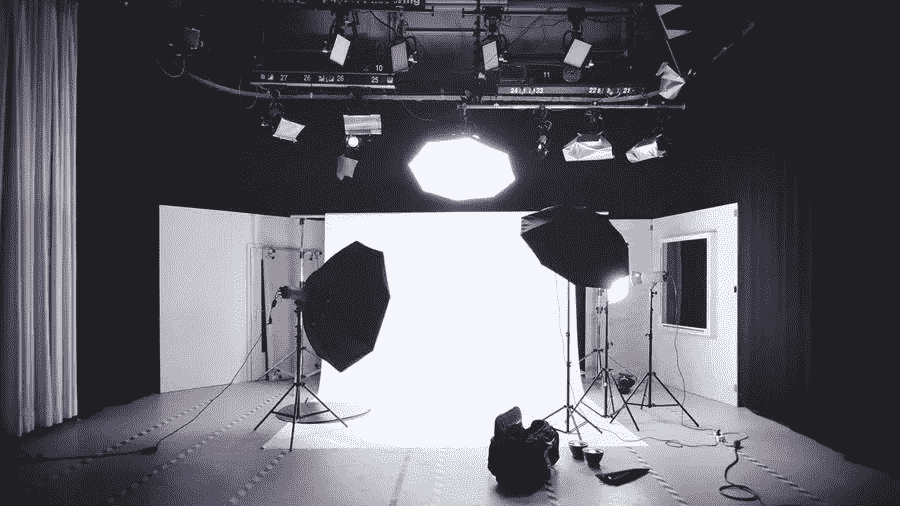

# 摄影工作室是一个好的商业选择吗？

> 原文：<https://medium.com/visualmodo/is-a-photography-studio-a-good-business-choice-e65758881f43?source=collection_archive---------1----------------------->

如果你有什么原创摄影技巧，不妨自己创业。你不是唯一一个将你的创意渠道转变为盈利业务的人。摄影现在是一种流行的职业和爱好。在这篇文章中，我们将回顾并了解摄影工作室是否是一个好的商业选择。

# 1.给你更多的效率

拥有一个摄影工作室是很重要的，因为它给摄影师。客户可以更好地控制他们拍摄照片的环境。在大多数情况下，试图确定一个理想的摄影地点是很麻烦的。通常需要几周或几个月的前期侦察来确定最佳位置。在某些情况下，客户甚至会在拍摄前改变主意，这就造成了问题。然而，有一个照相馆有助于这一点，因为照片可以出现更多的变化。所以，一个很好的理由来证明，摄影工作室业务是一个很好的选择。

使用绿色屏幕，摄影师可以创建一个满足客户需求的背景。因此，此后的任何变化都可以通过数字增强技术轻松实现。照相馆也不需要为拍摄做冗长的准备；客户只需要进来，过一会儿就完成了。

# 2.更少的干扰

与异地摄影相比，照相馆提供了一个干扰较少的环境。而且，大多数情况下。虽然有些客户可能更喜欢在大自然中拍摄。由于自然和环境的干扰，在寻找合适的时间拍照时会产生许多困难。此外，在某些情况下，会议可能会因为人们进入镜头而被打断。或者来自附近车辆或事件的噪音。在某些情况下，天气甚至会突然变化。因此，导致摄影中断，导致额外的成本和延迟。