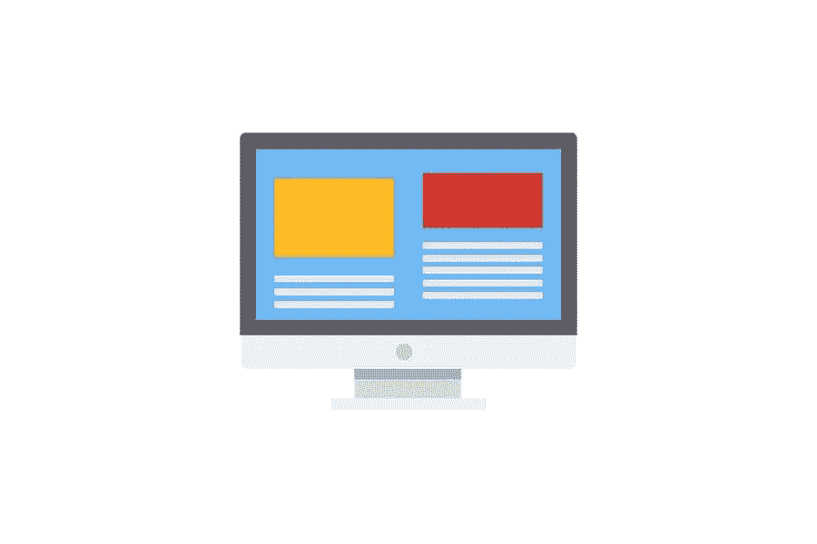

# 如何创建黑仔登陆页面

> 原文：<https://medium.com/visualmodo/landing-on-your-feet-how-to-create-a-killer-landing-page-e41f543c080d?source=collection_archive---------0----------------------->

准备好谈论转换了吗？如果你没有得到它们，那么答案很可能是一个响亮的是。我最常从客户那里听到的一件事是，“我有一个很棒的产品和一些杀手级的社交媒体广告，但我没有获得很高的转化率——我做错了什么？”在这篇文章中，你将学习如何创建一个杀手级的登陆页面。

出现这种情况有几个原因，根据我的经验，最常见的原因也是最容易解决的。在进行社交媒体活动时，许多人会犯菜鸟的错误，把客户从广告发送到他们的网站主页。这有什么不好？

几乎在所有情况下，你主页上的内容并不反映你广告的内容。这是一个问题，因为当你花钱抓住的客户发现自己在一个与他们点击的广告不是 100%相关的页面上时，他们就失去了兴趣。所以，本质上，你在竞选上浪费了时间和金钱。不要担心——正如我所说，答案就在你的指尖。

# 建造它，他们会来的。

事实证明，使用登录页面可以显著提高企业的转化率，原因如下。登录页面就像是你企业的迷你网站。

然而，与你的网站不同的是，一个登陆页面是超级有针对性的，并且与你的用户首先感兴趣的内容高度相关。这意味着，当你的用户点击你的内容或广告时，他们会发现自己所在的页面只包含一件事的信息——这个话题吸引了他们的注意力，足以让他们离开他们的社交媒体平台，”Chilli Fruit Web Consulting 的 Milosz Krasinski MD 说

在一个注意力持续时间比普通金鱼还短的时代，登陆页面的使用对于那些认真对待提高转化率的品牌来说至关重要。

令人高兴的是，现在有大量的登录页面构建工具——其中一些可以免费使用，让你在几分钟内就能完成一个页面。没那么快，speedy——在你一头扎进创建你的第一页之前，有几件事要记住，下面是我的创建一个杀手级登陆页的指南。

# 当然

你在登陆页面上只有有限的空间，所以最好的办法是尽可能多的填充信息，对吗？不对。虽然你很想尽可能地把页面填满，但这是适得其反的。

当面对一个“繁忙”和超载的页面时，普通用户会失去兴趣(还记得我说过的注意力持续时间吗？)在创建登录页面时，你希望用一条清晰的信息保持简单，以免不知所措。出于这个原因，你需要花些心思弄清楚你的关键信息是什么，然后坚持下去。

大多数用户会浏览而不是阅读你的登录页面上的内容——事实上，大多数用户实际上只会阅读大约 28%的内容。这意味着你需要让你的核心信息脱颖而出，让它保持简单，并遵循几个简单的规则:

*   使用项目符号将用户的注意力吸引到信息的关键部分。
*   在第一段的第一行使用你的关键词。人们倾向于从左上方扫描文本，所以这是你的信息应该在的地方。

# 成像

在你的登陆页面上使用图片是必要的。人类是视觉动物，优秀的照片或视频有助于吸引用户的注意力。与您的信息一样，图像应该清晰、易于理解，并且与内容相关。本着化繁为简的精神，最好坚持使用一张本身就能讲述一个故事的精彩图片。

例如，经典游戏网站 Solitaired 的团队在其登录页面上列出了所有的纸牌游戏。理解了用户对图像的反应后，他们用互动游戏代替了他们的娱乐目录。这使他们的跳出率降低了 40%以上，并改善了他们的总体用户漏斗。

# 金钱的颜色

当看你的登陆页面的整体设计时，颜色比你想象的更重要。我们已经知道，人们对染料有情绪反应，这方面的一些例子有:

红色表示兴奋和大胆。

**橙色**——代表清澈和温暖。

**绿色**——代表增长、现金和活力。

**蓝色** —表示力量和可靠性。

白色代表中立和冷静。

根据你想要传达的信息，颜色的使用可以帮助你强调重点。

# 制作标题以创建黑仔登陆页面

你只有一次机会阻止你的用户离开你的登陆页面，而且，在很多情况下，这都取决于你的标题。为你的登陆页面创建标题可能需要一些练习，但是你会发现这是值得花时间的。标题应该简短有力，并且应该清楚地解释提供的内容。始终避免在标题中使用行话或“推销”信息(就此而言，在所有文本中)。记住，你写的不是战争与和平。你把一个信息和一个目标组合在一起——让手指点击进入下一个阶段。

# 牢记销售周期

当进入登录页面的世界时，越多越好——这意味着您可能想要创建一些不同的页面？为什么？对大多数品牌来说，营销是多方面的，在销售周期的不同阶段，各种各样的活动被用来吸引用户。此外，出于这个原因，您需要为自行车的每个部分提供单独的页面。例如，您吸引全新用户的活动应该包括关于您的产品或服务的清晰明了的信息。相比之下，针对那些已经对您的产品感兴趣的人的活动应该专注于回答用户可能有的问题。

# 不要害羞

正如我们已经说过的，谈到你的措辞，销售发言是不被考虑的。然而，不自吹自擂仍有可能让自己变得强大。在登录页面上使用简短的推荐或评论可以加强您的信息的价值主张。

# 创建黑仔登陆页面的行动计划

所以，你已经掌握了你的标题，你使用了完美的图片，你的副本短小精悍……但是，如果你的行动要求不够理想，这一切都可能是徒劳的。

您将所有这些工作都放在创建登录页面上是为了一个原因——推动您的用户完成一个操作。

无论是购买、订阅时事通讯还是请求更多信息，如果你不清楚你想让他们做什么，他们实际上不太可能做到。如果您只有时间关注登录页面的某一部分，那么这应该是您的行动号召，您的首要要求是:

## 安置

我们之前谈到了关键词在文本中的位置，应该放在左上角。关于 CTA 的放置，规则略有不同。在可能的情况下，行动呼吁应该放在登录页面的右上角。其原因可以追溯到一句古老的广告谚语，即“保持视线，保持右上方”。我们的眼睛往往会自动被吸引到页面的右上角，这种放置是将 CTA 保留在用户眼线中的最佳方式。

## 一句话是什么

仔细听。我只会说一次。在任何情况下，不要对你的 CTA 使用“专横”的语言，比如“立即下载！”如果你想让你的用户[点击你的 CTA](https://visualmodo.com/7-landing-page-design-trends-for-2021/) 。你需要回答这样一个问题:“这对我有什么好处？'

价值主张应该是贯穿您登录页面的主线。所以，使用“下载我的免费电子书”或“签约我享受折扣”等措辞会得到更好的结果。

原因很简单。你不是告诉用户在没有任何动机的情况下做某事，而是给他们一个明显的理由去做。

## 这一切都是为了我创造一个黑仔登陆页面

从最后一点开始。当谈到你的行动号召的措辞时，细微差别是必不可少的。例如，以“下载我的免费电子书”为例。研究表明，这句话会比“下载你的免费电子书”这句话多获得近 90%的转化率。我不是说我们人类是一群以自我为中心的人，但是，这一点是绝对正确的。对于大多数用户来说，“这都是关于我的”。

高转化率登录页面的一个很好的例子是 Cigital。如你所见，标题醒目而直接。该值清晰可见，并且页面上的亮黄色 CTA 按钮清晰可见。

# 走到门口

把你的登陆页面想象成从你的用户家门口到你家门口的公路旅行。现在，想象一下这条路上有大量的交通灯、岔道和通行费。可以肯定地说，你的用户要么会在中途耗尽汽油，要么会认为这趟旅程不值得。

皈依的关键是尽可能保持皈依之路的快速和直接，以获得最大的成功机会。这意味着限制表单域的数量，并保持它们超级短，以避免失去用户的兴趣。站在他们的角度想想。你愿意花很长时间填写不同的表格，穿过几道关卡才能到达终点吗？”

杰克·兹穆津斯基，未来处理公司的高级助理

# 转换已转换的以创建黑仔登录页面

所以，你的用户已经顺利通过了这个过程，并转变成了一个用户。干得好，但你还没完成。这里的诀窍是让他们想要更多。因此，你可以通过一个引人入胜的感谢页面来做到这一点。这让用户感觉受到重视，但你也可以借此机会追加销售或提供进一步的信息。

# 保持一致

很有可能，我已经提到过，你需要不止一个登录页面来展示不同的信息。相比之下，CTA 和关键信息可能略有不同。确保品牌和整体核心信息在整个页面上保持一致是很重要的。

# 一次又一次的测试

虽然您的页面可能包含所有内容，但您认为它应该而且可能看起来很棒。现在不是放松油门的时候。测试应该是你的登陆页面策略不可或缺的一部分。这是你确切知道什么有效，什么无效的唯一方法。

# 结论创建一个黑仔登陆页面

2021 年，竞争比以往更加激烈。对于希望领先的品牌来说，踩水不是一个选择。花时间和精力掌握登录页面是一项投资，从长远来看将获得回报。因此，在那些非常受欢迎的转换绞。