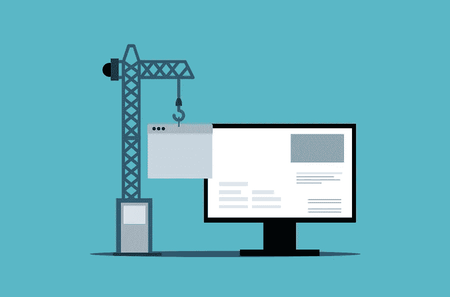

# 要避免的登录页面设计错误

> 原文：<https://medium.com/visualmodo/landing-page-design-mistakes-to-avoid-ec6ed1551aef?source=collection_archive---------0----------------------->

登录页面是一个独立于网站的页面，创建的目的是为了挖掘潜在客户。通常，用户通过自然搜索或赞助商链接进入登录页面。登录页面对企业很重要，因为它们只关注潜在客户的产生，而不是信息网站。在这篇文章中，你会看到要避免的顶级登录页面设计错误。

所以，一个弱的登陆页面会影响转化率。有许多登录页面设计错误会降低您的业务绩效。今天我们将分析常见的错误。为了找到更多信息，你可以直接联系创作专家。

# 1.无聊或不相关的标题

经常发生的情况是，在线广告吸引了你的注意力，你点击了它——然后去了一个内容乏味、与广告信息无关的网站。重要的是，登录页面的内容与广告活动的报价相关。访问者对点击后在网站上会看到什么有一定的期望。如果这种期望没有达到，你会立刻产生一个负面的第一印象。潜在客户很可能会离开。

标题的目的是提供对登录页面和业务的深入了解，因此无聊或不相关的标题具有破坏性。相反，引人注目和有意义的标题会让用户继续往下走。

# 2.过多的文本或广告:登陆页面设计错误

就内容而言，越多并不总是越好。过长的文本也会让访问者反感。如果页面如此无聊和笨拙，那为什么还要等待呢？

这种方法排斥顾客，而不是吸引他们。您在登录页面上分享的信息应该传达提案的精髓。确保[文本的数量足够](https://visualmodo.com/creating-high-converting-landing-page/)，但不要过多——它不应该引起负面情绪。

# 3.可笑的设计和奇怪的图像

当一个访问者访问一个登陆页面时，他应该会看到一些他感兴趣的东西。这将说服他留在页面上。除了文本，不要忘记图像——毕竟，视觉内容被感知得更快，并影响潜意识。