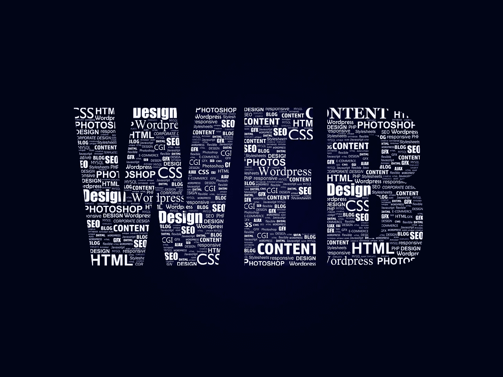

# 学习网页设计

> 原文：<https://medium.com/visualmodo/learning-web-design-a80d51a1f901?source=collection_archive---------1----------------------->

## 如何开始并且不放弃

你希望拥有一个网站吗？或者，也许你有一个网站，但你想从事网页设计？那么这篇文章将帮助你获得学习网页设计所需的额外动力。然而，记住仅仅阅读这篇文章是不够的。网页设计需要数月甚至数年的时间来获得所需的技能、工具和技术。没有比这更快的方法了。最近的一项研究表明，如果一个网站的内容没有吸引力，38%的人会停止访问该网站。所以，你需要获得成功地使你的网站吸引人的技巧。请继续阅读，了解如何开始。

# 学习网页设计

# 有最低要求

创建一个网站只需要很少的信息。只要你有基本的计算机技能，你就可以开始了。开始时不需要编码。网页设计行业的经验也不是必须的。基本上，只要你知道什么是文本文件，你就可以了！

在这个过程中，你需要一些技巧来创建一个好的网站。色彩理论是一门你会学到的艺术。就像你将了解人类如何与网站互动，以及他们为什么会有这样的反应。尽管如此，你还需要学习 HTML。

最终，你将能够进步到更高级的技能，比如学习 JavaScript 的编程。你还将学习[搜索引擎优化](https://visualmodo.com/most-common-seo-mistakes/)和内容管理系统。

记住这只是最难的部分。简单的部分是确保你有内容。你应该进入这个行业，因为你热爱它。你必须对互联网和技术着迷。记住，创建一个网站需要很多时间，你的时间表应该有利于这一点。

# 浏览器是你的朋友

如果你看看互联网上的各种网站，你会发现很多人使用图像编辑器来设计他们的网站。他们稍后编码设计。有一些程序可以帮助你做到这一点，例如 Photoshop、Sketch、Illustrator 和 Inkscape。有几篇评论说明了为什么在创建网站时应该使用这样或那样的工具。但是，实际上应该是在浏览器中设计的。使用软件，如 Photoshop，不允许你浏览网页。

使用浏览器有几个好处。它让你看到你到底得到了什么。这意味着在基于浏览器的设计中，你可以看到它到底是如何工作的。这对于响应式设计来说很方便。

另一个好处是基于浏览器的设计可以帮助你提高网页设计的技能。浏览器强迫你学习 HTML。在学习不同浏览器如何工作的同时，您将深入了解编码的细节。这一定会让你成为更好的设计师。

# 灵活一点

网站的每个部分都应该能够改变。如果一个概念不起作用或者不适合网站的其他部分，它应该被改变或者完全删除。甚至在你启动它之后，你可能仍然会注意到一些错误，你可以选择改变网站的方向。

这些网站就像孩子一样。只是在这种情况下，他们不会长大并离开家。相反，你需要不断地照顾他们，维护将是一项例行活动。

# 内容很重要

创建网站时，通常会有一个虚拟文本。它的创建是为了展示添加内容后整体设计的外观。避免这样做。网站设计应该符合你的内容，而不是相反。通过这种方式，你将会对你需要多少空间有一个准确的概念，并且避免以后的错误。

# 不同的人浏览网站的方式不同

人们会从不同的屏幕上浏览你的网站。有些人会用电脑浏览，有些人用平板电脑，有些人用普通手机。这些设备中的每一个都有各种各样的尺寸。你的网站应该能够适应所有这些屏幕。这一点非常重要。如果人们可以轻松访问网站的各个区域，他们更有可能购买你要卖的东西。

有些人会在昏暗的屏幕上浏览，有些人会在明亮的屏幕上浏览。有些人可能视力不好。因此，你的网站应该有对比色。摆弄不同深浅的颜色。

从你拥有的不同设备上测试你的网站，你将能够注意到哪些地方需要改进，并做出必要的改变。

# 你在卖什么？

最后，不要忘记为销售而设计。这包括创建一个关于你自己的博客。你仍然在推销你的想法和你的生活经历。你销售是基于这样的假设:它会让你的读者对[感兴趣，并对他们有很大帮助。对于博客来说，确保你的读者能够快速方便地找到他们感兴趣的文章。对于小册子网站，确保每个页面都展示了特定产品的精华，并使购买变得容易。人们需要看到你卖的东西，并且确信他们想买。他们需要知道，下次他们想买的时候，有一种更简单的方法来获取你卖的东西。这可以通过订阅你的网站来获得电子邮件或短信，或者在每次添加新内容时获得通知。](http://www.writersdigest.com/online-editor/10-ways-hook-reader-reel-good)

# 结论

总之，创建你的第一个网站是非常容易的。在这个指南的帮助下，你可以在没有图像编辑器的情况下维护一个有好图像的好网站，同时提高你作为网页设计师的技能。启动网站后，从用户那里获得关于网站运行情况的反馈。万一你遇到问题，请随时询问专家。

你认为这些建议有用吗？

简介:杰克·莱斯特是一名散文作家，目前为 paperwriters.org 的 T2 写文章。他报道的最常见的主题是教育、写作和营销。他有自己的写作风格，这也是他受到读者欢迎的原因。你可以翻翻[脸书](https://www.facebook.com/jakelesterone)，[Twitter](https://twitter.com/jakelesterhere)&[Google+](https://plus.google.com/u/2/104790796126720594692)。