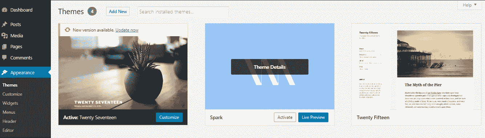
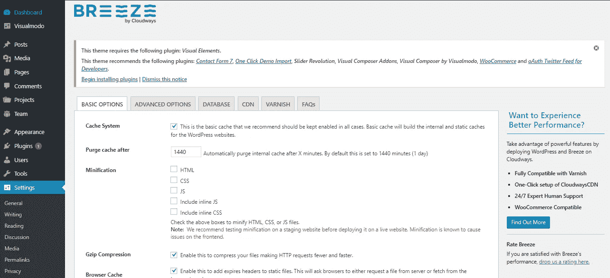
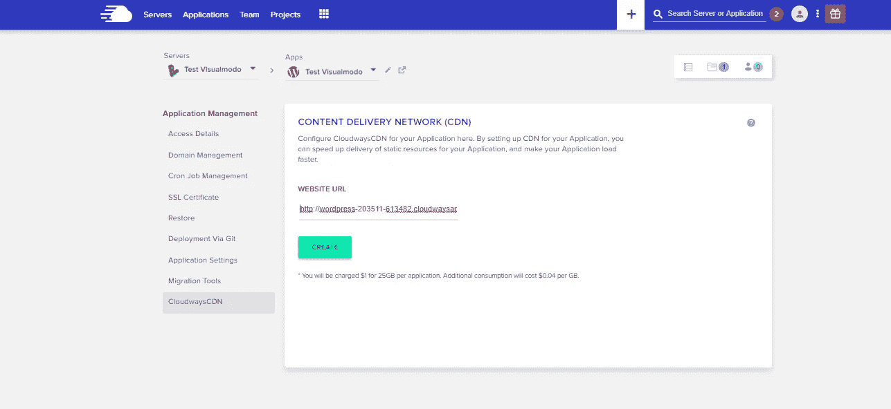

# 利用最快的 WordPress 主机

> 原文：<https://medium.com/visualmodo/leverage-fastest-wordpress-hosting-6bf0f2370369?source=collection_archive---------0----------------------->

## 用 Visualmodo 的 Spark 主题

想知道当 Visualmodo 与速度最快的 WordPress 主机提供商之一联手时会发生什么吗？请继续阅读，寻找答案。我们生活在一个快节奏的世界。从我们如何购物到我们如何消费娱乐，技术已经完全改变了我们过去的生活方式。

随着我们周围的世界变得越来越快，我们人类正在失去长时间专注的能力。最近，微软公司进行了一项研究，表明人们的注意力持续时间已经减少到可怜的 8 秒钟。令人震惊的是，即使是金鱼也有 9 秒的注意力持续时间。

如果你是一家从事网络业务的公司，上述统计数据对你来说应该是一个启示。在这个竞争激烈的环境中，你需要抓住你的观众的[的注意力](https://visualmodo.com/)，而且你需要动作快！

# 页面加载时间—一个重要因素

当用户访问你的网站时，他会被你网站的布局和美学设计所吸引。

说到这里，他也在不自觉的评估你网站的页面加载时间。更快的页面增强了用户的体验，并确保您的访问者停留更长时间。事实上，如果加载的时间超过 3 秒，40%的[网站访客会离开。](https://neilpatel.com/blog/loading-time/)

还有，不仅仅是用户体验的问题。谷歌——搜索引擎巨头在给网站排名时也将页面加载时间作为一个关键因素。更快的页面加载时间允许搜索引擎抓取更多你的网站，这对指数化有积极的影响。

# 如何加速你的 WordPress 网站

WordPress 目前为超过 31%的万维网提供支持。这个数字与日俱增。如果你拥有这些网站中的一个，你知道有很多竞争。

作为一家在线企业，你需要确保你的网站速度快，并提供良好的用户体验。您可以通过减小 cookie 大小、删除重复的脚本和优化图像来做到这一点。

尽管这些建议肯定会有所帮助，但它们不是问题的关键。提高页面速度的两个关键方法是:

*   雇佣最快的 WordPress 主机提供商，
*   使用一个简单的主题。

我们 Visualmodo 决定用我们的一个主题来尝试 Cloudways 托管，以测试它是否提高了网站的页面加载速度。这两个因素结合在一起，证明是天作之合。

# 关于 Cloudways——最快的 WordPress 主机提供商之一

Cloudways 是领先的托管云托管平台之一。该公司为数字机构、电子商务商店、创业公司、开发商和博客提供托管服务。他们充当最终用户和云提供商之间的中介。

Cloudways 与 5 家顶级云提供商合作。它们是:

*   谷歌云，
*   亚马逊，
*   数字海洋，
*   Vultr，和
*   利诺德

他们在全球拥有 60 多个数据中心，旨在为用户提供巨大的托管价值。

# 让我们开始:在 Cloudways 上安装 WordPress

首先，我们需要在 Cloudways 平台上安装 WordPress 并启动服务器。以下是一步一步的过程:

# 第一步:创建你的 Cloudways 账户

首先，您需要创建一个 Cloudways 帐户。去他们的[注册页面](https://platform.cloudways.com/signup)给他们你的详细信息。

之后，你需要登录。

# 步骤 2:启动服务器

接下来，您可以通过单击“启动”按钮轻松启动您的服务器。出于本练习的目的，我们选择了以下内容作为应用程序和服务器的详细信息:

*   应用程序:WordPress 4.9.8，
*   应用程序和服务器名称:Test Visualmodo
*   云提供商:Linode
*   服务器大小:1 GB
*   地点:弗里蒙特

单击“立即启动”按钮启动您的服务器。需要几分钟才能发射。

# 第三步:访问 WordPress 网站

启动服务器后，你会得到一个临时的 URL 来测试你的 WordPress 网站。从顶部的应用程序选项卡中获取 URL。

你可以很容易地用这个版本进行测试和实验，最终让你的网站上线。您的应用程序管理屏幕应该是这样的:

# 步骤 4:访问你的服务器

访问你的服务器的能力给你一种控制感。您可以从顶部的服务器选项卡中获取主凭据。

# 让我们从测试开始！

你现在可以走了！现在让我们比较一个默认的 WordPress 主题(217)和我们的一个主题的速度。这个想法是想看看 Cloudways 和 [Visualmodo](https://visualmodo.com/wordpress-themes/) 的结合会产生怎样的效果。

# pingdom——一个令人难以置信的网站速度测试工具

让我们先用默认主题测试一下我们网站的速度。Pingdom 是最可靠的网站速度测试工具之一。你所要做的就是输入网址并选择位置。它会在几秒钟内告诉你网站的速度指标。

让我们输入中转 URL，选择旧金山作为地点，因为它离弗里蒙特最近。

现在我们来分析一下[的测试结果](https://tools.pingdom.com/#597c3420b4800000):

使用默认的 Twenty 主题，您得到的性能等级为 A，得分为 91。页面加载时间为 420 毫秒

# Visualmodo 的拯救火花主题

Spark 是 Visualmodo 的高级 WordPress 主题。它允许你不用一行代码就能建立一个网站。无论你是一个专业博客还是一个电子商务商店，Spark 都可以做到。既然是高级主题，你就得买。

在你安装了主题之后，你可以很容易地集成它。在你的 WordPress 仪表盘中，从外观部分选择主题。

点击“新建”并上传主题。

一旦上传，Spark 将出现在你的 WordPress 仪表盘中。点击“激活”按钮激活主题。

我们来看看激活 Spark 后网站有没有什么改进。

让我们对其进行 Pingdom 测试。以下是[的测试结果](https://tools.pingdom.com/#597c5b86b0c00000):

您会注意到，成绩等级有了明显的提高，达到了 94 分。页面加载时间也减少到了 416 毫秒

然而，不是这样的！您可以使用 Cloudways 进一步提高网站的性能。

# Cloudways Breeze —将您的网站速度提升到一个新的水平

虽然有了 [Spark](https://visualmodo.com/theme/spark-wordpress-theme/) ，网站性能有了相当大的提升，但仍有进一步提升的空间。

Cloudways 提供了一个免费的 WordPress 缓存插件来进一步提高网站的性能。只需在 *Breeze、*中做一些调整，你就可以显著改善网站的页面加载时间。

我们开始吧！

您会在仪表板顶部找到 *Breeze* 功能。将鼠标悬停在它上面，然后单击“设置”。

你将到达这里。

在缩小部分，选中所有的框来缩小 HTML，CSS 和 JavaScript 文件。然后点击“保存更改”。这个想法是在不改变其功能的情况下从源代码中去掉不必要的字符。

此外，在“高级选项”选项卡中，将 CSS 和 JS 文件分组。不要忘记再次“保存更改”。

为了进一步改善页面加载时间，我们将移除表情符号支持。我们通过在主题代码中的**function.php**文件的末尾添加几行代码来做到这一点。这将是一个很好的举措，因为大多数 WordPress 用户不需要它。

现在让我们测试一下[结果](https://tools.pingdom.com/#597c690f5e800000):

现在的结果简直惊人！成绩等级提高到近乎完美的 99。网站上的每个页面只需 146 毫秒就能加载完毕。太不可思议了，对吧？

# 内容交付网络

[CloudwaysCDN](https://www.cloudways.com/en/?id=309377) 是 Cloudways 的另一个网站增强功能。它增加了你的网站的性能。

它是这样工作:

CloudwaysCDN 会为您的网站创建一个副本，并将其存储在遍布全球的多台服务器上。假设您是东京的用户，而您的服务器位于英国。CloudwaysCDN 将从您最近的位置获取数据，确保您的网站速度不会受到影响。

现在让我们看看如何在网站中集成 CloudwaysCDN:

在您的 [Cloudways](https://www.cloudways.com/en/?id=309377) 仪表板的 Applications 选项卡中，选择 CDN。在这里，输入您网站的 URL，然后单击“创建”。

在下一个屏幕上，只需点击“应用”。

最后，去你的 WordPress 仪表盘。在“设置”部分，选择 Breeze。转到 CDN 选项卡，选中“启用”和“保存更改以激活 CloudwaysCDN”。

# 最后

无论你是专业博主还是数字代理，你都需要保证你的网站速度快。

为此，你需要记住两个因素:在最快的 WordPress 主机上托管你的网站，同时使用轻量级主题。

正如我们上面所展示的，Cloudways 结合 Visualmodo 使得一个网站快如闪电。按照步骤，让魔法展开。感兴趣吗？了解更多关于 [Cloudways](https://www.cloudways.com/en/?id=309377) 的信息，并尝试他们的托管平台！

*我们希望收到您的来信。请在下面的评论区告诉我们你的想法。*