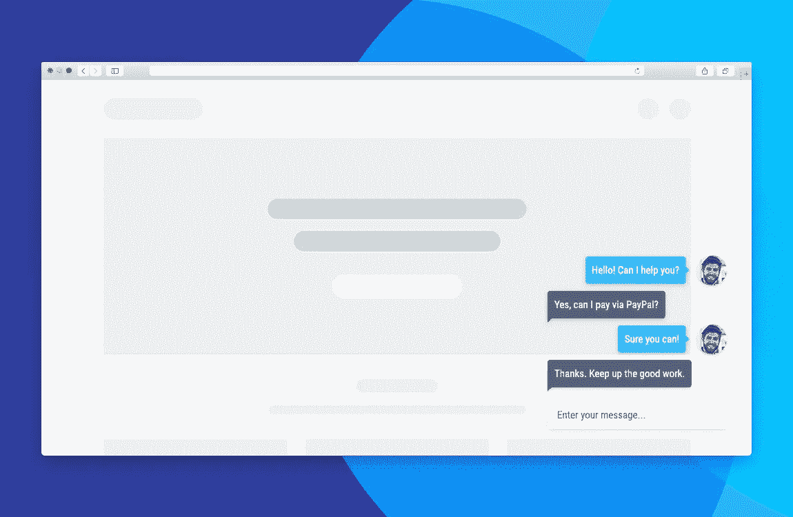

# 在线聊天

> 原文：<https://medium.com/visualmodo/live-chat-95b44705a24b?source=collection_archive---------0----------------------->

## WordPress 实施指南

想给 WordPress 网站添加实时聊天功能吗？接着往下读，因为我们正在看一些最好的实时聊天插件

有疑问或投诉的顾客过去不得不直接去商店，但是当电话发明后，顾客可以打电话给商店。尽管这一度是一项创新，但人们很快就厌倦了它还带来的与接受客户服务相关的问题。

接下来是互联网。电子邮件和社交媒体使得代理可以一次解决更多的问题，使响应时间更快，但显然不够快。在解决客户服务问题时，电子邮件和社交媒体都有其不足之处。

及时解决客户问题的最新尝试是实时聊天，它结合了电话和互联网的优势。

自 20 世纪 80 年代末以来，实时聊天就一直存在，当时 Quantum Link 为 Commodore 64 创建了在线消息(OLM ),为即时消息铺平了道路。Q-Link 后来被称为 AOL——一个你可能更熟悉的公司名称。

许多人认为实时聊天只是客户联系卖家的另一种方式，但由于有其他媒体可以提供客户服务支持，所以还没有太多考虑其实施。的确，这是一个错误，因为实时聊天有助于提高客户满意度，从而增加销售额。

# 为什么是实时聊天？

许多人认为实时聊天是另一项需要掌握和实施的技术，也是一个额外的预算/人员安排问题。那些有这种想法的人忽略了在 WordPress 上建立实时聊天的好处。

第一，实时聊天方便客户。他们不必退出网站来创建查询，如果他们有问题，只需点击一下就可以获得帮助。51%的消费者表示他们喜欢实时聊天，因为他们可以在工作时进行多任务处理和在线购物。

实时聊天[支持](https://visualmodo.com/blog/)代理也能够同时处理多项任务，这使得公司可以通过不雇佣运营呼叫中心所需的那么多代理来削减成本。

实时聊天通过提供及时的响应来改善客户服务体验。一项研究发现，93%的企业没有遵守“5 分钟规则”——只有 7%的公司在 5 分钟或更短时间内回复询问！

这是值得注意的，因为仅仅 5 分钟的响应延迟就会导致此人成为销售线索的几率降低 400%。在同一项调查中，7%及时回复询问的公司有一个共同点，那就是他们使用实时聊天。

良好的客户服务会带来销售，38%的客户表示，他们通过实时聊天进行了购买。eMarketer 的一项研究还发现，63%的客户会回到有实时聊天功能的网站。

最重要的是，在线客户更喜欢这种客户支持方式。与任何其他客户服务沟通媒介(包括语音、电子邮件、web 表单或社交媒体)相比，92%的客户对使用实时聊天感到最满意。

底线是:在 WordPress 上使用实时聊天并不难，也不贵。这里有一些在 [WordPress](https://visualmodo.com/help/) 上建立实时聊天的最佳插件:

# 实时聊天 WordPress 插件

# LiveChat

[LiveChat](https://wordpress.org/plugins/wp-live-chat-software-for-wordpress/) ，就像它的名字一样简单明了，采取一种严肃的商业方式。它是实时聊天支持软件的行业领导者，并提供一个免费插件，使网站所有者即使在旅途中也能与他们的网站访问者交流，因为你不必登录到 WordPress 仪表盘来使用该工具。LiveChat 应用程序允许您或您的聊天操作员从笔记本电脑、平板电脑或手机访问 LiveChat。

LiveChat 附带了一个功能，允许聊天代理根据某些标准向用户发送聊天邀请，如他们访问了多少页面或他们在一个网站上呆了多长时间。其他功能包括实时监控、文件共享和为客户提供 24/7 支持的内置票务系统。后一个功能使得即使你离线，你网站的访问者仍然可以联系你寻求支持。

LiveChat 还与第三方软件解决方案无缝集成，如 Zendesk、Google Analytics、流行的 CRM Hubspot、Salesforce 以及脸书和 Twitter 等社交媒体网站。

但是使用 [LiveChat](https://www.livechatinc.com/) 就不是了。基本计划按年计费，起价为 16 美元/月/代理人。

# Zendesk 聊天

来自顶级客户服务平台的 [Zendesk Chat](https://wordpress.org/plugins/zopim-live-chat/) (原名 Zopim)是领先的实时聊天服务之一，可以通过免费插件轻松添加到 WordPress。

除了作为最受欢迎的客户服务工具提供商之一，Zendesk 还拥有这个插件列表中最时尚的实时聊天框界面，可以在 WordPress 上进行实时聊天，具有可定制的布局和主题。

ZenDesk Chat 还提供聊天触发器(当访问者在一个页面上停留一定时间或访问一定数量的页面时，它会打开聊天框)、移动优化的小部件和高级分析仪表板。

有一个免费的 Zendesk 聊天计划，但它只允许一个代理处理聊天，而且你一次只能和一个客户聊天。如果你是网站(和企业)的唯一所有者和经营者，这可能是你的理想选择。对于其他人来说，Zendesk Chat 的溢价起价为 14 美元/代理人/月

# 奥拉克

Olark 是市场上最好的实时聊天解决方案之一，你可以在你的 WordPress 网站上使用一个小部件(只需将代码片段添加到你的孩子主题中)或 WP 插件[Olark](https://wordpress.org/plugins/olark-for-wp/)来设置它。

Olark 的功能非常强大，包括:

*   聊天报告
*   CRM 和帮助台与许多流行的软件解决方案集成，包括 Salesforce、Zendesk 和 Groove
*   能够根据职能(如销售或支持)将操作员分成团队
*   搜索聊天历史的能力——每个聊天对话框都会获得客户在您网站上活动的详细分类。对话结束后，客户可以留下评级
*   白色标签功能
*   能够查看顾客购物车中的商品

Olark 的定价相当简单，从 17 美元/代理人/月开始。

# WP 实时聊天支持

[WP 实时聊天支持](https://wordpress.org/plugins/wp-live-chat-support/)面向在 WordPress 上寻找经济高效的实时聊天解决方案的企业。

它有 6 个预定义的聊天框主题，能够将聊天拖放到页面上的任何地方，能够无限制地同时聊天，离线消息存储，谷歌分析集成，没有广告或链接，以及能够根据访客的 IP 地址禁止他们与你聊天。

该插件在技术上是免费的，但你可以一次性支付 39.95 美元升级到他们的高级版本，获得一个网站的许可证。高级功能包括无限的实时聊天代理、预定义的响应、客户满意度评级，以及将代理照片添加到实时聊天窗口的能力。

# Tidio 实时聊天

Tidio 实时聊天插件是最容易设置的实时聊天插件——只需激活它，您就可以开始了！它有 3 种不同的设计，你可以调整配色方案，以适应贵公司的品牌。

Tidio 提供了一个专用于移动和桌面设备的应用程序，您可以在其中管理您的实时聊天，以及一个集成的小工具，支持 140 多种语言的实时聊天。

如果您不在线，访问者可以通过电子邮件向您发送问题，您也可以通过电子邮件回复他们。此外，Tidio 实时聊天与 Zendesk、GetResponse、SalesForce 和 MailChimp 集成。

Tidio 提供了一个支持一个代理和一个开放聊天的免费计划。3 名操作员的高级计划起价为 15 美元/月，可以以 10 美元/月/人的价格添加其他操作员。或者，您可以选择每 5000 个独立站点访问者每月花费 15 美元的计划。

# 在 WordPress 上设置实时聊天

如今，实时聊天是许多网站的必备功能，尤其是电子商务网站，人们在完成购买前经常会有疑问。WordPress 上的实时聊天通过提供及时的响应来改善客户服务体验，这可以对业务产生积极的影响:增加品牌忠诚度和销售额。

使用插件，很容易在 WordPress 上建立实时聊天。你唯一要担心的事情是确保你的实时聊天是由经过培训的客服人员来处理客户服务查询！