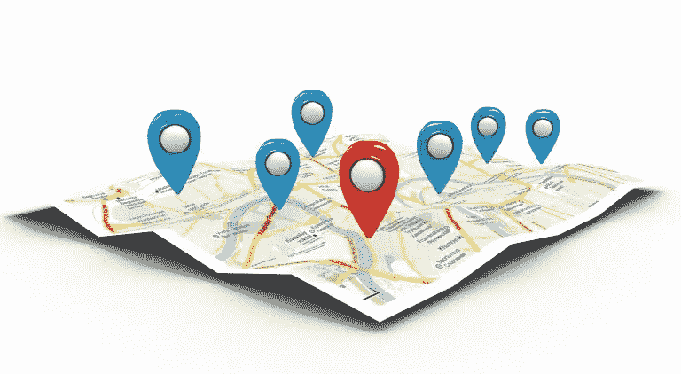

# 本地业务与搜索引擎优化

> 原文：<https://medium.com/visualmodo/local-business-vs-seo-bd327e2b37a4?source=collection_archive---------0----------------------->

本地搜索新手？想知道从哪里开始？我们的搜索引擎优化专家提供策略，帮助您启动您的本地商业网页排名和搜索优化。

# 本地商业页面排名

如果你遵循 SEO 策略已经有一段时间了，你应该知道一件事:SEO 一直在变化。当谈到本地搜索引擎优化时，为可能正在搜索你的本地业务的客户优化你的站内和站外搜索引擎优化策略比以往任何时候都重要。本地竞争正在升温，如果你不在你的排名上，你可以打赌你的竞争对手会。

# 结构数据

如果你想在本地排名，有 3 件事要记住。第一个是向您的站点添加结构化数据。至少在你的联系人页面上有 schema.org 标记是很重要的，你也可以考虑把它添加到页脚。Yoast 的本地 SEO 插件可以帮助你解决第一个问题。它会将[谷歌](https://visualmodo.com/)地图插入你的联系页面，以及你的公司地址和营业时间。除此之外，如果 Google 选择为您的网站使用丰富的搜索结果，您可能还会在搜索结果页面中看到这些数据。西雅图汽车最佳乘坐目前没有任何结构化数据，所以我们强烈建议将其添加到他们的网站！

# 搜索您的业务

此外，你应该让谷歌知道你是一个本地企业主，有一个谷歌我的企业帐户。当人们在西雅图搜索汽车服务时，这将有助于您的网站出现在搜索结果中。拥有这一点也可以在 SERPs 中产生丰富的结果，比如知识图。请确保您的 Google My Business 帐户中列出的地址与您网站上显示的地址完全相同，否则您将无法从拥有该帐户中受益。

# 复习

在你的网站上有评级和评论是很重要的，可以让你的访客觉得你的企业值得信赖。此外，这也有助于谷歌确定你的业务对他们的用户是否有价值。因此，西雅图最佳城市汽车服务公司应该为客户提供一种可能性，让他们对自己的服务进行评级，或者在自己的网站上写一篇感言。这是他们可以在使用他们的服务后主动要求客户做的事情。

# 表演

页面速度是谷歌最重要的排名因素之一，所以确保你的网站加载速度很关键。我们做了一个西雅图城市汽车最佳乘坐页面速度检查，这是我们发现的。

首先，我们建议侯赛因看看他们的托管公司。当使用谷歌的 PageSpeed Insights 工具时，“减少服务器响应时间”是建议之一。这不是你自己能做到的，但这取决于你的托管公司提供什么样的服务器。如果他们不能加快响应时间，可以考虑寻找更好的托管公司。

其次，应该为所有类型的文件启用浏览器缓存。对于 seattletowncarbestride.com 上的一些 JPG 和 CSS 文件来说，情况并非如此。由于这个站点运行在 Apache 服务器上，您可以在 Yoast SEO 插件中很容易地解决这个问题。您可以通过在。htaccess 文件。

最后但同样重要的是，西雅图城市汽车最佳乘坐应该优化他们网站上的一些图像。需要压缩的图像列表可以在 Pagespeed Insights 工具中找到。压缩图像将减小文件大小，这将使这些图像加载更快。

# 用户需求

如果人们致力于为搜索引擎优化他们的网站，他们往往会忽略用户体验。但是，如果你的访问者似乎喜欢你的网站——谷歌通过分析所谓的用户信号来确定——这可以积极地影响你的排名。谷歌希望为用户提供最好的搜索结果和体验。所以不要忘记时刻关注你的网站的可用性。

西雅图城市汽车最佳乘坐在其网站上有相当多的移动元素，导致分心，并可能对用户体验产生负面影响。尤其是在主页上，当一路向下滚动时，移动的图像变得有点烦人。淡化这一点会让网站看起来更加专注和平静。

另外，在主页上使用了一个[滑块](https://visualmodo.com/)。这是我们建议不要做的事情。在这种情况下，最重要的原因是，如果滑块发生变化，行动号召会消失并重新出现。这使得访问者很难到达你想让他们到达的页面。

图片是你网站的重要组成部分，因为它们可以让你的网站更有吸引力。确保它们没有损坏或丢失，尤其是在主页上，这看起来有点不专业:

# 为你的访问者和谷歌写内容

我们喜欢西雅图城市汽车最佳骑行的地方是，他们提供的所有服务都有单独的登录页面。这使得优化每个服务的关键词成为可能。因此，他们在每个服务中排名的机会都会增加。服务页面也有一些描述服务内容的内容。请记住，你应该在一页上至少写 300 个字，向谷歌展示你真的知道你在说什么。因为谷歌希望向用户展示尽可能好的搜索结果，你应该能够让谷歌相信你是这方面的专家。

西雅图城市汽车最佳乘坐的一些页面可能会受益于一些额外的关注。“[预订](http://seattletowncarbestride.com/book-a-limo/)页面和“[价格](http://seattletowncarbestride.com/seattle-sea-tac-town-car-rates/)页面缺乏介绍性内容。两者都可以被谷歌视为“内容单薄”的页面，降低了它们的排名机会。此外,“预订”页面内容很少，联系方式也不完整。一定要确保你的访问者能够找到你，否则，优化你的网站根本没有意义。

除了希望阅读你的内容的访问者之外，谷歌也试图“阅读”你的内容。标题在理解你的内容中起着重要的作用。Seattle Town Car Best Ride 使用 H1 和 H2 标题来组织文本，但它在几乎每一页上都使用了两次 H1。谷歌可能会感到困惑，因为它假设 H1 描述了页面的主题。如果有多个 H1 标题，谷歌不知道你认为哪个最重要。

元描述是 SEO 的另一个重要内容元素。如果你想说服潜在的访问者点击进入你的网站，一个好的元描述是至关重要的。有了清晰的描述，你可以告诉潜在的访问者一个页面是关于什么的。

西雅图城市汽车最佳乘坐是缺乏元描述的许多网页。这并不意味着页面不会在搜索结果的片段中显示描述，但谷歌本身会从你的页面中选择一个句子——这并不总是不好的。有时谷歌会这样做，即使你已经创建了一个元描述。然而，我们认为写一个强有力的元描述是值得的。如果谷歌选择显示它，它可以使你的片段更有吸引力。

# 时间到了

随着谷歌和互联网的变化和发展，搜索引擎优化也是如此。几年前，大多数网站都运行在 HTTP 上。如今，你会看到越来越多的网站使用 HTTPS 进行安全浏览。我们鼓励网站所有者采取这一步骤，谷歌也是如此。谷歌曾表示，拥有 HTTPS 被视为一个排名信号。Seattle Town Car Best Ride 还没有在 HTTPS 运行，因此我们明确建议进行这一更改。一般来说，你的主机公司可以帮你转到 HTTPS。

搜索引擎优化的另一个重要发展是谷歌首先转向移动索引。正如他们宣布的那样，这可能会在 2018 年发生。因此，谷歌将根据你的网站的移动版本，而不是桌面版本，对你的网站进行排名。谷歌这样做是因为越来越多的用户在移动设备上浏览，而不是在桌面上。所以拥有一个顶尖的移动网站应该是每个人的头等大事。

幸运的是，西雅图城市汽车最佳乘坐外观和工作在移动罚款。如上所述，他们应该改进的是他们的网站速度，以获得更好的移动性能。

# 结论

总的来说，西雅图城市汽车最佳乘坐，在内容方面做得并不差。他们很清楚他们提供什么服务，并通过在每个内容部分使用行动号召来确保他们的访问者知道如何联系他们。但是他们肯定会从一些局部优化中受益。添加结构化数据，创建 Google My Business 帐户，并为他们的网站添加评级和评论，向 Google 表明他们是一家需要认真对待的西雅图企业！