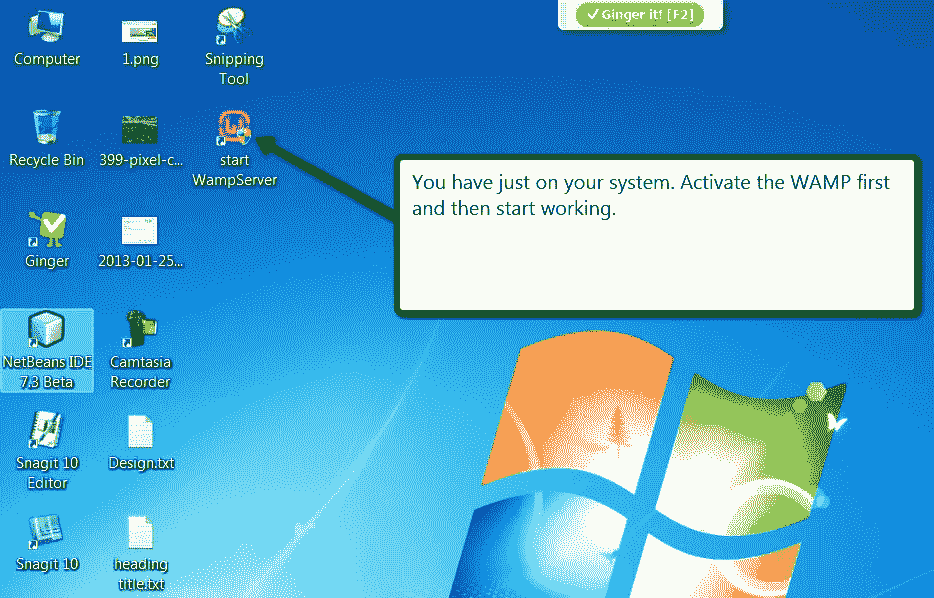
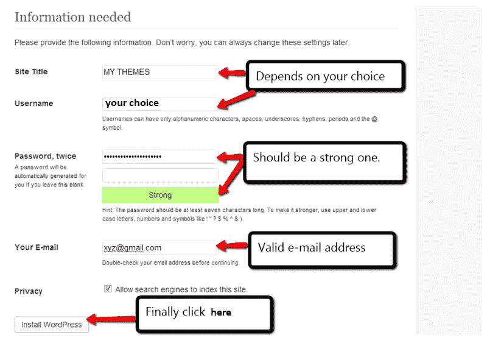
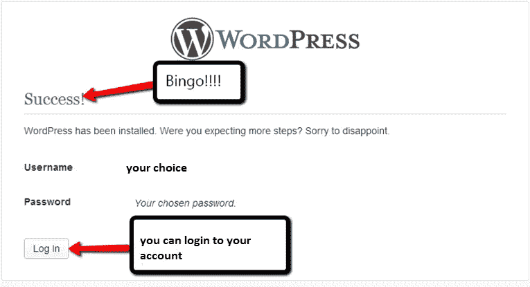

# 本地主机:WordPress 本地安装

> 原文：<https://medium.com/visualmodo/localhost-wordpress-installation-locally-72d569f3a67d?source=collection_archive---------0----------------------->

我在 WordPress 学到的第一件事是它在 localhost 上的安装过程，不知道它还有其他独特的功能。

毫无疑问，网络上有各种各样的免费 WordPress 主题，高级 WordPress 主题，但是首先使用 WordPress 是继续发展的关键。

随着我一步一步地学习，学到了更多有趣的东西，我意识到 WordPress 不仅是一个 CMS，也是一个伟大的博客平台。

它如何简单地为你打开了探索自我的网络世界。

一个伟大的帮助平台，与他人分享你的经验。

这篇文章是献给每一个寻求开始使用 WordPress 并需要在线曝光的*初学者的。*

我希望最后你会很容易地在你的系统上安装 WordPress，并使用令人惊叹的 CMS 应用程序来提升你的 WordPress 博客或网站。

虽然，这个教程是关于*在 WAMP* 本地安装 WordPress 的，但是让我告诉你一些关于 WordPress 的基本要点

*   WordPress 是一个免费的开源博客工具——一个基于 PHP 和 MySQL 的内容管理系统(CMS)。
*   要使用 WordPress，你必须为它的工作环境在你的机器上安装一个服务器(WAMP，XAMP)。没有服务器，你将无法安装 WordPress。
*   你将安装的服务器，它应该支持 PHP 和 MySQL 的要求。
*   安装 WordPress 相当容易和简单，所以我建议你有耐心。

在这篇文章中，我使用了 *WAMP 软件*(支持 PHP 和 MySQL)来安装 WordPress。你可以使用任何你选择的网络服务器来安装 WordPress。

# WordPress 本地主机安装的 12 个简单步骤

# 步骤 1 下载 WAMP 服务器

如我之前所说，WordPress 需要一个网络服务器(可以是任何人，比如我用 WAMP 软件安装了 WordPress ),所以首先你需要在你的机器上下载并安装一个叫 WAMP 的软件(已经预建了本地主机服务器)。

WAMP 代表 Windows Apache MySQL 和 PHP。

只需打开你的任何一个浏览器，在你的系统上下载 [WAMP](http://www.wampserver.com/en/) 软件。

[下载 WAMP](http://www.wampserver.com/en/#wampserver-64-bits-php-5-5)

这将提供一个平台来轻松安装 WordPress。

记住一件事，当安装 WAMP 时，任何其他服务器都不应该处于活动模式，否则会与 WAMP 的安装冲突。

# 步骤 2 安装 WAMP 服务器

下载 WAMP 服务器后，双击它的图标运行并安装在你的一个目录下(默认情况下，它安装在本地 c 盘)。

# 步骤 3 激活 WAMP 服务器

记住，每次你打开你的机器，首先你需要通过双击图标来激活 WAMP 服务器。

激活后，你会在任务栏上看到一个绿色的“W”标记(默认情况下看起来是红色的)。

# 步骤 4 下载 WordPress Zip

现在打开你的浏览器。去 www.wordpress.org 轻松下载 WordPress 的最新版本。

[下载文字新闻](https://wordpress.org/latest.zip)

# 第 5 步打开目录，你已经安装了 WAMP

打开安装了 WAMP 服务器的目录，并执行以下步骤。

**目录**(本地 c 盘，默认 wamp 安装在此目录)**–>wamp—>www—>复制**WordPress 的 zip 文件夹到此，点击右键，选择“解压到此”。

现在复制一个文件夹，并将其重命名，例如，它被重命名为“wordpress1”。

制作 WordPress 的多份拷贝并重新命名将会节省你再次下载 WordPress 的时间(如果你需要再次下载文件的话)..

# 打开你的浏览器窗口

打开 web 浏览器窗口，在地址栏中键入以下内容“localhost/phpmyadmin/”，然后按 enter 键。

下图所示的页面将显示在您的屏幕上:

现在，选择数据库并为你的 WordPress 创建一个数据库，比如说“表格”,如下图所示。

只需单击 create，您的数据库就可以使用了。

# 步骤 7:在你的浏览器上输入“本地主机”

现在在你的浏览器上输入“localhost”。从那里，选择你复制的文件夹(你为你的 WordPress 网站重新命名的那个)。

# 步骤#8 创建一个配置文件

在此之后，将获得如下图所示的页面。

现在，单击同一页面上的“创建配置文件”按钮。

# 第 9 步点击“开始”按钮

现在，在执行上述步骤后，在下一页中单击“开始”按钮。

# 步骤#10 填写数据库连接详细信息

这一步非常重要。你在这里需要小心一点。请记住几件事，并以这种方式进行

*   **数据库** **名称**应该与你之前为你的 WordPress 创建的相同。
*   **用户名**根据 MySQL 用户名默认为“root”。
*   如果您在创建数据库时没有提到密码**和**，请将其留空，否则，如果您之前提到过，请键入相同的密码。
*   让其他字段保持原样。现在，你的页面应该如下图所示。最后点击“提交”按钮继续。

# 步骤#11 填写其他一般信息并点击“安装 WordPress”

在这之后，简单地填写下一页的各个字段，最后点击“安装 WordPress”按钮。您的页面将如下图所示:

# 步骤#12 你已经成功安装了 WordPress

最后这里是你的目的地。

答对了。您已经成功地在您的机器上安装了 WordPress。

为了确保您已经以完美的方式完成了所有步骤，您可以登录您的帐户。

安装 WordPress 比其他任何工作都简单。

一旦你熟悉了这个令人兴奋的平台，你可以做任何事情，从写博客到制作网站。这都是免费的。

这篇文章仅仅是关于在本地主机(WAMP 服务器)上安装 WordPress 的，但是，你可以点击下面的按钮，学习一个完整的教程系列来理解安装 WAMP 的过程。