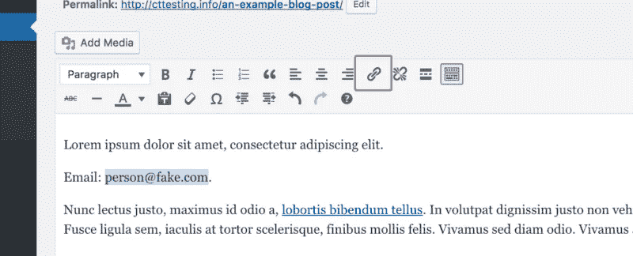
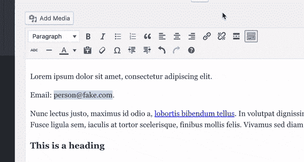

# 使电子邮件地址在 WordPress 中可点击

> 原文：<https://medium.com/visualmodo/make-email-address-clickable-in-wordpress-60a6d210b6ff?source=collection_archive---------0----------------------->

这一节将教你如何在有或没有文本编辑器的情况下创建一个指向电子邮件地址的可点击链接。这是一个简单的过程，你可以在几秒钟内掌握。

# 使电子邮件地址在 WordPress 中可点击


你可能在网上见过这样的可点击的电子邮件地址，[fake@email.com](mailto:fake@email.com)。

如果您点按该电子邮件地址，它将打开您电脑的默认电子邮件客户端。那么你如何给你的[站点添加这样的链接呢？](https://visualmodo.com/)

这里有一个简单的方法来添加电子邮件链接到文章和页面，加上你可以用于菜单和部件的 HTML。

# 如何创建邮件:链接

HTML5 引入了一些新的链接类型，包括特殊的电子邮件链接或 [*邮件链接*链接](https://css-tricks.com/snippets/html/mailto-links/)。WordPress 帮助你自动链接电子邮件地址，而无需接触 HTML。

首先，在帖子或页面中键入一个简单的电子邮件地址。然后突出显示电子邮件地址文本，并单击编辑器中的链接图标。



*或者，按 cmd+k (ctrl+k)使用链接快捷方式。*

WordPress 将识别电子邮件地址，并自动为您插入正确的 Mailto 链接。



只需按 enter/return 键添加链接，就大功告成了。

# 电子邮件链接如何工作

当链接到一个网站时，在开头包含“http://”。所有的链接都需要一个协议，而“http://”是我们用来链接网页的超文本协议。

Mailto 是一种不同的协议。链接到电子邮件地址时会用到它。实际上，当链接到一个电子邮件地址时，你只需要记住使用“mailto:”而不是“http://”。

# 邮件链接 HTML

如果你把链接添加到一个小部件或菜单，你将不会有你在文章编辑器中得到的自动 Mailto 链接创建。

这是将电子邮件地址链接添加到菜单时 URL 的外观。

```
mailto:fake@email.com
```

这是 Mailto 链接的完整 HTML。

```
<a href="mailto:fake@email.com">fake@email.com</a>
```

# 使用 WordPress 的电子邮件链接

在这篇文章中，你学习了如何利用 HTML5 的“Mailto”链接，在 WordPress 网站的任何部分添加电子邮件链接。

使电子邮件地址可点击可以让访问者更容易与你联系。你甚至可以更新链接，让它有一个[预先写好的主题行](https://css-tricks.com/snippets/html/mailto-links/#article-header-id-1)。

如果你对添加可点击的电子邮件地址有任何疑问，请在下面发表评论。