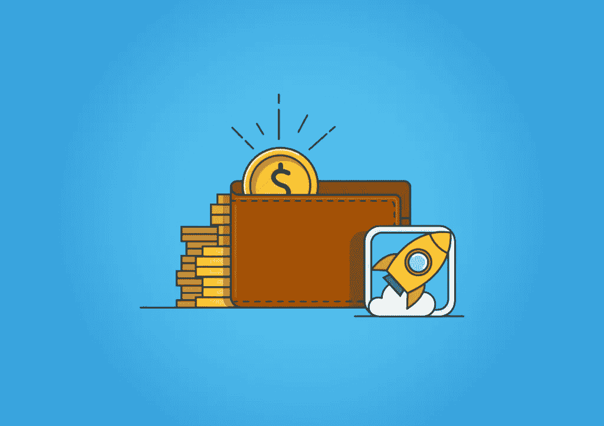

# 没有 AdSense 的博客赚钱

> 原文：<https://medium.com/visualmodo/make-money-blogging-without-adsense-911903502537?source=collection_archive---------0----------------------->

所以问题是，没有 Adsense 的博客怎么赚钱？在这里，你将积极地学习如何以任何简单的方式通过博客赚钱。

当我开始写博客时，Google Adsense 是我唯一知道的博客赚钱方式。在那个时候，获得 Adsense 的批准并不像现在这样困难。我得到了一个子域网站的 Adsense 许可。

后来我转到了自己主持的 WordPress 博客，开始更认真地写博客。很快我意识到 Adsense 并没有给我带来多少收入。我开始为我的博客寻找其他的赚钱方式。

Adsense 仍然是[博客作者](https://visualmodo.com/)的最佳广告网络。但如果认为这是博客赚钱的唯一途径，那就有点夸张了。沃伦·巴菲特说过，“不要把所有的鸡蛋放在一个篮子里”，意思是不要依赖一种收入来源。如果你的 Adsense 账号被封禁了怎么办？因此，如果你没有得到 Adsense 的批准，或者你被禁止，或者 Adsense 不适合你，请继续阅读。在这篇文章中，我将分享 5 种不用 AdSense 就能让你的博客赚钱的最好方法。

# 没有 AdSense 的博客赚钱？

# 1.联盟营销。这并没有听起来那么难。

联盟营销是通过销售别人的产品来获取佣金的过程。这个想法是你选择一个你喜欢的产品，然后你开始在你的博客上推广这个产品。当有人通过你的代销商链接购买产品时，你将获得佣金。

当谈到获得成功的联盟营销，你可能会认为你必须做 PPC 营销或必须建立一个庞大的电子邮件列表。但是如果你有一个拥有体面读者的博客，你就不需要这么做了。只要选择合适的产品，并在你的博客上推广。

子公司[营销](https://visualmodo.com/)需要时间。如果有人告诉你，他会让你一夜之间成为千万富翁，那他是在当着你的面撒谎。有很多课程声称能让你成为千万富翁，并要求你购买他们的产品。大多数情况下，那些都是骗局。要想在联盟营销中获得成功，你需要努力工作。

ShareASale 是一个附属网络，被成千上万的博客作者使用。

# 2.尝试替代方案。Adsense 并不是唯一的程序。

老实说，没有真正的站长替代方案。凭借广告质量、最高点击率和经常性收入，Adsense 仍然是最好的广告网络。

但是除了 AdSense，还有其他的博客广告网络。通过使用这些网络，你可以获得可观的收入。这里列出了一些高收入的替代广告。

*   Media.net
*   投标人
*   对抗性的

我建议你做一些实验，找出适合你的方法。因为对我有效的，可能对你无效，对你有效的，可能对我无效。

对于博客作者来说，Media.net 是最好的 AdSense 替代品之一。

# 3.直接广告。去掉第三方

直接广告是让你的博客赚钱的好方法。直接广告最大的好处是，你可以避开第三方。你可以完全控制你的广告，比如广告将在哪里以及如何展示。

但是如果你刚刚创建了一个新的 WordPress 博客，直接广告可能不适合你。你必须为你的博客创造可观的流量来吸引广告商。

这里有一些获得直接广告的技巧。

*   创建一个“广告”页面，包含有关博客统计、受众概况、广告选项等信息。你可以看看我们广告页，了解一些情况。
*   使用 OIO 出版商插件来管理您的广告。
*   访问其他与你的领域相关的博客，看看谁在这些博客上做广告。试着联系那些广告商。
*   加入像 [DigitalPoint](https://www.digitalpoint.com/) 这样的论坛寻找广告客户。

OIOPublisher 插件帮助您最大限度地提高收入，并让您完全控制您的广告空间。

# 4.写赞助评论和赞助文章。但是不要卖链接。

产品所有者或服务提供商付钱给博客写手来写他们。它可以是一篇赞助评论或一篇赞助文章。

在赞助商评论中，产品所有者会要求你写一篇他们产品的评论。赞助帖子是发布关于产品/服务的付费帖子。可能是你写的，也可能是广告商写的。

如果你做得对，发表赞助帖子或赞助评论没有坏处。事实上，它可以为你创造一大笔钱。

但是你必须小心赞助商的帖子。在撰写赞助评论/帖子之前，你需要考虑以下几点。

*   帖子要和你的小众相关。
*   绝不接受赌场或赌博网站。
*   将“nofollow”标签添加到[广告商](https://visualmodo.com/)链接中。
*   写详细的帖子来吸引其他广告商。

SponsoredReviews.com 是一个博客帖子服务，连接广告商和博客。

# 5.销售产品或服务。不要仅仅依赖广告和代销商收入。

一个有目标流量的博客可以通过销售产品或服务来获得可观的收入。

Problogger 上的一项民意调查发现，44%的博客出售自己的产品或服务。如果你的博客有相当多的读者，你可以向你的读者提供产品或服务。

你要销售的产品或服务必须与你博客的主题相关。这里有一些你可以销售的产品/服务的例子。

*   电子书
*   会员网站
*   课程
*   软件
*   网页设计/开发
*   SEO 服务
*   培训服务等。

网虫帮助博客在网上销售产品。

# 轮到你了

所以，这些是不用 AdSense 也能从你的博客中赚钱的最好方法。以上所有的方法在一个地方可能都不适合你。你必须找到最适合你的方法。联盟营销最适合我。但它可能不太适合你。如果你在没有 Google Adsense 的情况下使用其他方式赚钱，请告诉我们。